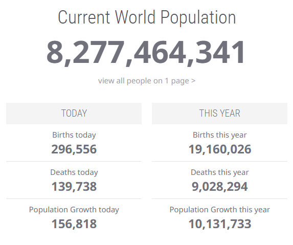
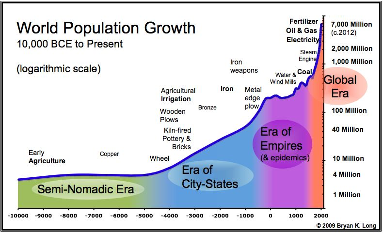
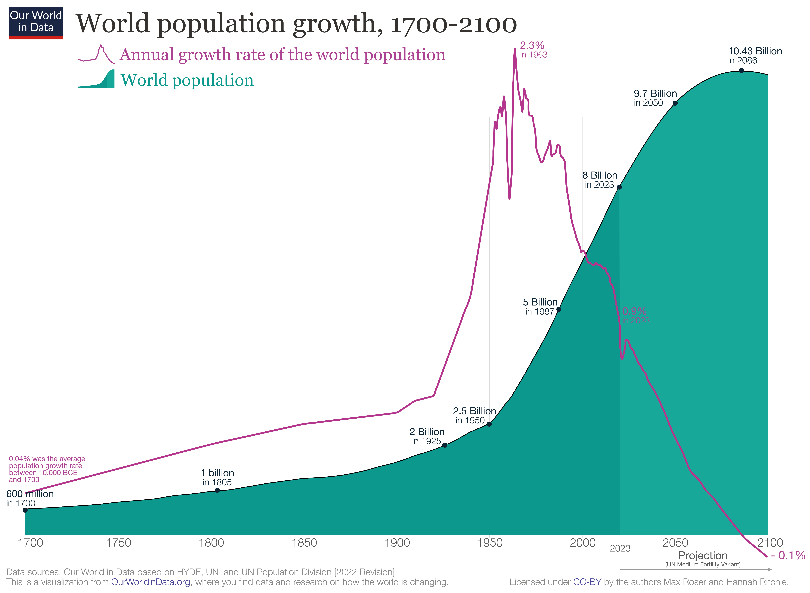

## Learning Objectives

By the end of this module, you should be able to:

-   Describe historical and current global population trends
-   Distinguish between growth rate and total population size
-   Explain how fertility, mortality, and migration shape population change
-   Define replacement-level fertility and demographic momentum
-   Compare regional and country-level demographic trajectories
-   Interpret population projections and their underlying assumptions
-   Analyze how demographic patterns influence future environmental pressures

# Population Growth

## Current Global Population (February 2026)

::::: columns
::: {.column width="50%"}
-   Estimated current global population: [\~8.3 billion]{.keyword} (Worldometers 2026; UN World Population Prospects 2022 revision)
-   Annual net increase: \~70 million people (\~0.9% per year) (UN WPP 2022; Worldometers 2026)
-   Most populous countries:
    -   **India**: \~1.48 billion
    -   **China**: \~1.41 billion
    -   **United States**: \~349 million (Worldometers 2026)
-   **Growth unevenly distributed:** fastest in sub-Saharan Africa; stable or declining in parts of Europe and East Asia (UN WPP 2022)
:::

::: {.column width="50%"}
{fig-alt="Screenshot of the Worldometers website displaying a large headline reading “Current World Population” with a live counter at 8,277,464,341. Below are two columns labeled “Today” and “This Year.” The “Today” column shows births today (296,556), deaths today (139,738), and population growth today (156,818). The “This Year” column shows births this year (19,160,026), deaths this year (9,028,294), and population growth this year (10,131,733)."}
:::
:::::

## Historical Global Population Growth

::::: columns
::: {.column width="50%"}
-   Population remained **very low and stable** for most of human history
-   Gradual increase with **early agriculture (\~10,000 BCE)**
-   Accelerating growth during:
    -   Agricultural intensification
    -   Rise of empires and trade networks
    -   Industrial Revolution
-   **Sharp exponential increase after \~1800**
-   **\~8 billion by 2022** (UN World Population Prospects 2022)
-   **Estimated total humans ever born:** \~117 billion (Population Reference Bureau 2022)
:::

::: {.column width="50%"}
{fig-alt="Graph titled “World Population Growth, 10,000 BCE to Present” plotted on a logarithmic scale. The horizontal axis shows time from 10,000 BCE to 2000 CE, and the vertical axis shows population size increasing from 1 million to over 7 billion. The curve remains relatively flat during the Semi-Nomadic Era, rises gradually during the Era of City-States and Era of Empires, and then increases steeply during the Global Era after 1800. Technological milestones such as agriculture, irrigation, metal tools, steam engine, coal, oil, electricity, and fertilizer are marked along the timeline. The sharpest rise occurs after the Industrial Revolution."}
:::
:::::

## Global Population Growth: Rate vs. Total Size

::::: columns
::: {.column width="50%"}
-   Global population: **\~8 billion in 2023**
-   Peak global growth rate: **\~2.3% in 1963**
-   Current growth rate: **\~0.9%**
-   Growth rate has declined steadily since the 1960s
-   Total population continues to increase despite slowing rate

**Key point:**\
Growth has already peaked — but population size is still rising.
:::

::: {.column width="50%"}
{fig-alt="Chart titled “World population growth, 1700–2100.” The green shaded area shows total world population rising from about 600 million in 1700 to 8 billion in 2023, projected to reach about 9.7 billion in 2050 and 10.4 billion in 2086 before stabilizing. A purple line shows the annual population growth rate, which peaks at about 2.3% in 1963 and then declines steadily to about 0.9% in 2023, projected to approach zero or slightly negative by 2100."}
:::
:::::

## When Will Population Peak?

::::: columns
::: {.column width="55%"}
-   **UN World Population Prospects (2024 revision):**
    -   Peak global population \~**10.3 billion**
    -   Timing: **mid-2080s**
    -   Slight decline or stabilization by 2100
-   Peak timing depends primarily on:
    -   Future **fertility decline**
    -   Pace of development and education
    -   Regional demographic momentum
-   Different models produce different forecasts:
    -   UN: later, higher peak
    -   IHME (Lancet): earlier, lower peak (\~2060s)
:::

::: {.column width="45%"}
{fig-alt="Line graph titled “Peak People” comparing global population projections from 1950 to 2100. The vertical axis shows population in billions from 0 to about 12. Historical population rises from roughly 2.5 billion in 1950 to about 7.8 billion around 2020. After 2020, three projections diverge: the United Nations projection (orange line with shaded 95% confidence interval) rises to nearly 11 billion by 2100; the IHME projection (dark blue line) peaks around mid-century near 9.7–10 billion and then declines to below 9 billion by 2100; and the IIASA projection (light blue line) peaks near mid-century and declines slightly by 2100. The UN projection remains highest by the end of the century."}
:::
:::::

## Future global population growth will be geographically uneven

::::: columns
::: {.column width="50%"}
-   Global growth increasingly concentrated in **sub-Saharan Africa**
    -   UN projects Africa’s population will **roughly double by \~2070**
-   **Asia:** still largest population, but growth slowing
    -   Several countries at or below replacement fertility
-   **Europe:** stable or declining population
-   **Latin America:** slowing growth, approaching stabilization
-   **North America:** modest growth, strongly influenced by migration
:::

::: {.column width="50%"}
).](images/expected-population-growth-across-continents-mobile-v2.png){fig-alt="Chart illustrating projected population trends by world region to 2100. Sub-Saharan Africa shows steep continued growth, approximately doubling by around 2070. Asia grows more slowly and stabilizes later in the century. Europe shows little growth or gradual decline. Latin America stabilizes mid-century. North America grows modestly. The figure emphasizes that most future global population growth is concentrated in Africa." fig-align="center" width="80%"}
:::
:::::

## Diverging Population Paths: India, China, Europe, United States

::::: columns
::: {.column width="50%"}
-   **India**
    -   Recently became the world’s most populous country
    -   Population still growing, but fertility declining
    -   Projected to peak later this century
-   **China**
    -   Population peaked in the early 2020s
    -   Rapid aging and projected long-term decline
-   **Europe**
    -   Low fertility for decades
    -   Gradual population decline projected
-   **United States**
    -   Slower growth
    -   Migration plays major role in stabilizing population
:::

::: {.column width="50%"}
).](images/unpop-us-eu-chn-ind.png){fig-alt="Line chart comparing projected population size from 1950 to 2100 for India, China, Europe, and the United States. India’s population continues rising through mid-century before stabilizing. China’s population peaks in the early 2020s and then declines steadily. Europe shows gradual long-term decline. The United States shows slower, steadier growth with relative stabilization later in the century. The figure highlights divergent demographic futures among major world regions."}
:::
:::::

## Africa: Rapid Growth

-   Fastest population growth of any world region
-   UN projects population will **roughly double by \~2070**
-   Median age remains low → large youth population
-   Rapid urbanization underway
-   Growth driven by:
    -   Higher fertility in several countries
    -   Declining mortality
    -   Demographic momentum

**Implication:**\
Africa will account for most global population growth this century.

## Asia: Slowing Growth

-   Still the **most populous continent**
-   Regional fertility has declined substantially
-   Several countries below replacement fertility
-   Population projected to peak mid-century, then stabilize or decline
-   Rapid aging in parts of East Asia

**Implication:**\
Asia’s demographic influence remains large, but growth is slowing.

## Country Case: China

-   Population peaked in the early 2020s
-   Fertility well below replacement (\~1.0–1.2)
-   Rapid population aging
-   Shrinking workforce projected
-   One-child policy legacy continues to shape demographics

**Implication:**\
Managing aging and economic transition now central challenges.

## Country Case: India

-   World’s most populous country
-   Fertility has declined to near replacement (\~2.0)
-   Large and youthful population structure
-   Continued growth projected for several decades
-   Rapid urbanization and economic development underway

**Implication:**\
India’s demographic trajectory will strongly influence global totals.

## Country Case: United States

-   Moderate population growth
-   Fertility below replacement (\~1.6–1.7)
-   Migration plays major role in population stability
-   Aging population, but slower than many European and East Asian countries

**Implication:**\
Future growth depends heavily on immigration policy and economic conditions.

## Why Did Population Growth Accelerate?

-   For most of history: high birth rates **and** high death rates → slow growth
-   After \~1800: death rates declined rapidly → rapid population expansion.

**Major drivers:**

-   Agricultural intensification (food surplus)
-   Industrial Revolution (energy, mechanization)
-   Improved sanitation and clean water
-   Vaccines and medical advances
-   Declining infant and child mortality
-   Increased life expectancy

## Key Takeaways — Population Growth

-   Global population now **\~8+ billion**
-   Growth rate peaked in the 1960s and has declined
-   Total population continues to rise
-   Future growth concentrated in **sub-Saharan Africa**
-   Major regions and countries are on very different demographic paths
-   Acceleration driven primarily by declining mortality

Next: What mechanisms determine population change?

# Mechanisms of Population Change

## Mechanisms of Population Change

Population size changes through three processes:

-   **Fertility** → births
-   **Mortality** → deaths
-   **Migration** → movement across borders

[Population change = births − deaths ± net migration]{.keyword}

Understanding these mechanisms explains *why* population grows, stabilizes, or declines.

## [Fertility]{.keyword}: average number of children born per woman

::::: columns
::: {.column width="50%"}
-   Measured as [Total Fertility Rate (TFR)]{.keyword}
-   Global TFR:
    -   \~5.0 in 1950
    -   \~2.3 today (UN WPP 2024)
-   Influenced by:
    -   Education (especially for women)
    -   Access to contraception
    -   Urbanization
    -   Economic opportunity
    -   Cultural norms

Lower fertility → slower population growth.
:::

::: {.column width="50%"}
{fig-alt="Scatter plot titled “Women’s educational attainment vs. fertility rate, 1950 to 2020.” The horizontal axis shows average years of schooling among women aged 15–64, and the vertical axis shows total fertility rate (children per woman). Each point represents a country-year observation. The overall pattern shows a strong negative relationship: countries where women have few years of schooling tend to have high fertility rates (often above 4–6 children per woman), while countries where women have 10–15 years of schooling tend to have fertility rates near or below replacement level (around 1–2 children per woman). Over time, many countries move rightward (more education) and downward (lower fertility)." width="90%"}
:::
:::::

## [Mortality]{.keyword}: number of deaths in a population

::::: columns
::: {.column width="50%"}
-   Measured as **death rate** or **life expectancy**
-   Global life expectancy:
    -   \~47 years in 1950
    -   \~73 years today (World Bank; UN WPP)

Major improvements from:

-   Sanitation and clean water

-   Vaccines and antibiotics

-   Improved nutrition

Declining mortality historically drove rapid population growth.
:::

::: {.column width="50%"}
, based on UN Inter-agency Group for Child Mortality Estimation and historical demographic data).](images/Youth-mortality-rates-over-last-two-millennia-updated-to-2022.png){fig-alt="Line chart showing the share of children who died before age five from 1800 to recent years across multiple world regions. In 1800, child mortality was extremely high in all regions, often around 40–50%. Over the 19th and early 20th centuries, mortality declines gradually in Europe and North America, and more steeply after 1950 worldwide. By the early 21st century, child mortality falls below 5% in high-income regions and declines substantially in Africa, Asia, and Latin America, though rates remain higher in sub-Saharan Africa. The overall pattern shows dramatic global improvement in child survival over time." fig-align="center" width="80%"}
:::
:::::

## [Migration]{.keyword}: movement of people between countries

::::: columns
::: {.column width="50%"}
-   Includes:
    -   Immigration (inflow)
    -   Emigration (outflow)
-   Affects national and regional population size
-   Less important at the *global* scale
    -   Migrants leave one country but enter another

Migration strongly shapes demographic patterns in countries such as the United States and parts of Europe.
:::

::: {.column width="50%"}
)](images/annual-net-migration.png)
:::
:::::

## Replacement-Level Fertility

-   [Replacement-level fertility]{.keyword}:\
    Average number of children per woman needed to keep population stable\
-   In most countries: \~**2.1 children per woman**
    -   2 to replace parents
    -   +0.1 to account for mortality and sex ratio

Important distinction:

-   TFR at replacement does **not** immediately stop growth
-   Population structure and momentum still matter

Next: Age structure and demographic momentum.
