# Climate as a Driver of Ecosystems

## Climate and the Distribution of Ecosystems

::::: columns
::: {.column width="50%"}
-   Great diversity of terrestrial and aquatic habitats
-   Climate differences shape global ecosystem patterns
-   Distribution of [biomes]{.keyword} linked to temperature and precipitation
-   Human activities increasingly affect these systems
:::

::: {.column width="50%"}
.](images/clipboard-34563444.png){fig-alt="A four-panel image showing different ecosystems: a desert landscape with Joshua trees, an alpine tundra with sparse vegetation and rocky terrain, a dense coniferous forest on a mountain slope, and an underwater coral reef with fish and coral colonies."}
:::
:::::

------------------------------------------------------------------------

## Factors That Influence Climate

::::: columns
::: {.column width="50%"}
-   Incoming [solar radiation]{.keyword} drives global energy balance
-   Earth’s [rotation]{.keyword} influences atmospheric movement
-   Global patterns of air and water circulation
-   Atmospheric gases influence heat retention
-   Surface features and [topography]{.keyword} shape regional climates
:::

::: {.column width="50%"}
](images/clipboard-2451285485.png){fig-alt="Diagram showing solar radiation entering Earth’s atmosphere as shortwave energy, some reflected back to space, and some absorbed by the surface. The surface emits longwave radiation, part of which escapes to space while part is absorbed and re-emitted by the atmosphere."}
:::
:::::

------------------------------------------------------------------------

## Weather vs Climate

::::: columns
::: {.column width="50%"}
-   [Weather]{.keyword}: short-term atmospheric conditions
-   Daily variation in temperature, precipitation, wind
-   [Climate]{.keyword}: long-term atmospheric patterns
-   Climate measured over decades to centuries
-   Climate differences produce distinct ecosystems
:::

::: {.column width="50%"}
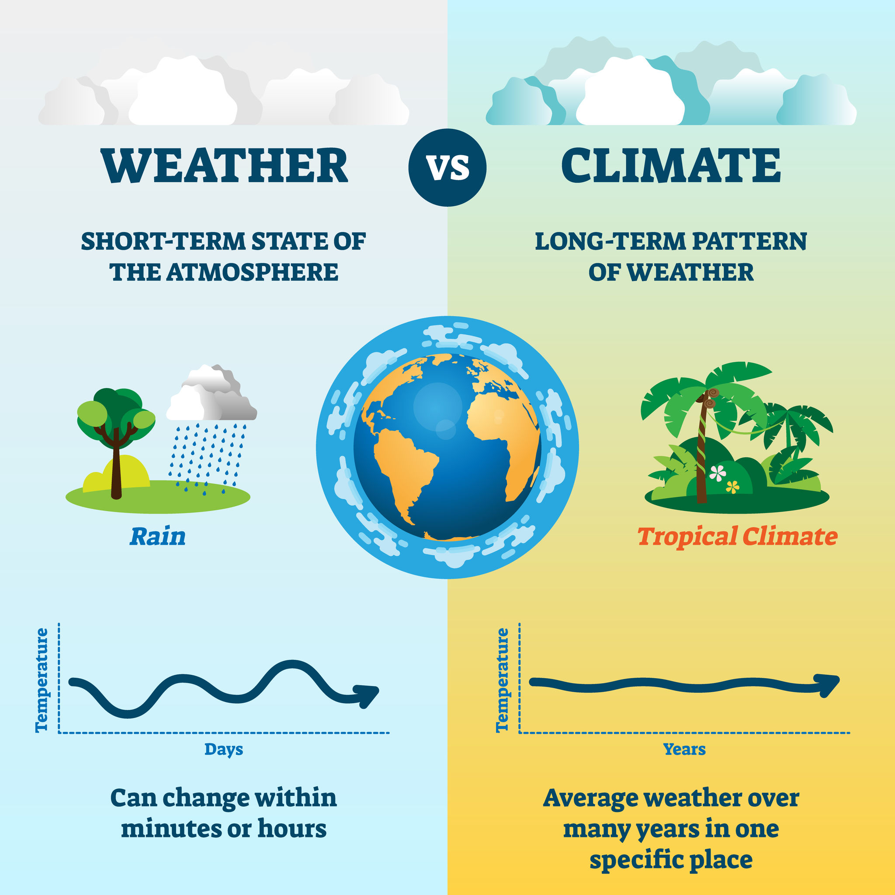
:::
:::::

## Solar Radiation and Latitude

::::: columns
::: {.column width="50%"}
-   Uneven distribution of solar energy across latitudes
-   Equatorial regions receive concentrated sunlight
-   High latitudes receive less direct energy
-   Sunlight passes through more atmosphere at high latitudes
-   Energy spreads across larger surface area
:::

::: {.column width="50%"}
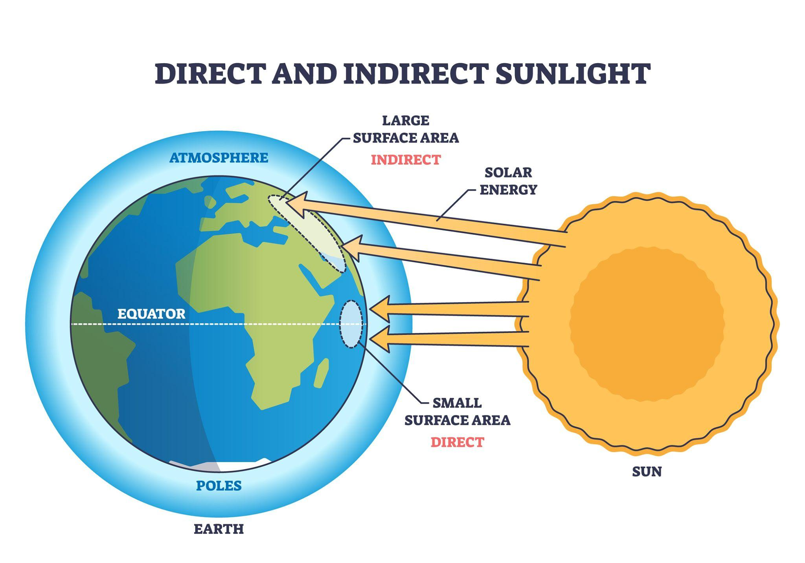
:::
:::::

------------------------------------------------------------------------

## Atmospheric Convection

::::: columns
::: {.column width="50%"}
-   Solar heating drives atmospheric [convection]{.keyword}
-   Warm moist air rises and cools
-   Cooling air releases precipitation
-   Cooler dry air sinks and flows across surface
-   Continuous circulation redistributes heat and moisture
:::

::: {.column width="50%"}
](images/clipboard-2859786614.png){fig-alt="Diagram showing a circular convection cycle in the atmosphere: red arrows show hot air rising and cooling, blue arrows show cool air sinking, and near the surface cool air flows horizontally to replace rising warm air." fig-align="center" width="60%"}
:::
:::::

## Global Air Circulation

::::: columns
::: {.column width="50%"}
-   Large-scale atmospheric circulation patterns
-   Rising and sinking air form [Hadley cells]{.keyword}
-   Earth’s rotation creates the [Coriolis effect]{.keyword}
-   Produces global [prevailing winds]{.keyword}
-   Winds redistribute heat and precipitation
:::

::: {.column width="50%"}
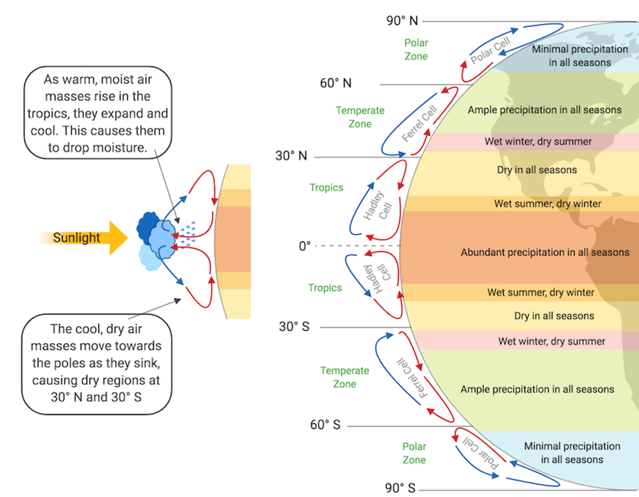
:::
:::::

## Ocean Currents and Climate

::::: columns
::: {.column width="50%"}
-   Ocean currents redistribute heat across the planet
-   Movement of warm and cold water regulates climate
-   Circulation connects deep and surface waters
-   Example: North Atlantic currents warm Europe
-   Ocean circulation influences regional ecosystems
:::

::: {.column width="50%"}
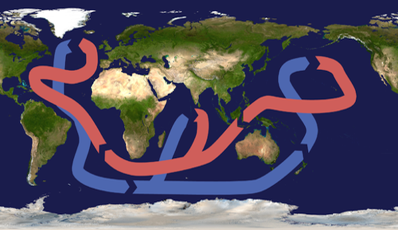
:::
:::::

------------------------------------------------------------------------

## Ocean–Atmosphere Interactions

::::: columns
::: {.column width="50%"}
-   Atmosphere and oceans tightly linked
-   Wind patterns drive surface ocean currents
-   [El Niño–Southern Oscillation]{.keyword} alters Pacific circulation
-   Changes global temperature and precipitation
-   Climate impacts occur across much of the planet

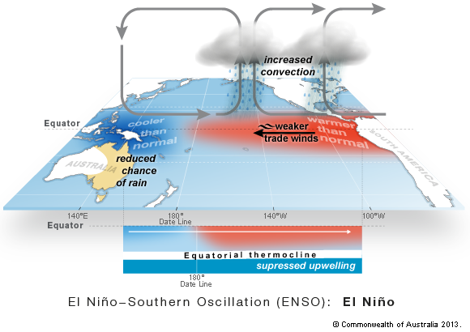{width="212"}
:::

::: {.column width="50%"}
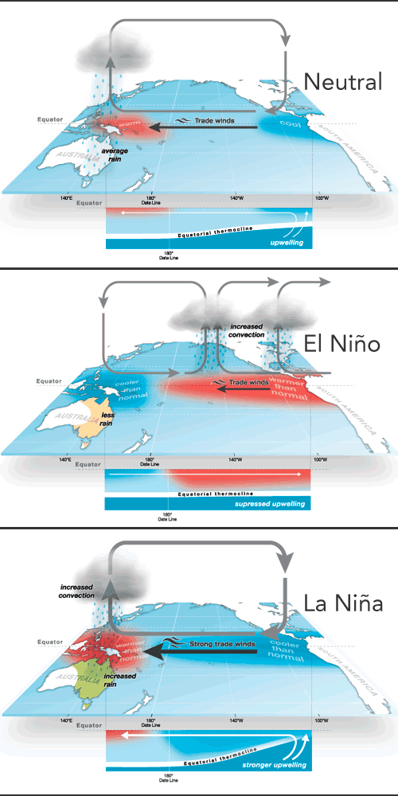{width="450"}
:::
:::::

------------------------------------------------------------------------

## Topography and Local Climate

:::: columns
::: {.column width="50%"}
-   Mountains influence regional precipitation patterns
-   Moist air rises and cools along slopes
-   Precipitation falls on windward side
-   Dry conditions develop on leeward side
-   Known as the [rain shadow effect]{.keyword}
:::
::::

------------------------------------------------------------------------

## Urban Microclimates

::::: columns
::: {.column width="50%"}
-   Cities create distinct local climates
-   Buildings and pavement absorb and retain heat
-   Reduced airflow and increased pollution
-   Higher temperatures compared to rural areas
-   Creates [urban heat islands]{.keyword}
:::

::: {.column width="50%"}
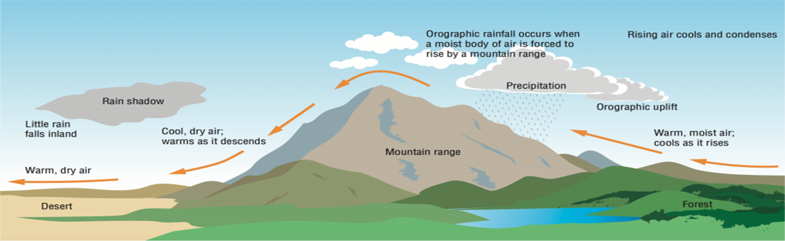
:::
:::::

------------------------------------------------------------------------

# Global Biomes and Ecosystems

## Climate Shapes Global Ecosystems

::::: columns
::: {.column width="50%"}
-   Climate determines the distribution of major ecosystems
-   Temperature and precipitation are the primary controls
-   Regions with similar climates support similar ecosystems
-   These large ecosystem regions are called [biomes]{.keyword}
:::

::: {.column width="50%"}
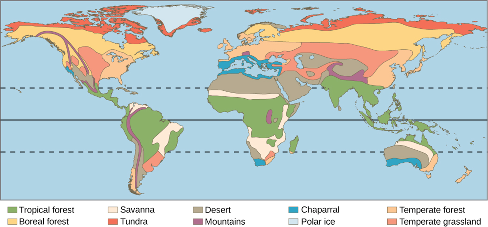
:::
:::::

------------------------------------------------------------------------

## Major Terrestrial Biomes

::::: columns
::: {.column width="50%"}
-   Large ecological regions defined by climate and vegetation
-   Characterized by dominant **plant growth forms**
-   Plants determine habitat structure for animals
-   Climate limits which plants can survive

Major terrestrial biomes include:

-   [deserts]{.keyword}
-   [grasslands]{.keyword}
-   [forests]{.keyword}
-   [tundra]{.keyword}
:::

::: {.column width="50%"}
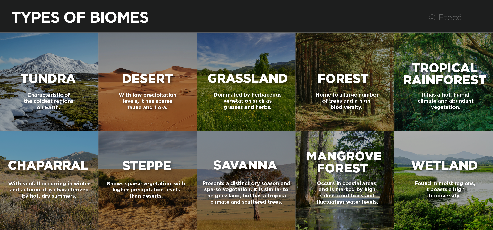
:::
:::::

------------------------------------------------------------------------

## Deserts

::::: columns
::: {.column width="50%"}
-   Defined by extremely low precipitation
-   Often receive less than 25 cm of rain annually
-   Vegetation is sparse and adapted to water scarcity
-   Plants show [drought adaptations]{.keyword} such as deep roots and water storage
-   Large temperature variation between day and night

Types of deserts:

-   [tropical deserts]{.keyword}
-   [temperate deserts]{.keyword}
-   [cold deserts]{.keyword}
:::

::: {.column width="50%"}
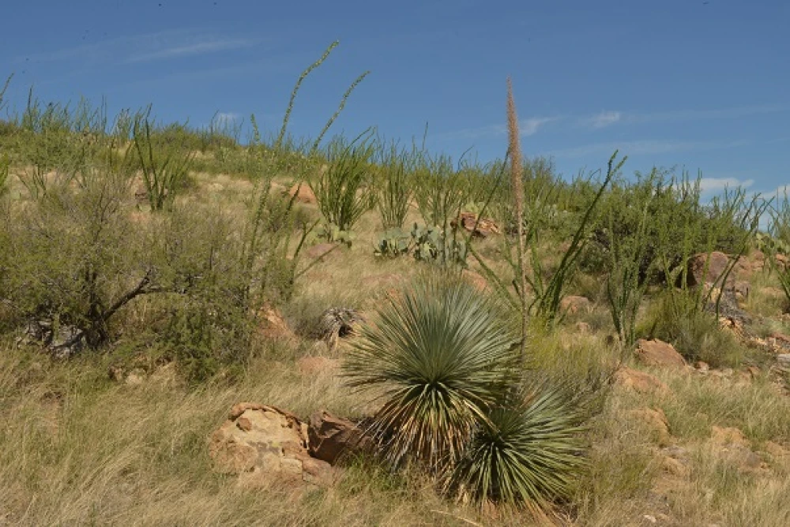
:::
:::::

## Grasslands

::::: columns
::: {.column width="50%"}
-   Moderate precipitation but too dry for forests
-   Dominated by grasses rather than trees
-   Fire and grazing help maintain grass dominance
-   Highly productive soils in many regions

Two major types:

-   [tropical grasslands (savannas)]{.keyword} - large grazers
-   [temperate grasslands]{.keyword} - cold winters
:::

::: {.column width="50%"}
](images/clipboard-3757645035.png)
:::
:::::

## Forest Ecosystems

::::: columns
::: {.column width="50%"}
-   Dominated by trees and woody vegetation
-   Occur where precipitation is sufficient to support forests
-   Often have layered vegetation structure
-   Support extremely high biodiversity

Major forest types:

-   [tropical forests]{.keyword}
-   [temperate forests]{.keyword}
-   [boreal forests]{.keyword}
:::

::: {.column width="50%"}
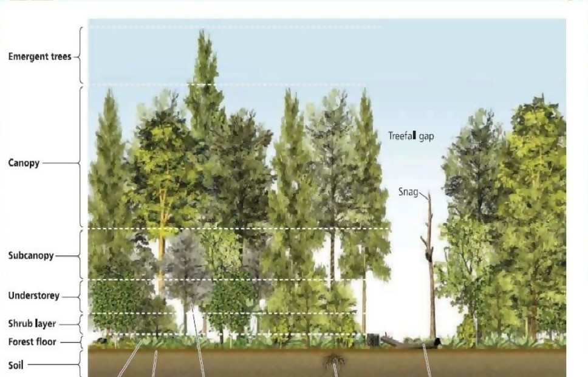
:::
:::::

## Mountain Ecosystems

::::: columns
::: {.column width="50%"}
-   Climate changes rapidly with elevation
-   Temperature decreases with increasing altitude
-   Mountains contain multiple ecological zones
-   Often support high biodiversity and endemism
-   Provide important freshwater resources
:::

::: {.column width="50%"}

:::
:::::

------------------------------------------------------------------------

## Human Disturbance to Terrestrial Ecosystems

::::: columns
::: {.column width="50%"}
-   Humans have altered \~**75% of Earth’s land surface** through agriculture, forestry, mining, and urban development (UNEP)
-   \~**60% of global ecosystem services** are degraded or used unsustainably (Millennium Ecosystem Assessment)
-   Major drivers include **land conversion, resource extraction, and infrastructure development**
-   Global analyses show **conversion pressure is still increasing**, especially in parts of Africa, Central America, and Southeast Asia
-   Many of these areas contain **intact ecosystems and high biodiversity**, creating growing conservation risks
:::

::: {.column width="50%"}
, Earth System Science Data (Fig. 3).](images/clipboard-2653614171.png){#fig-global-human-modification fig-alt="World map showing the degree of human modification of land ecosystems, with darker colors indicating higher levels of impact from agriculture, cities, roads, and energy infrastructure."}
:::
:::::

## Major human disturbances by ecosystem

::::::: columns
::: {.column width="25%"}
### [Deserts]{.keyword}

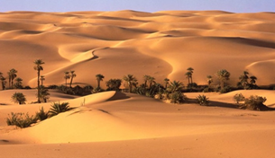{width="100%"}

-   groundwater depletion from irrigation
-   soil damage from off-road vehicles and mineral extraction
:::

::: {.column width="25%"}
### [Grasslands]{.keyword}

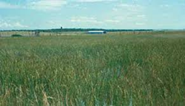{width="100%"}

-   conversion to cropland
-   overgrazing by livestock
:::

::: {.column width="25%"}
### [Forests]{.keyword}

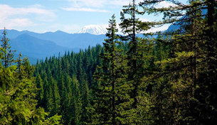{width="100%"}

-   deforestation for agriculture and livestock
-   logging for timber and paper
:::

::: {.column width="25%"}
### [Mountains]{.keyword}

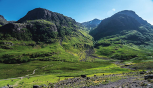{width="100%"}

-   mining and mineral extraction
-   dams and reservoirs altering river systems
:::
:::::::

All figures used with permission from sciencefacts.net

## Aquatic Ecosystems

::::: columns
::: {.column width="50%"}
-   Water covers about 71% of Earth's surface

-   Aquatic ecosystems support enormous biodiversity

-   Important ecosystem services: food, climate regulation, nutrient cycling

-   Two major categories:

    -   [marine ecosystems]{.keyword}

    -   [freshwater ecosystems]{.keyword}
:::

::: {.column width="50%"}

.](https://d9-wret.s3.us-west-2.amazonaws.com/assets/palladium/production/s3fs-public/styles/full_width/public/thumbnails/image/EarthsWater-BarChart.png)
:::
:::::

## Marine Ecosystems

:::::: columns
::: {.column width="60%"}
-   Oceans contain about **97% of Earth's water**
-   Marine ecosystems play a major role in **global climate regulation**
-   Ocean circulation redistributes heat and influences weather patterns
-   Marine primary producers generate a large share of Earth’s oxygen
:::

:::: {.column width="40%"}
::: {layout="[[1,1,1], [1], [1]]"}
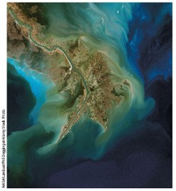

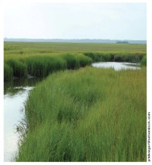

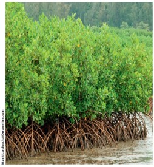

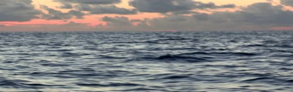

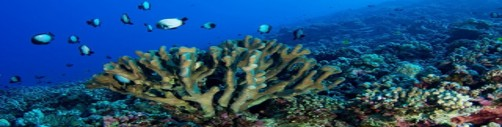
:::
::::
::::::

## Major marine zones

:::::: columns
::: {.column width="60%"}
-   [coastal zone]{.keyword} – shallow waters along continents; high nutrient input and some of the **most productive ecosystems** (estuaries, coral reefs, mangroves)
-   [open ocean]{.keyword} – vast offshore waters with lower nutrient concentrations; dominated by **plankton-based food webs**
-   [ocean floor]{.keyword} – benthic habitats ranging from shallow shelves to deep-sea trenches; organisms adapted to **low light, high pressure, and limited food**
:::

:::: {.column width="40%"}
::: {layout="[[1,1,1], [1], [1]]"}

:::
::::
::::::

## Open Ocean

::::: columns
::: {.column width="60%"}
-   [Pelagic zone]{.keyword} includes open-water habitats where organisms live in the water column, not seafloor
-   Pelagic ecosystems are dominated by **plankton-based food webs**; support fish, marine mammals, seabirds
-   Productivity depends on sunlight, nutrients, and vertical mixing of ocean waters
-   Vertical light zones structure marine ecosystems:
    -   [photic zone]{.keyword} (\~0–200 m): enough sunlight for photosynthesis; phytoplankton drive primary production
    -   [aphotic zone]{.keyword} (\>200 m): little or no light; no photosynthesis; organisms depend on organic matter from surface waters
    -   [abyssal zone]{.keyword} (\~4,000–6,000 m): dark, cold, high pressure; specialized deep-sea organisms
:::

::: {.column width="40%"}
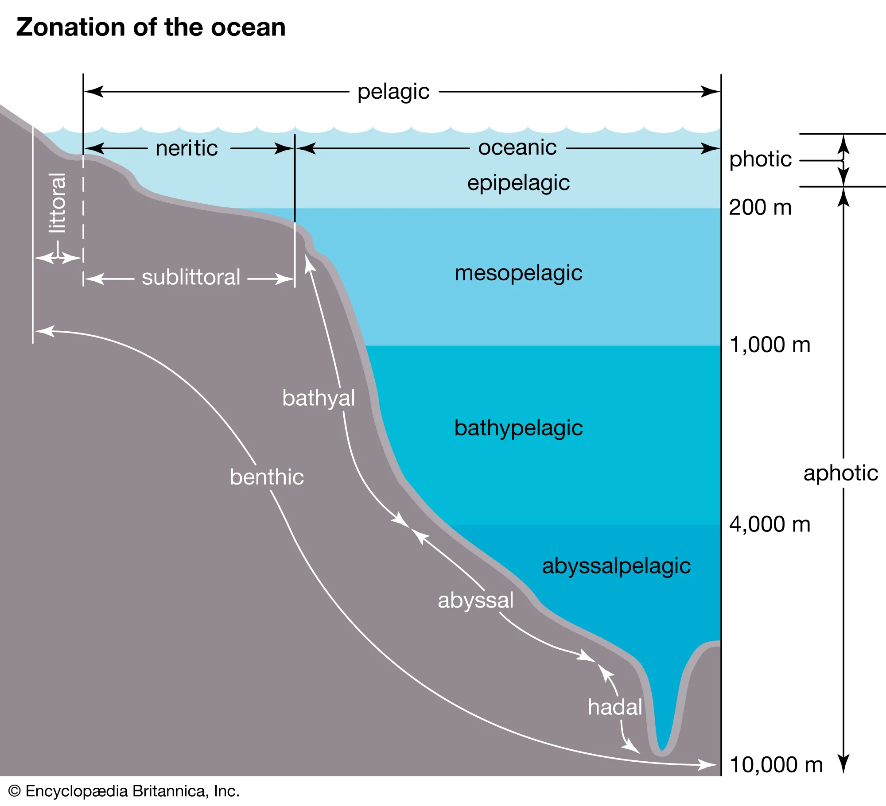
:::
:::::

## Ecosystem Services provided by oceans

::::: columns
::: {.column width="60%"}
-   Oceans dominate the planet and provide essential [ecosystem services]{.keyword} that support life and economies
    -   [Provisioning services]{.keyword}: seafood, genetic resources, and raw materials from marine organisms
    -   [Supporting services]{.keyword}: marine food webs, habitat for biodiversity, nutrient and water cycling
    -   [Maintaining services]{.keyword}: climate regulation, carbon storage, coastal protection, and water purification
    -   [Cultural services]{.keyword}: recreation, tourism, education, wildlife watching, and artistic inspiration
:::

::: {.column width="40%"}
{width="90%"}
:::
:::::

## Freshwater Ecosystems

::::: columns
::: {.column width="50%"}
-   Includes lakes, rivers, streams, and wetlands
-   Freshwater systems contain a small fraction of global water
-   Extremely important for human use and biodiversity
-   Water flow strongly influences ecosystem structure

Major freshwater systems:

-   [lakes and ponds]{.keyword}
-   [rivers and streams]{.keyword}
-   [wetlands]{.keyword}
:::

::: {.column width="50%"}
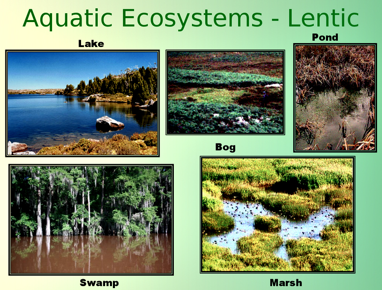
:::
:::::

## Lakes

::::: columns
::: {.column width="50%"}
-   [Lakes]{.keyword} are large bodies of **standing freshwater** formed when depressions fill with water
-   Lake basins can form through **glacial activity**, crustal movement, or **volcanic processes**
-   Lakes vary in **depth and nutrient levels**, shaping productivity and biodiversity
-   Typical deep lakes have distinct ecological zones
:::

::: {.column width="50%"}
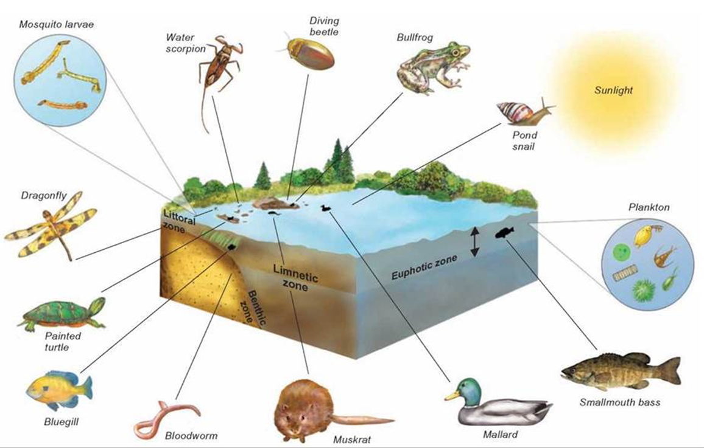
:::
:::::

## Nutrient Levels in Lakes

:::::: columns
::: {.column width="50%"}
-   Lakes differ in nutrient availability

-   Nutrients influence primary productivity

-   Two common lake types:

    -   [oligotrophic lakes]{.keyword} – low nutrients, clear water

    -   [eutrophic lakes]{.keyword} – high nutrients, high productivity

-   Nutrient inputs from human activities can cause [eutrophication]{.keyword}
:::

:::: {.column width="50%"}
::: {#fig-elephants layout-ncol="2"}
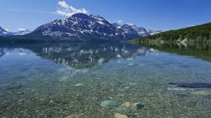

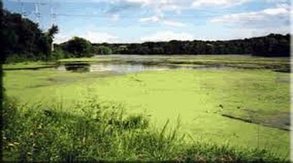

Two common lake types
:::
::::
::::::

## Freshwater streams and rivers

::::: columns
::: {.column width="50%"}
-   [streams and rivers]{.keyword} transport large volumes of freshwater from upland areas to lakes and oceans
-   Flowing water shapes landscapes through [erosion]{.keyword}, carving valleys and moving sediment
-   Most rivers pass through three zones: source zone, transition zone, and floodplain zone
-   Sediment deposited at the river mouth can form a [delta]{.keyword}
:::

::: {.column width="50%"}
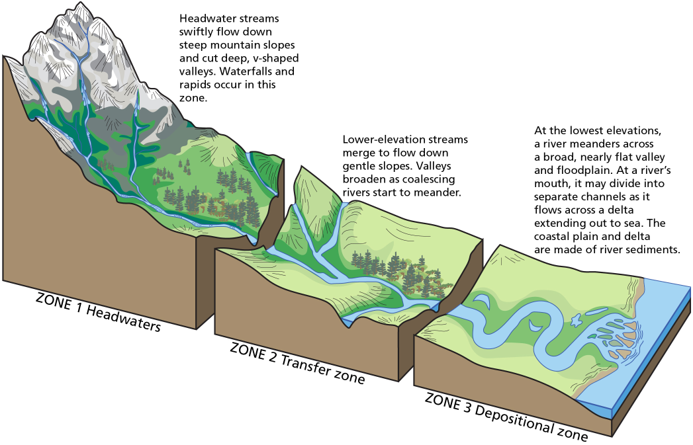
:::
:::::

## Freshwater inland wetlands

::::: columns
::: {.column width="50%"}
-   [Freshwater inland wetlands]{.keyword} act as natural **sponges**, storing and slowly releasing water
-   Wetlands filter pollutants and help **improve water quality**
-   They reduce flooding and erosion and help **maintain stream flow during drought**
-   Wetlands also **recharge groundwater aquifers**
-   These habitats support high **biodiversity** and provide recreation for people
:::

::: {.column width="50%"}
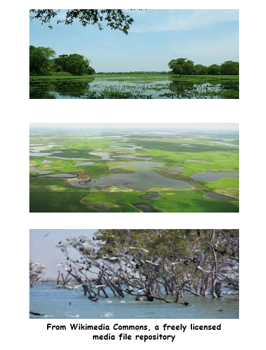
:::
:::::

# The Biodiversity Crisis

## Core Case Study: Where Have all the European Honeybees Gone?

::::: columns
::: {.column width="50%"}
-   Honeybees provide one of the most important ecosystem services: pollination.
-   European honeybees are used by farmers almost exclusively in the United States for pollinating crops.
    -   This dependence on one species is a violation of the principle of sustainability.
-   Since 2006, the honeybees have been in massive decline.
    -   This is called colony collapse disorder (CCD).
-   What can we learn from their collapse?
:::

::: {.column width="50%"}
{fig-alt="Close-up photograph of a European honey bee (Apis mellifera) perched on a flower while collecting nectar and pollen."}
:::
:::::

## Biodiversity hotspot

::::: columns
::: {.column width="50%"}
-   There are 34 recognized biodiversity hotspots around the world.
-   Although these cover only 2.3 percent of the Earth’s surface, 42 percent of the terrestrial vertebrate species and 50 percent of the world’s plants are endemic to those hotspots.
:::

::: {.column width="50%"}
{fig-alt="World map highlighting major biodiversity hotspots, with shaded regions across tropical forests, Mediterranean climates, and island regions where exceptionally high numbers of endemic plant and animal species occur but are threatened by habitat loss."}
:::
:::::

## What Role Do Humans Play in the Loss of Species and Ecosystem Services?

::::: columns
::: {.column width="50%"}
-   As the human population has grown exponentially, the rate of species extinction has also increased manyfold.
-   By the end of this century, the extinction rate is predicted to be 10,000 times higher than before human exponential growth began.
-   Species that can no longer be found on Earth have suffered biological extinction.
-   Mass extinction: the extinction of many species in a relatively short period of geologic time.
    -   The earth has had five mass extinctions.
    -   After each mass extinction, biodiversity returned and often was higher than before.
-   Recovery took millions of years.
:::

::: {.column width="50%"}
{fig-alt="Bar chart comparing expected background extinction rates with observed vertebrate extinctions since 1500, showing that many more species have gone extinct in the modern era than would be expected under natural extinction rates."}
:::
:::::

## Scientists Use Background Extinction Rates to Study Populations

::::: columns
::: {.column width="50%"}
-   Current annual rate of species extinction is between 100 and 1,000 times the background extinction rate.
-   At today’s rates, we are losing between 1,000 and 10,000 species per year.
-   During the next 100 years, the background extinction rate is estimated to rise to at least 10,000 times its current rate.
-   A dramatic rise in extinction rates will result from:
    -   Habitat loss and degradation
    -   Climate change
    -   Ocean acidification
    -   Human activity
:::

::: {.column width="50%"}
{fig-alt="Line graph showing cumulative percentage of vertebrate species extinctions over time. The observed extinction curve rises far above curves representing expected background extinction rates, indicating that modern extinction rates are much higher than natural levels."}
:::
:::::

## Endangered and Threatened Species Are Ecological Smoke Alarms

::::: columns
::: {.column width="50%"}
-   Species heading toward biological extinction are classified as:
    -   Endangered: so few individual survivors that the species could soon become extinct.
    -   Threatened: enough individuals to survive in the short term but not the long term.
-   Some species have characteristics that increase extinction risk:
    -   Low reproductive rate
    -   Rare species
    -   Narrow geographic distribution
:::

::: {.column width="50%"}
{fig-alt="Collage of several wetland-dependent species, including birds, amphibians, reptiles, fish, and mammals that live in or rely on wetland habitats such as marshes and swamps." width="70%"}
:::
:::::

## Why Species Extinction Matters for Ecosystems

::::: columns
::: {.column width="50%"}
-   Species interact in complex ecological networks.
-   The loss of one species can disrupt these interactions.
-   Some species play key ecological roles, such as:
    -   Pollination
    -   Seed dispersal
    -   Nutrient cycling
    -   Predation and population control
-   When man species disappear, ecosystems can lose important functions.
-   In some cases, the loss of a single keystone species can cause large changes in ecosystem structure and biodiversity.
:::

::: {.column width="50%"}
{fig-alt="Diagram of a kelp forest trophic cascade showing sea otters controlling sea urchin populations, which allows kelp forests to persist; when otters are absent, sea urchins increase and kelp declines." width="80%"}
:::
:::::

## Why Should We Work to Prevent Extinction Possibilities?

::::: columns
::: {.column width="50%"}
-   We depend on many ecosystem services, including provisioning (e.g. fish) and maintenance services (e.g. carbon sequestration)
-   Many species contribute to economic services such as the discovery of medicinal drugs.
-   “Eliminating species that make up an essential part of the world’s biodiversity is like burning millions of books that we have never read.”
-   Sharp reductions in biodiversity result in reduced speciation.
:::

::: {.column width="50%"}
{fig-alt="Photograph of a sea otter floating on its back in coastal water while surrounded by strands of kelp at the ocean surface."}
:::
:::::

## HIPPCO: Loss of Habitat Is the Single Greatest Threat to Species

::::: columns
::: {.column width="50%"}
-   [HIPPCO]{.keyword}
    -   Habitat destruction, degradation, and fragmentation (greatest threat to species)
    -   Invasive (nonnative species)
    -   Population growth and increasing use of resources
    -   Pollution
    -   Climate change
    -   Overexploitation
:::

::: {.column width="50%"}
{fig-alt="Diagram showing a landscape divided into smaller isolated habitat patches by roads and human development, illustrating the concept of habitat fragmentation."}
:::
:::::

## Habitat Fragmentation

::::: columns
::: {.column width="50%"}
-   [Habitat fragmentation]{.keyword} occurs when large, continuous habitats are divided into smaller, isolated patches.

-   Human activities such as roads, logging, agriculture, and urban development commonly cause fragmentation.

-   Fragmentation increases **edge habitat** and reduces **core interior habitat**, which can negatively affect species that require large, undisturbed areas.

-   Isolated habitat patches can restrict movement between populations.

-   Limited movement makes species more vulnerable to predators, disturbance, and local extinction.
:::

::: {.column width="50%"}
{fig-alt="Diagram showing a large continuous habitat broken into smaller isolated patches by development, illustrating increased edge habitat, reduced core interior habitat, and corridors connecting some patches to allow wildlife movement."}
:::
:::::

## We Have Moved Disruptive Species into Some Ecosystems

::::: columns
::: {.column width="50%"}
-   [Nonnative species]{.keyword} (also called introduced or exotic species) are organisms that humans move outside their natural geographic range.

-   Species may be introduced:

    -   **Intentionally** (agriculture, horticulture, pest control, pets)
    -   **Accidentally** (shipping, trade, travel)

-   Many introduced species survive only briefly.

-   Some become [invasive species]{.keyword} when they establish, spread rapidly, and disrupt native ecosystems.
:::

::: {.column width="50%"}
{fig-alt="World maps showing the number of established alien species across regions for several taxonomic groups, with darker colors indicating higher numbers of nonnative species."}
:::
:::::

## Harmful Effects of Nonnative Species

::::: columns
::: {.column width="50%"}
-   Invasive species can harm ecosystems by:

    -   Competing with native species for resources
    -   Preying on native species
    -   Spreading disease
    -   Altering habitats or ecosystem processes

-   In the United States, invasive species are a major contributor to species endangerment:

    -   **Zebra mussels** in North America clog water systems and outcompete native mussels.
    -   **Kudzu vine** spreads rapidly and smothers native vegetation in the southeastern United States.
    -   **Burmese pythons** in Florida prey on native mammals and birds in the Everglades.
:::

::: {.column width="50%"}
{fig-alt="Photograph of a large Burmese python in a wetland area swallowing a deer, demonstrating the predatory impact of this invasive snake in the Florida Everglades."}
:::
:::::

## Prevention Is the Best Way to Reduce Threats from Invasive Species

::::: columns
::: {.column width="50%"}
-   Once nonnative species become established, they are almost impossible to remove.
-   Prevention is the best way to limit threats:
    -   Funding research to identify bioinvader characteristics
    -   Using satellite observations and ground surveys to model dispersal
-   Establish international treaties banning species transfer.
-   Increase inspection on imported goods.
-   Educate the public about harmful effects of releasing nonnative species.
:::

::: {.column width="50%"}

:::
:::::

## Human Population and Ecological Footprint

::::: columns
::: {.column width="50%"}
-   As the human population grows, the **ecological footprint** of human activities expands.

-   More land and resources are required for:

    -   Agriculture
    -   Cities and infrastructure
    -   Energy and materials

-   Expanding human land use reduces and fragments wildlife habitat.

-   Increasing human population and resource use can drive species toward extinction.
:::

::: {.column width="50%"}
-   Example: **Passenger pigeon**

    -   Once one of the most abundant birds in North America
    -   Extensive deforestation and commercial hunting in the 1800s caused rapid population collapse
    -   The last individual died in captivity in 1914

](https://i0.wp.com/reviverestore.org/wp-content/uploads/2017/11/flock2.png){fig-align="center" width="50%"}
:::
:::::

## The Biodiversity Crisis

::::: columns
::: {.column width="50%"}
-   Biodiversity is declining at an unusually rapid rate.

-   Current extinction rates are estimated to be **tens to hundreds of times higher** than natural background rates.

-   Some scientists describe the current period as a possible **sixth mass extinction**.

-   Human activities are the primary drivers of modern biodiversity loss.
:::

::: {.column width="50%"}
-   Major causes are often summarized as **HIPPCO**:

    -   Habitat loss and fragmentation
    -   Invasive species
    -   Pollution
    -   Population growth and resource use
    -   Climate change
    -   Overexploitation
:::
:::::

# Protecting Species and Biodiversity

## International Treaties and National Laws Can Help Protect Species

::::: columns
::: {.column width="50%"}
-   1975 Convention on International Trade in Endangered Species (CITES)
    -   Signed by 178 countries
    -   Bans hunting, capturing, and selling threatened and endangered species
-   Enforcement varies among countries.
-   Countries can exempt themselves from particular species.
-   Convention on Biological Diversity (CBD)
    -   Signed by 193 countries
    -   Commits to reducing biodiversity loss and sharing genetic resources
    -   Focuses on ecosystems rather than individual species.
:::

::: {.column width="50%"}
:::
:::::

## Wildlife Refuges Can Help Protect Species

::::: columns
::: {.column width="50%"}
-   Establish wildlife refuges and protected areas.
-   The National Wildlife Refuge System was established by President Theodore Roosevelt.
-   By 2013 there were more than 560 refuges in the system.
-   Wetlands are protected in three-fourths of these refuges.
-   At least one-fourth of all U.S. endangered and threatened species have habitats in these refuges.
-   Pelican Island National Wildlife Refuge in Florida was America’s first refuge.
:::

::: {.column width="50%"}

:::
:::::

## Seed Banks, Botanical Gardens, and Wildlife Farms

::::: columns
::: {.column width="50%"}
-   Plant genetic information preserved in climate-controlled seed banks.
-   Example: Svalbard Global Seed Vault.
-   Botanical gardens help preserve species, but only about 3% of the world’s plants are preserved.
-   Some farms raise endangered species for sale, reducing pressure on wild populations.
:::

::: {.column width="50%"}

{fig-align="center" width="60%"}
:::
:::::

## Zoos and Aquariums Protect Some Species

::::: columns
::: {.column width="50%"}
-   Some endangered species preserved using:
    -   Egg pulling
    -   Captive breeding
-   Other techniques include:
    -   Artificial insemination
    -   Embryo transfer
    -   Incubators
    -   Cross-fostering
:::

::: {.column width="50%"}

:::
:::::

## Captive Breeding and Genetic Variation

::::: columns
::: {.column width="50%"}
-   The major issue is genetic variation.
-   Scientists estimate that 10,000 or more individuals are needed to maintain evolutionary potential.
-   Zoos do not have space or resources to maintain such populations.
-   Aquariums serve mainly educational roles and cannot act as gene banks.
:::

::: {.column width="50%"}
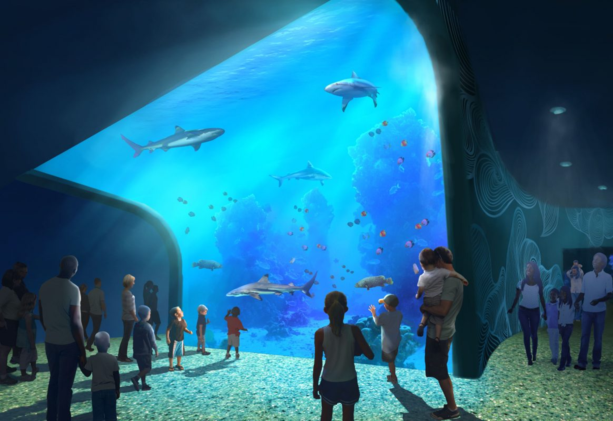{fig-align="center" width="80%"}
:::
:::::

## Limitations of Financial and Human Resources Raise Additional Questions

-   Conservation resources are limited.

-   Decisions must be made about which species and ecosystems to prioritize.

-   Should conservation focus on species humans find appealing or those with the greatest ecological importance?

-   How do scientists determine which habitats most need protection?

-   How should limited conservation resources be allocated among biodiversity hotspots?

# Conserving Ecosystems

## Role and Importance of Forest Ecosystems

::::: columns
::: {.column width="50%"}
-   [Forests]{.keyword} provide critical [ecosystem services]{.keyword}, including carbon storage, climate regulation, and water cycling
-   Forests support a large share of terrestrial [biodiversity]{.keyword}, provide habitat for many species
-   Hundreds of millions of people live in or near forests, and over **1 billion people** rely on them for food, fuel, and livelihoods
-   Contribute to human well-being, including **clean water, air quality, and disease regulation**
-   Important source of **medicines and bioactive compounds** used in modern and traditional healthcare
:::

::: {.column width="50%"}

:::
:::::

## What Are the Major Threats to Forest Ecosystems?

::::: columns
::: {.column width="50%"}
-   Forests have tremendous economic value.
-   Scientists and economists have estimated the economic value of major ecosystem services that the world’s forests and other ecosystems provide.
-   Forests are most threatened by:
    -   Unsustainable cutting and burning of vegetation
    -   The effects of climate change
        -   (changing fire regimes)
:::

::: {.column width="50%"}

:::
:::::

## Ecological Succession in Forests

::::: columns
::: {.column width="50%"}
-   [ecological succession]{.keyword}: gradual change in species composition over time after disturbance
-   [primary succession]{.keyword}: begins on bare substrate (e.g., after glaciation or volcanic activity)
-   [secondary succession]{.keyword}: recovery after disturbance with soil remaining (e.g., fire, logging)
-   Early stages dominated by fast-growing species; later stages by long-lived, shade-tolerant species
-   Leads to more complex structure and increased biodiversity over time
:::

::: {.column width="50%"}
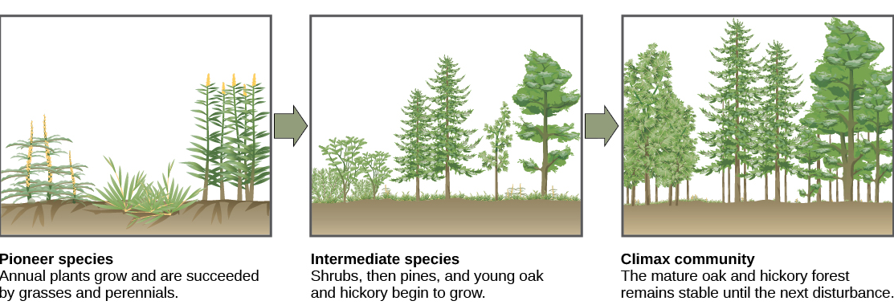{width="1025"}
:::
:::::

## Forest Age and Successional Stages

::::: columns
::: {.column width="50%"}
-   [old-growth forest]{.keyword} (primary forest): little or no major disturbance for long periods (\~200+ years)

-   Structurally complex with large, old trees, multiple layers, and high habitat diversity

-   Acts as a reservoir of [biodiversity]{.keyword}, supporting many specialized species

-   [second-growth forest]{.keyword}: regrows after disturbance through [secondary succession]{.keyword}

-   Develops following logging, agriculture, fire, or storms

-   Typically younger, less structurally complex, and lower biodiversity than old-growth forests
:::

::: {.column width="50%"}
{width="1167"}
:::
:::::

## [Tree Plantation]{.keyword}

::::: columns
::: {.column width="50%"}
-   A managed forest that contains only one or two species of trees that are all the same age.
-   Also known as a tree farm or commercial forest.
-   Old-growth or second-growth forests are often cleared for timber and replaced by tree plantations.
-   Trees grown in plantations are usually harvested by clear-cutting as soon as they become commercially valuable. Land is then replanted and clear-cut again in a regular cycle.
-   Some limited ecological benefit for some species. Most forest specialists will not live here.
-   Lower biodiversity and ecosystem services than natural forest
:::

::: {.column width="50%"}

:::
:::::

## Tree Harvest Strategies

::::: columns
::: {.column width="50%"}
-   Harvest methods vary in **intensity and ecological impact**
-   [selective cutting]{.keyword}: removes individual or small groups of trees
    -   Lower impact; maintains forest structure and biodiversity
-   [shelterwood cutting]{.keyword}: removes trees in stages
    -   Balances timber harvest with natural regeneration
-   [clear-cutting]{.keyword}: removes all trees from an area
    -   Most efficient, but causes high habitat loss and ecosystem disturbance
-   More info
:::

::: {.column width="50%"}
](https://canadasforestindustry.weebly.com/uploads/4/6/0/0/46008539/5040999_orig.png)
:::
:::::

## Fires and Forest Ecosystems

::::: columns
::: {.column width="50%"}
-   Fire can **release nutrients, reduce fuel buildup, and stimulate regeneration**
-   Severe fires can **remove vegetation, increase erosion, and alter succession pathways**
-   Types of fires
    -   [ground fires]{.keyword}: burn organic material below the surface (roots, peat). Slow-moving, difficult to detect and extinguish

    -   [surface fires]{.keyword}: burn leaf litter and low vegetation. Often low intensity; can recycle nutrients and maintain ecosystem health

    -   [crown fires]{.keyword}: burn through tree canopies. High intensity; spread rapidly and cause severe ecosystem damage
:::

::: {.column width="50%"}
](images/clipboard-3125008650.png)
:::
:::::

## Deforestation and Loss of Intact Forests

::::: columns
::: {.column width="50%"}
-   [deforestation]{.keyword}: large-scale removal of forests for agriculture, grazing, and development
-   [intact forest landscapes]{.keyword}: large, continuous areas of natural forest with **minimal human disturbance**
-   Since 2000, about **12% of intact forest landscapes have been lost globally**
-   Loss is concentrated in tropical regions and parts of the boreal zone
-   Reduces [biodiversity]{.keyword}, carbon storage, and increases erosion and watershed degradation
:::

::: {.column width="50%"}
).](images/clipboard-1360929059.png){fig-alt="World map showing intact forest landscapes in green and areas of forest loss or disturbance in yellow to red, with large intact regions in the Amazon, central Africa, and northern boreal forests."}
:::
:::::

## Case Study: Forest Disturbance in the Brazilian Legal Amazon

::::: columns
::: {.column width="50%"}
-   From 2000–2013, the main driver of forest loss was **agroindustrial clearing for pasture** (\~63% of total loss)
-   Other drivers included **small-scale clearing** (\~12%) and **cropland expansion** (\~9%)
-   By 2013, disturbance in nonprimary forests plus fire and logging made up \~53% of total loss, rivaling primary-forest deforestation
-   Fire disturbance peaked in 2005, 2007, and 2010 during major droughts
-   Focusing only on primary deforestation misses a growing share of forest degradation and carbon loss
:::

::: {.column width="50%"}
 (Fig. 1).](https://www.science.org/cms/10.1126/sciadv.1601047/asset/e3ff993f-b510-417d-83b3-01f0b3599918/assets/graphic/1601047-f1.jpeg){fig-alt="Stacked bar chart comparing 2000–2013 tree cover loss across primary forests, secondary forests, natural woodlands, secondary woodlands, and plantations in the Brazilian Legal Amazon. Loss in primary forests is largest and is dominated by clearing for pasture, with additional contributions from cropland conversion, small-scale clearing, fire, and selective logging." fig-align="center" width="50%"}
:::
:::::

## Case Study: Forest Loss and Regrowth in the United States

::::: columns
::: {.column width="50%"}
-   Since 1600, much of the eastern U.S. was cleared for **agriculture, timber, and settlement**
-   Forest cover declined sharply by the early 1900s, with most original forests removed or fragmented
-   Since then, forest cover has **partially recovered** as agriculture shifted west and land was abandoned
-   Today, many U.S. forests are **second-growth or managed forests**, not original old-growth systems
-   Regrowth has restored tree cover, but forests often differ in **structure, biodiversity, and ecological function**
:::

::: {.column width="50%"}
 and Earth System Science Data.](images/clipboard-70058470.png){fig-alt="Series of maps of the United States from 1630 to 2020 showing land cover change, with forests declining over time due to agriculture and urbanization, followed by partial regrowth of forests in some regions, especially in the eastern U.S." fig-align="center" width="80%"}
:::
:::::

## Strategies for Sustaining Terrestrial Biodiversity

Some strategies include:

-   Protect [species]{.keyword} and prevent extinctions through conservation and management
-   Expand and connect [protected areas]{.keyword} (parks, reserves, wildlife corridors)
-   Identify and prioritize [biodiversity hotspots]{.keyword} for conservation
-   Reduce habitat loss by limiting deforestation, grassland conversion, and fragmentation
-   Restore degraded ecosystems through [ecological restoration]{.keyword} and rehabilitation

## Protecting Biodiversity Hotspots

::::: columns
::: {.column width="50%"}
-   [biodiversity hotspots]{.keyword}: regions with high species richness and high levels of endemism under threat
-   Cover only \~2–3% of Earth’s land surface but contain a large share of global plant and vertebrate diversity
-   Many hotspots face intense pressure from habitat loss and human development
-   A relatively small proportion is effectively protected and managed
-   Targeted conservation in hotspots can protect a disproportionate share of global biodiversity
:::

::: {.column width="50%"}
{fig-alt="World map highlighting major biodiversity hotspots, with shaded regions across tropical forests, Mediterranean climates, and island regions where exceptionally high numbers of endemic plant and animal species occur but are threatened by habitat loss."}
:::
:::::

## Restoring and Rebuilding Ecosystems

-   Repair ecosystem damage and support [ecological succession]{.keyword} through different approaches
    -   [ecological restoration]{.keyword}: return ecosystems as close as possible to their original state
    -   [rehabilitation]{.keyword}: improve ecosystem function without fully restoring original conditions
    -   [replacement]{.keyword}: convert degraded systems into productive uses (e.g., pasture or managed forest)
    -   [artificial ecosystems]{.keyword}: create human-designed systems to provide specific ecosystem services
-   These approaches vary in how much **biodiversity and ecosystem function** they recover

## Human Activities Are Threatening Aquatic Biodiversity

::::: columns
::: {.column width="50%"}
-   Human activities have degraded [aquatic ecosystems]{.keyword}, including wetlands, coral reefs, mangroves, and the ocean floor
-   [freshwater systems]{.keyword} are altered by dams, water withdrawal, pollution, and land use change
-   [bottom trawling]{.keyword} damages seafloor habitats by dragging heavy nets across the ocean floor
-   Coastal development, pollution, and climate change are major drivers of aquatic biodiversity loss
:::

::: {.column width="50%"}
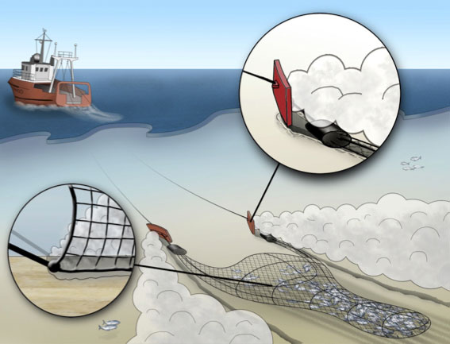{fig-align="center" width="80%"}
:::
:::::

## Ocean Acidification

::::: columns
::: {.column width="50%"}
-   Oceans absorb about **25% of human CO₂ emissions**
-   Dissolved CO₂ forms carbonic acid, releasing hydrogen ions (H⁺)
-   Increased H⁺ lowers [pH]{.keyword}, making seawater more acidic
-   Ocean chemistry varies regionally, with lower pH in some upwelling areas
-   Ongoing acidification is a major threat to marine ecosystems
:::

::: {.column width="50%"}

:::
:::::

## Ocean Acidification Impacts

::::: columns
::: {.column width="50%"}
-   Acidification reduces [carbonate ions]{.keyword} (CO₃²⁻) needed for shell formation
-   Many organisms rely on [calcium carbonate]{.keyword} (CaCO₃) for shells and skeletons
-   Affected groups include corals, shellfish, and some plankton
-   Lower carbonate availability slows growth and weakens structures
-   In more acidic conditions, shells and coral reefs may begin to dissolve
:::

::: {.column width="50%"}
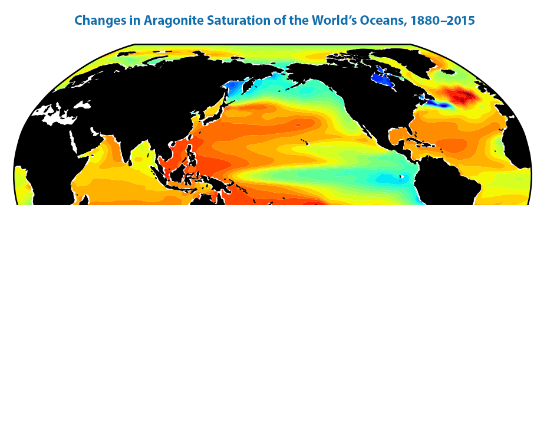
:::
:::::

## Problems That Threaten Aquatic Biodiversity

::::: columns
::: {.column width="50%"}
-   Introduction of invasive species can threaten aquatic ecosystems.

-   Lionfish consume many reef fish species, including parrotfish that normally control algae on reefs.

-   Where lionfish dominate, coral reefs may be severely threatened.

-   Lionfish have invaded eastern coastal waters of North America and have few natural predators.
:::

::: {.column width="50%"}
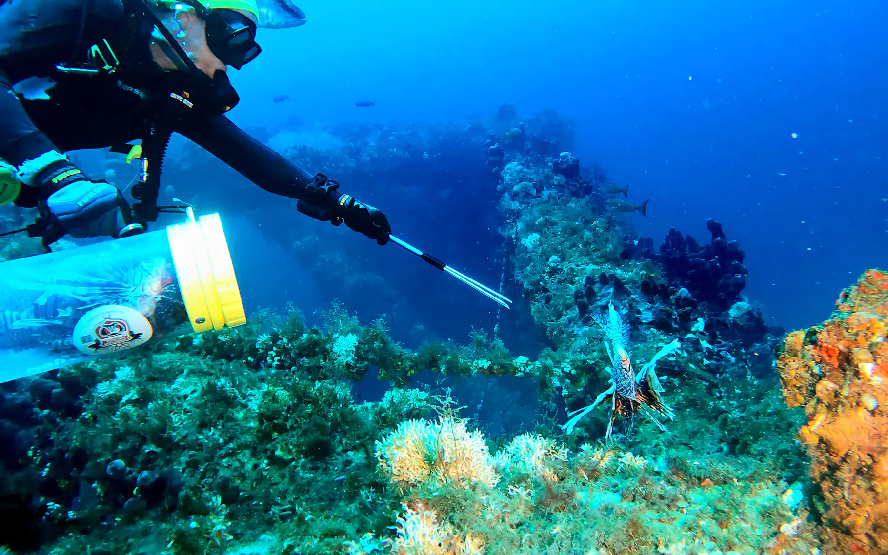
:::
:::::

## Overfishing: Gone Fishing, Fish Gone

::::: columns
::: {.column width="50%"}
-   Fish provide about 20% of the world’s animal protein.

-   A **fishery** is a concentration of wild aquatic species suitable for commercial harvesting.

-   Industrial fishing fleets use GPS, sonar, huge nets, long fishing lines, aircraft, and factory ships.

-   Overfishing:

    -   Reduces marine biodiversity
    -   Degrades ecosystem services
:::

::: {.column width="50%"}
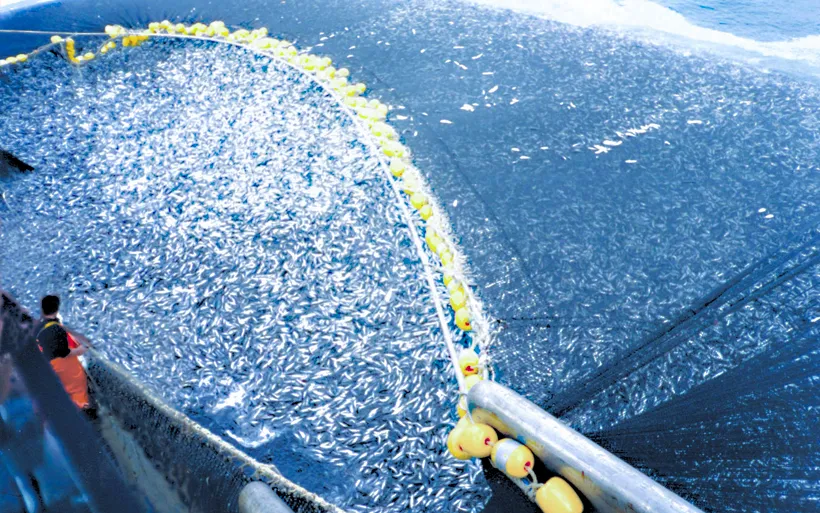
:::
:::::

## Overfishing: Gone Fishing, Fish Gone

::::: columns
::: {.column width="50%"}
-   About 4.4 million fishing boats harvest fish worldwide.

-   Approximately:

    -   57% of fisheries are fully exploited
    -   30% are overexploited or depleted

-   Overharvesting has caused collapse of several major fisheries.

-   Large commercially valuable fish such as cod, marlin, swordfish, and tuna are becoming scarce.
:::

::: {.column width="50%"}
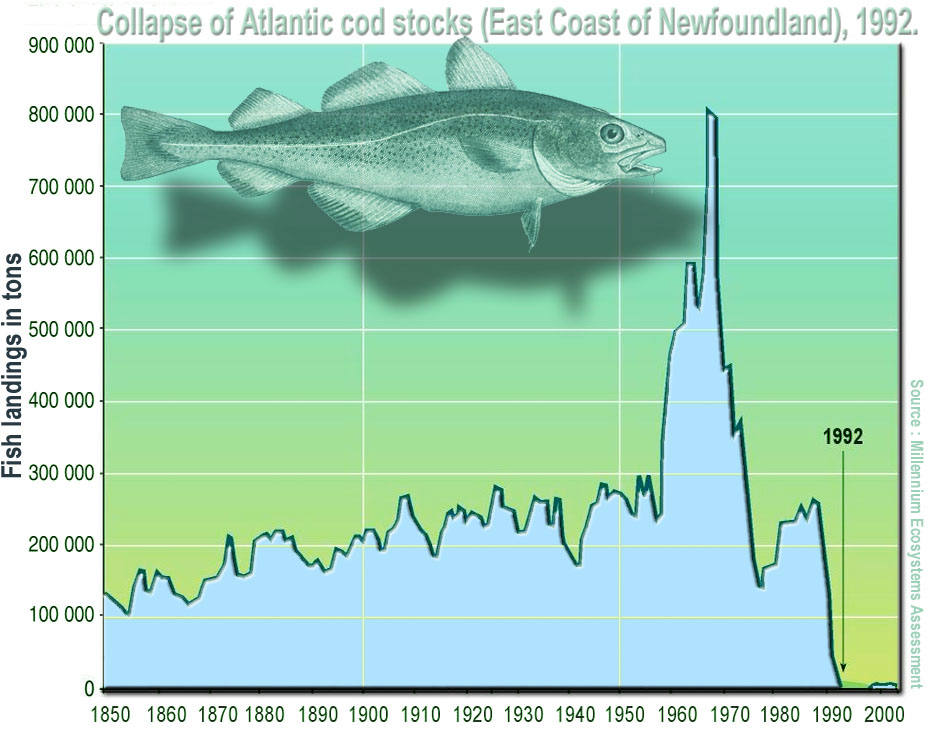
:::
:::::

## Overfishing: Gone Fishing, Fish Gone

::::: columns
::: {.column width="50%"}
-   Fishing industries are increasingly targeting smaller species lower in the food web.

-   Examples include:

    -   Anchovies
    -   Herring
    -   Sardines
    -   Krill

-   Much of this catch becomes fishmeal for aquaculture.

-   This reduces food availability for larger marine species and disrupts marine ecosystems.
:::

::: {.column width="50%"}
:::
:::::

## Case Study: Upsetting Marine Ecosystems—Jellyfish Invasions

::::: columns
::: {.column width="50%"}
-   Jellyfish blooms can cause:
    -   Beach closures
    -   Disruption of fishing operations
    -   Damage to coastal fish farms
-   Human activities that promote jellyfish growth include:
    -   Removing their predators
    -   Reducing competitors
    -   Ocean acidification
:::

::: {.column width="50%"}

:::
:::::

## How Can We Sustain Aquatic Biodiversity?

::::: columns
::: {.column width="50%"}
-   Strategies include:
    -   Establishing marine protected areas
    -   Managing coastal development
    -   Reducing water pollution
    -   Preventing overfishing
:::

::: {.column width="50%"}
-   Protection is difficult because:
    -   Fish prints and ecological footprints are expanding
    -   Ocean damage is often not visible
    -   The ocean is often viewed as an inexhaustible resource
    -   Much of the ocean lies outside national jurisdiction
:::
:::::

## Sustaining Aquatic Biodiversity: An Ecosystem Approach

Key strategies:

-   Map and monitor aquatic biodiversity to identify priority areas
-   Protect biodiversity hotspots and expand marine protected areas
-   Establish large, fully protected marine reserves to support recovery
-   Restore degraded ecosystems (e.g., coral reefs, wetlands) through ecological restoration
-   Reduce overfishing, pollution, and habitat destruction
-   Support sustainable livelihoods to reduce pressure on aquatic ecosystems
