# Food Security and Human Nutrition

## Food security means reliable access to sufficient, nutritious food

::::: columns
::: {.column width="50%"}
-   [Food security]{.keyword}: consistent access to enough safe, nutritious food for a healthy life
-   Built on four pillars: [availability]{.keyword}, [access]{.keyword}, [utilization]{.keyword}, [stability]{.keyword}
    -   Availability: enough food is produced and supplied at regional/global scales
    -   Access: people have economic and physical ability to obtain food
    -   Utilization: food provides adequate nutrition (diet quality, health, sanitation)
    -   Stability: access and supply are reliable over time (no seasonal or crisis disruption)
:::

::: {.column width="50%"}
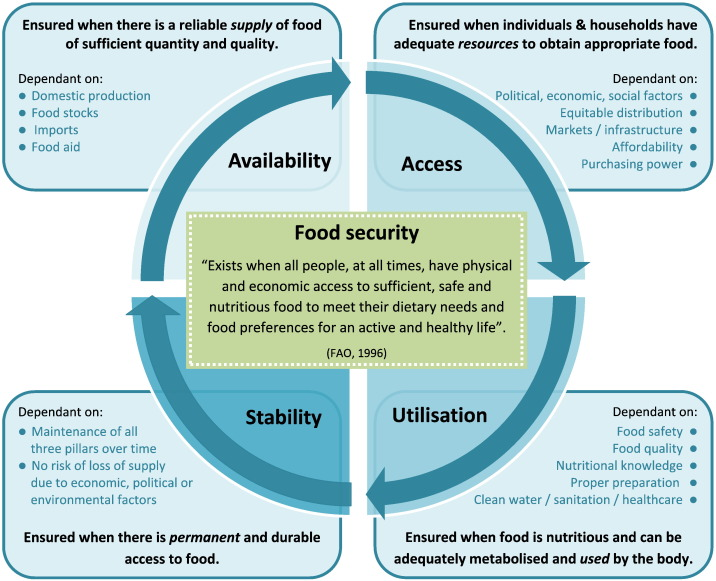
:::
:::::

::: notes
-   Image from <https://publichealthnotes.com/food-security-determinants-and-urbanization/>
:::

## Food security is not just about producing enough food

::::: columns
::: {.column width="50%"}
-   Global food production is currently sufficient to feed the population
-   Food insecurity persists due to uneven [distribution]{.keyword} of food across regions
-   [Affordability]{.keyword}: low-income households cannot purchase sufficient or nutritious food
-   Infrastructure and markets influence who gets food and when
-   Political instability and conflict disrupt food systems
:::

::: {.column width="50%"}
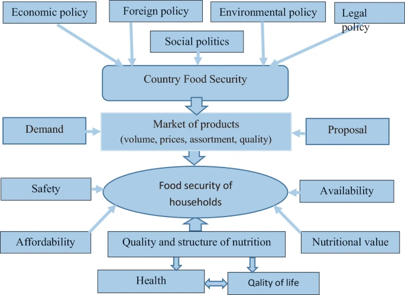
:::
:::::

## Poverty is the primary driver of food insecurity

::::: columns
::: {.column width="50%"}
-   [Poverty]{.keyword} limits purchasing power and access to diverse diets
-   Low-income households prioritize calories over nutrition
-   Occurs in both developing and developed countries
-   [Food deserts]{.keyword}: areas lacking access to fresh, healthy foods
-   Economic inequality drives differences in diet quality and health
:::

::: {.column width="50%"}
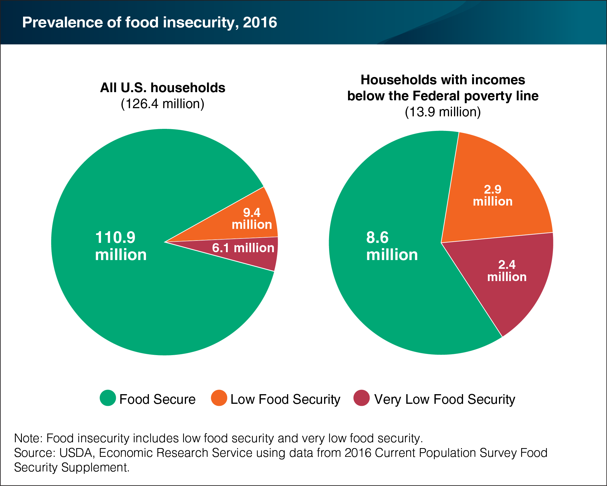
:::
:::::

::: notes
Source: <https://www.ers.usda.gov/data-products/charts-of-note/chart-detail?chartId=85246>
:::

## Food insecurity includes multiple forms of malnutrition

::::: columns
::: {.column width="50%"}
-   [Undernutrition]{.keyword}: insufficient calories to meet energy needs
-   [Malnutrition]{.keyword}: imbalance or lack of essential nutrients
-   [Micronutrient deficiency]{.keyword}: lack of vitamins/minerals despite adequate calories
-   [Overnutrition]{.keyword}: excess calorie intake leading to obesity
-   These conditions can coexist within the same population
:::

::: {.column width="50%"}
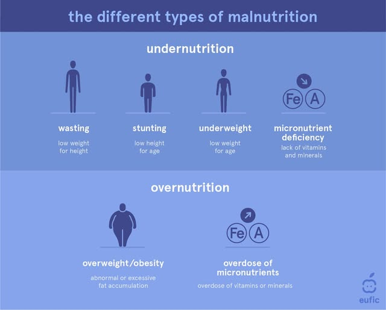
:::
:::::

## Obesity reflects a global shift in food systems

::::: columns
::: {.column width="50%"}
-   Increased availability of processed, energy-dense foods
-   High intake of sugar, fat, and refined carbohydrates
-   Linked to [noncommunicable diseases]{.keyword} (diabetes, heart disease)
-   Occurs alongside hunger in many countries (nutrition transition)
-   Indicates systemic imbalance in global food systems
:::

::: {.column width="50%"}
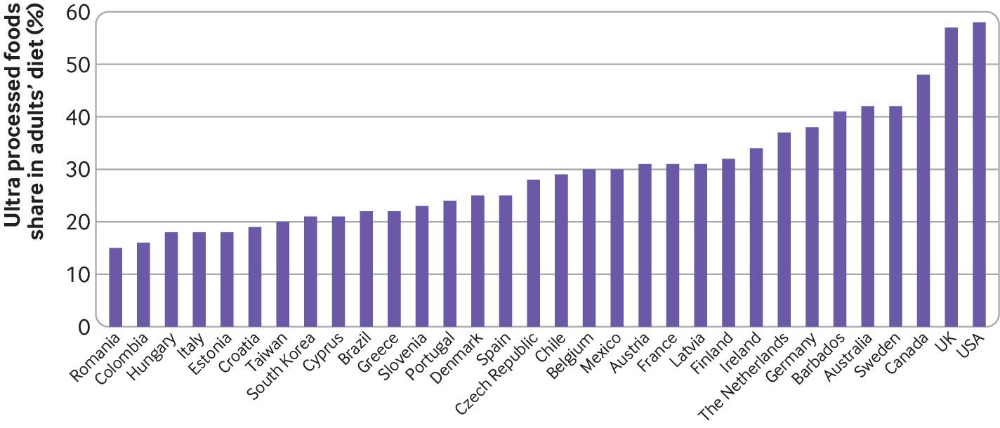{fig-align="center" width="60%"}

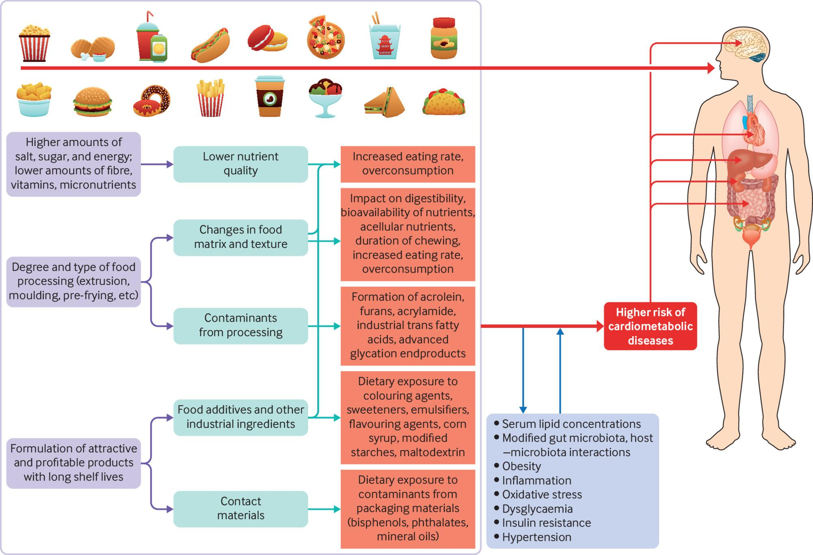{fig-align="center" width="60%"}
:::
:::::

# Modern Food Production and the Green Revolution

## Modern food systems rely on a few major production systems

::::: columns
::: {.column width="50%"}
-   [Croplands]{.keyword}: grains like rice, wheat, and corn dominate diets
-   [Livestock systems]{.keyword}: meat, dairy, and eggs from animals
-   [Fisheries and aquaculture]{.keyword}: capture and farming of aquatic species
-   Global diets rely heavily on a few staple crops
-   Low diversity reduces resilience to pests and environmental change
:::

::: {.column width="50%"}
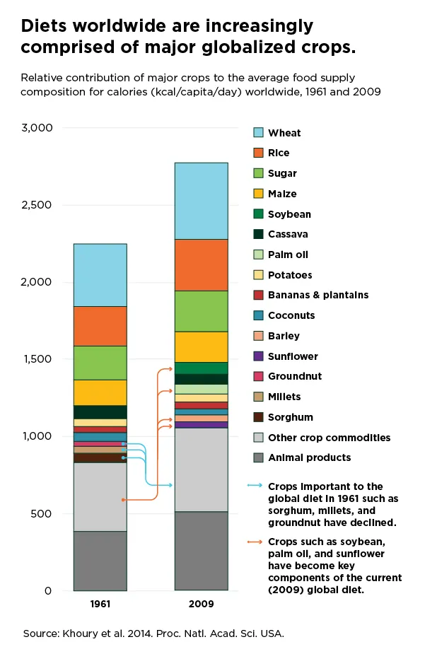{fig-align="center" width="455"}
:::
:::::

## Industrial agriculture maximizes yield through intensive inputs

::::: columns
::: {.column width="50%"}
-   [Industrial agriculture]{.keyword}: high-input, large-scale farming systems
-   Uses [monoculture]{.keyword}: growing a single crop over large areas
-   Relies on synthetic fertilizers, pesticides, and irrigation
-   Mechanization increases efficiency but requires fossil fuels
-   Produces most global food but creates dependencies
:::

::: {.column width="50%"}
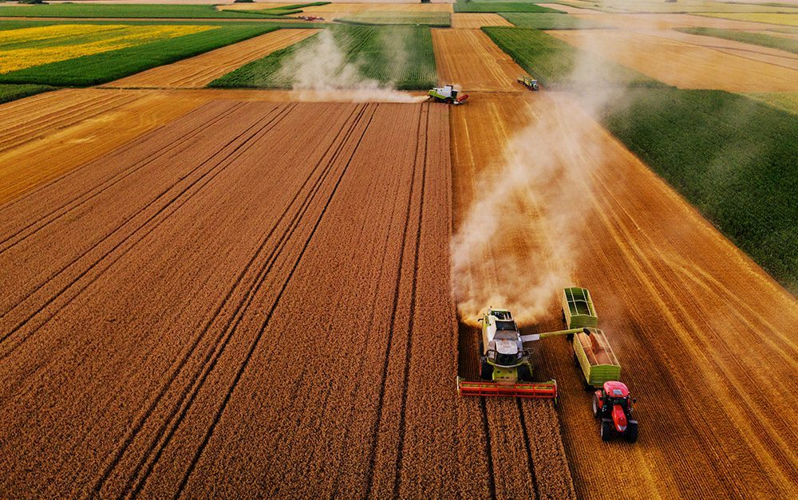
:::
:::::

## Industrial agriculture increases efficiency but reduces resilience

::::: columns
::: {.column width="50%"}
-   Monocultures are vulnerable to pests and disease outbreaks
-   High reliance on external inputs (fertilizer, water, energy)
-   Loss of genetic and species diversity
-   Economies of scale favor large agribusinesses
-   Tradeoff: high yield vs ecological stability
:::

::: {.column width="50%"}
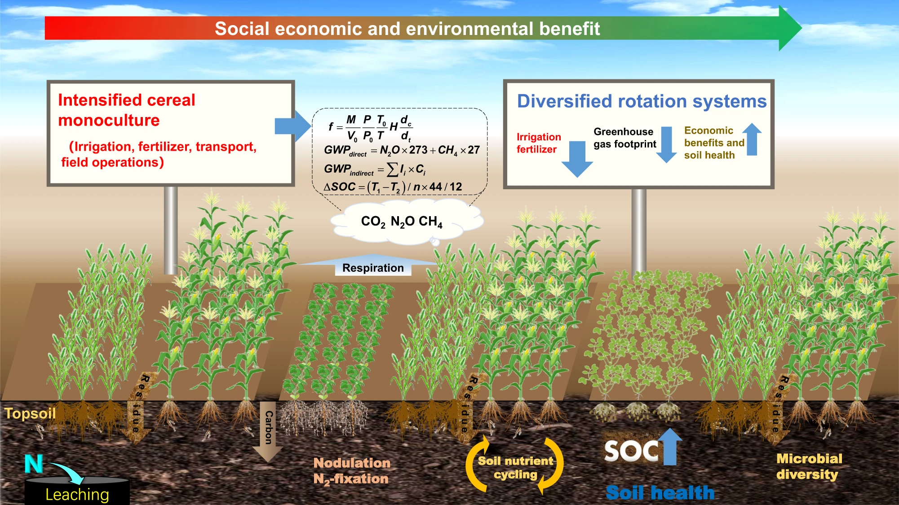
:::
:::::

## The Green Revolution transformed global agriculture

::::: columns
::: {.column width="50%"}
-   [Green Revolution]{.keyword}: mid-20th century increase in agricultural productivity
-   Introduction of [high-yield varieties]{.keyword} of major crops
-   Expansion of irrigation infrastructure
-   Increased use of fertilizers and pesticides
-   Mechanization of planting, harvesting, and processing
:::

::: {.column width="50%"}
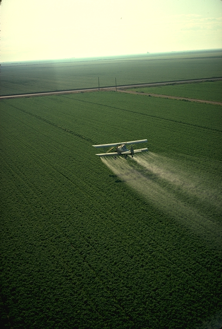
:::
:::::

## The Green Revolution dramatically increased food production

::::: columns
::: {.column width="50%"}
-   Global grain production increased substantially
-   Supported rapid human population growth
-   Reduced famine in many regions
-   Increased efficiency per unit land
-   Helped stabilize food supplies globally
:::

::: {.column width="50%"}
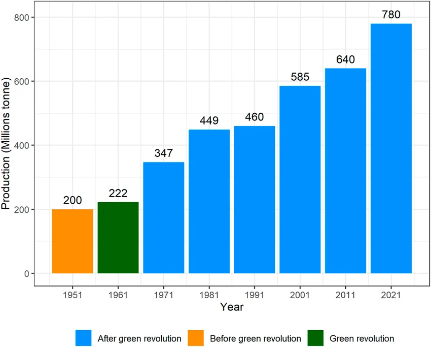
:::
:::::

## The Green Revolution created new environmental and social challenges

-   Increased dependence on water, fertilizers, and pesticides
-   Environmental degradation (soil, water, biodiversity)
-   Benefits unevenly distributed across regions
-   Yield growth is slowing in many areas
-   Raises questions about long-term sustainability

# Environmental Costs of Food Production

## Agriculture has a large environmental footprint

-   Uses \~70% of global freshwater withdrawals
-   Occupies a large proportion of ice-free land
-   Requires significant [energy]{.keyword} inputs for production and transport
-   Contributes to greenhouse gas emissions
-   Major driver of environmental change globally

## Soil erosion removes critical resources for agriculture

-   [Topsoil]{.keyword}: nutrient-rich upper layer essential for plant growth
-   Erosion removes nutrients and organic matter
-   Caused by plowing, deforestation, overgrazing
-   Reduces crop productivity over time
-   Soil formation is much slower than soil loss

## Desertification degrades productive land into arid systems

-   [Desertification]{.keyword}: transformation of fertile land into desert-like conditions
-   Driven by overgrazing, deforestation, and climate change
-   Reduces soil productivity and water retention
-   Common in dryland regions
-   Leads to displacement of human populations

## Irrigation boosts yields but can degrade soil and water systems

-   [Irrigation]{.keyword}: artificial addition of water to crops
-   Enables agriculture in dry regions
-   Leads to [salinization]{.keyword}: salt buildup in soils
-   Depletes groundwater resources
-   Alters natural water cycles and availability

## Agriculture contributes to water pollution

-   Fertilizer runoff introduces excess nitrogen and phosphorus
-   Causes [eutrophication]{.keyword}: nutrient enrichment of water bodies
-   Leads to algal blooms and oxygen depletion (dead zones)
-   Pesticides contaminate surface and groundwater
-   Pollution affects ecosystems and drinking water supplies

## Agriculture drives biodiversity loss at multiple levels

-   Conversion of natural habitats to farmland
-   Monocultures reduce species diversity
-   Loss of [agrobiodiversity]{.keyword}: diversity within agricultural systems
-   Decline of pollinators and beneficial species
-   Reduced ecosystem resilience and stability

## Meat production has high environmental costs per calorie

-   Requires large inputs of feed, land, and water
-   Produces methane and other greenhouse gases
-   [CAFOs]{.keyword}: concentrated animal feeding operations
-   Generate large amounts of waste and pollution
-   Less efficient than plant-based food production

# Pests, Pesticides, and Biotechnology

## Pests reduce agricultural productivity and require management

-   [Pests]{.keyword}: organisms that damage crops or reduce yield
-   Include insects, weeds, fungi, and pathogens
-   Can significantly reduce food production
-   Management is essential for stable yields
-   Definitions depend on human goals and context

## Pesticides provide benefits but carry ecological risks

-   [Pesticides]{.keyword}: chemicals used to control pests
-   Increase crop yields and reduce losses
-   Can harm non-target organisms (pollinators, predators)
-   Contaminate soil and water
-   Pose risks to human health

## Pesticide resistance creates long-term challenges

-   Some pests survive pesticide application
-   Survivors reproduce and pass resistance traits
-   Leads to [pesticide resistance]{.keyword}
-   Requires stronger or more frequent chemical use
-   Creates a cycle known as the [pesticide treadmill]{.keyword}

## Persistent organic pollutants accumulate in food webs

-   [POPs]{.keyword}: long-lasting, toxic chemicals (e.g., DDT)
-   Persist in environment for years or decades
-   [Bioaccumulation]{.keyword}: buildup in individual organisms
-   [Biomagnification]{.keyword}: increasing concentration up food chains
-   Linked to health and ecological impacts

## Biotechnology allows targeted changes to crop traits

-   [Biotechnology]{.keyword}: use of biological systems to improve crops
-   Includes traditional breeding and [genetic engineering]{.keyword}
-   Can introduce specific genes for desired traits
-   More precise than traditional breeding
-   Expands tools available for agriculture

## Genetically engineered crops offer both benefits and limitations

-   Can improve pest resistance and reduce pesticide use
-   May enhance nutritional content (e.g., golden rice)
-   Limited evidence of increased yield rates
-   Potential ecological risks (gene flow, resistance)
-   Require ongoing monitoring and evaluation

# Sustainable Agriculture and Solutions

## Sustainable agriculture balances productivity with environmental health

-   [Sustainable agriculture]{.keyword}: long-term, integrated food production system
-   Aims to meet human needs while protecting ecosystems
-   Balances environmental, economic, and social goals
-   Reduces reliance on nonrenewable inputs
-   Focuses on resilience and long-term viability

## Soil conservation practices maintain long-term productivity

-   Reduce erosion and nutrient loss
-   Techniques include contour farming, terracing, cover crops
-   Maintain soil structure and fertility
-   Improve water retention
-   Essential for sustainable food systems

## Integrated pest management reduces reliance on chemicals

-   [IPM]{.keyword}: combination of biological, cultural, and chemical methods
-   Focuses on managing, not eliminating pests
-   Uses pesticides as a last resort
-   Maintains ecological balance
-   Reduces environmental and health risks

## Biological control uses natural predators to manage pests

-   Introduces or supports natural enemies of pests
-   Examples: ladybugs controlling aphids
-   Reduces need for chemical pesticides
-   Requires understanding of ecological interactions
-   Can have unintended ecological effects

## Crop rotation and intercropping improve system resilience

-   [Crop rotation]{.keyword}: alternating crops to break pest cycles
-   [Intercropping]{.keyword}: growing multiple crops together
-   Increases biodiversity and nutrient cycling
-   Reduces disease and pest outbreaks
-   Mimics natural ecosystem processes

## Organic and low-input systems reduce environmental impacts

-   Avoid synthetic fertilizers and pesticides
-   Enhance soil health and biodiversity
-   Reduce pollution and fossil fuel use
-   Often lower yields but more sustainable long-term
-   Increasing adoption globally

## Feeding a growing population requires integrated solutions

-   Increase production while reducing environmental harm
-   Improve food distribution and access
-   Reduce waste and shift consumption patterns
-   Balance technological and ecological approaches
-   Address social and economic inequalities
