# Food Security and Human Nutrition

## Food security means reliable access to sufficient, nutritious food

::::: columns
::: {.column width="50%"}
-   [Food security]{.keyword}: consistent access to enough safe, nutritious food for a healthy life
-   Built on four pillars: [availability]{.keyword}, [access]{.keyword}, [utilization]{.keyword}, [stability]{.keyword}
    -   Availability: enough food is produced and supplied at regional/global scales
    -   Access: people have economic and physical ability to obtain food
    -   Utilization: food provides adequate nutrition (diet quality, health, sanitation)
    -   Stability: access and supply are reliable over time (no seasonal or crisis disruption)
:::

::: {.column width="50%"}

:::
:::::

::: notes
-   Image from <https://publichealthnotes.com/food-security-determinants-and-urbanization/>
:::

## Food security is not just about producing enough food

::::: columns
::: {.column width="50%"}
-   Global food production is currently sufficient to feed the population
-   Food insecurity persists due to uneven [distribution]{.keyword} of food across regions
-   [Affordability]{.keyword}: low-income households cannot purchase sufficient or nutritious food
-   Infrastructure and markets influence who gets food and when
-   Political instability and conflict disrupt food systems
:::

::: {.column width="50%"}

:::
:::::

## Poverty is the primary driver of food insecurity

::::: columns
::: {.column width="50%"}
-   [Poverty]{.keyword} limits purchasing power and access to diverse diets
-   Low-income households prioritize calories over nutrition
-   Occurs in both developing and developed countries
-   [Food deserts]{.keyword}: areas lacking access to fresh, healthy foods
-   Economic inequality drives differences in diet quality and health
:::

::: {.column width="50%"}

:::
:::::

::: notes
Source: <https://www.ers.usda.gov/data-products/charts-of-note/chart-detail?chartId=85246>
:::

## Food insecurity includes multiple forms of malnutrition

::::: columns
::: {.column width="50%"}
-   [Undernutrition]{.keyword}: insufficient calories to meet energy needs
-   [Malnutrition]{.keyword}: imbalance or lack of essential nutrients
-   [Micronutrient deficiency]{.keyword}: lack of vitamins/minerals despite adequate calories
-   [Overnutrition]{.keyword}: excess calorie intake leading to obesity
-   These conditions can coexist within the same population
:::

::: {.column width="50%"}

:::
:::::

## Obesity reflects a global shift in food systems

::::: columns
::: {.column width="50%"}
-   Increased availability of processed, energy-dense foods
-   High intake of sugar, fat, and refined carbohydrates
-   Linked to [noncommunicable diseases]{.keyword} (diabetes, heart disease)
-   Occurs alongside hunger in many countries (nutrition transition)
-   Indicates systemic imbalance in global food systems
:::

::: {.column width="50%"}
{fig-align="center" width="60%"}

{fig-align="center" width="60%"}
:::
:::::

# Modern Food Production and the Green Revolution

## Modern food systems rely on a few major production systems

::::: columns
::: {.column width="50%"}
-   [Croplands]{.keyword}: grains like rice, wheat, and corn dominate diets
-   [Livestock systems]{.keyword}: meat, dairy, and eggs from animals
-   [Fisheries and aquaculture]{.keyword}: capture and farming of aquatic species
-   Global diets rely heavily on a few staple crops
-   Low diversity reduces resilience to pests and environmental change
:::

::: {.column width="50%"}
{fig-align="center" width="455"}
:::
:::::

## Industrial agriculture maximizes yield through intensive inputs

::::: columns
::: {.column width="50%"}
-   [Industrial agriculture]{.keyword}: high-input, large-scale farming systems
-   Uses [monoculture]{.keyword}: growing a single crop over large areas
-   Relies on synthetic fertilizers, pesticides, and irrigation
-   Mechanization increases efficiency but requires fossil fuels
-   Produces most global food but creates dependencies
:::

::: {.column width="50%"}

:::
:::::

## Industrial agriculture increases efficiency but reduces resilience

::::: columns
::: {.column width="50%"}
-   Monocultures are vulnerable to pests and disease outbreaks
-   High reliance on external inputs (fertilizer, water, energy)
-   Loss of genetic and species diversity
-   Economies of scale favor large agribusinesses
-   Tradeoff: high yield vs ecological stability
:::

::: {.column width="50%"}

:::
:::::

## The Green Revolution transformed global agriculture

::::: columns
::: {.column width="50%"}
-   [Green Revolution]{.keyword}: mid-20th century increase in agricultural productivity
-   Introduction of [high-yield varieties]{.keyword} of major crops
-   Expansion of irrigation infrastructure
-   Increased use of fertilizers and pesticides
-   Mechanization of planting, harvesting, and processing
:::

::: {.column width="50%"}

:::
:::::

## The Green Revolution dramatically increased food production

::::: columns
::: {.column width="50%"}
-   Global grain production increased substantially
-   Supported rapid human population growth
-   Reduced famine in many regions
-   Increased efficiency per unit land
-   Helped stabilize food supplies globally
:::

::: {.column width="50%"}

:::
:::::

## The Green Revolution created new environmental and social challenges

::::: columns
::: {.column width="50%"}
-   Increased dependence on water, fertilizers, and pesticides
-   Environmental degradation (soil, water, biodiversity)
-   Benefits unevenly distributed across regions
-   Yield growth is slowing in many areas
-   Raises questions about long-term sustainability
:::

::: {.column width="50%"}
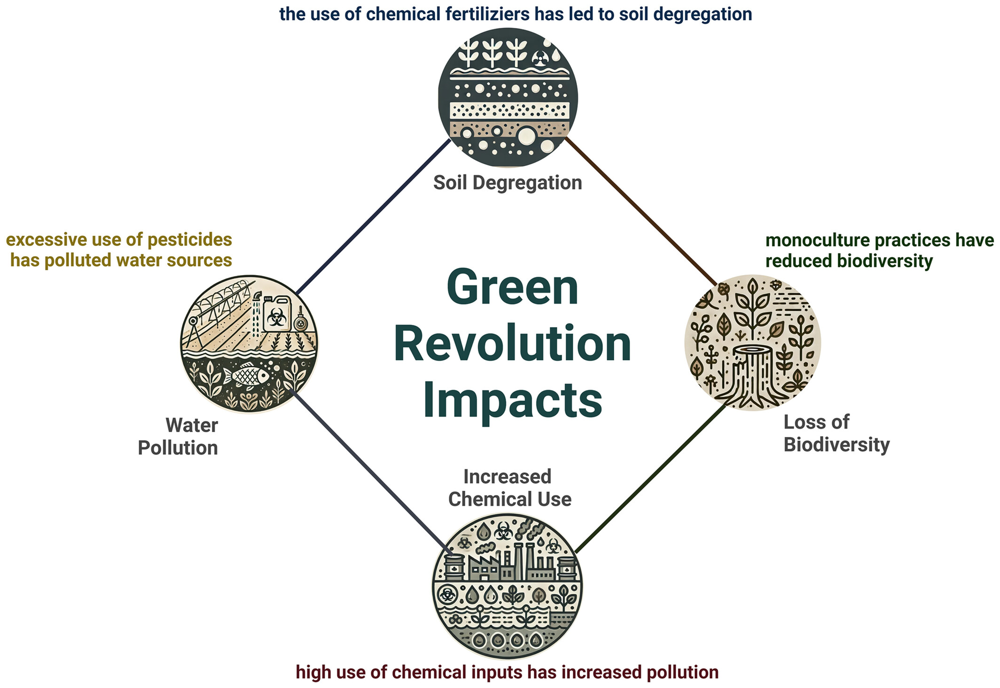
:::
:::::

# Environmental Costs of Food Production

## Agriculture has a large environmental footprint

::::: columns
::: {.column width="50%"}
-   Uses \~70% of global freshwater withdrawals
-   Occupies a large proportion of ice-free land
-   Requires significant [energy]{.keyword} inputs for production and transport
-   Contributes to greenhouse gas emissions
-   Major driver of environmental change globally
:::

::: {.column width="50%"}
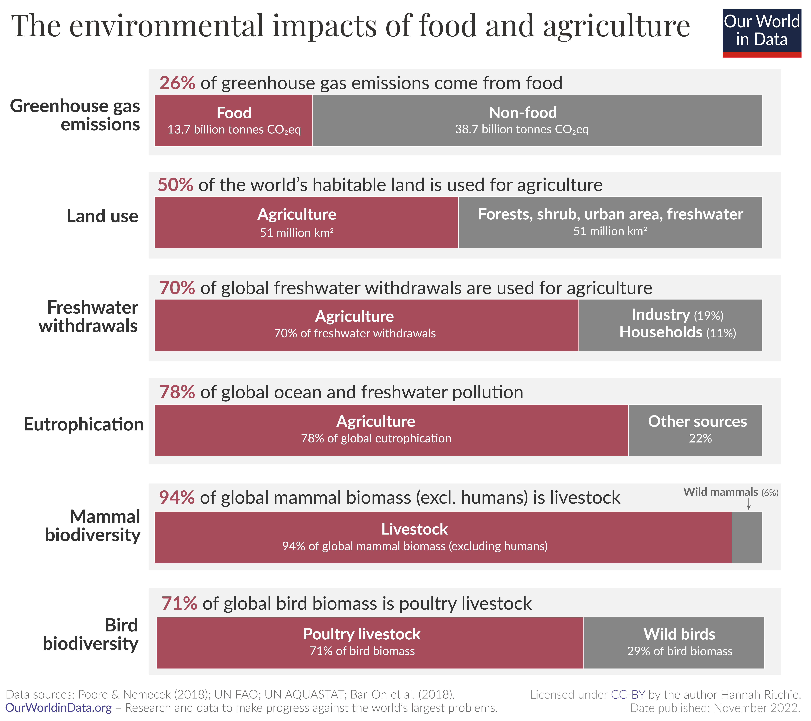
:::
:::::

## Soil erosion removes critical resources for agriculture

::::: columns
::: {.column width="50%"}
-   [Topsoil]{.keyword}: nutrient-rich upper layer essential for plant growth
-   Erosion removes nutrients and organic matter
-   Caused by plowing, deforestation, overgrazing
-   Reduces crop productivity over time
-   Soil formation is much slower than soil loss
:::

::: {.column width="50%"}
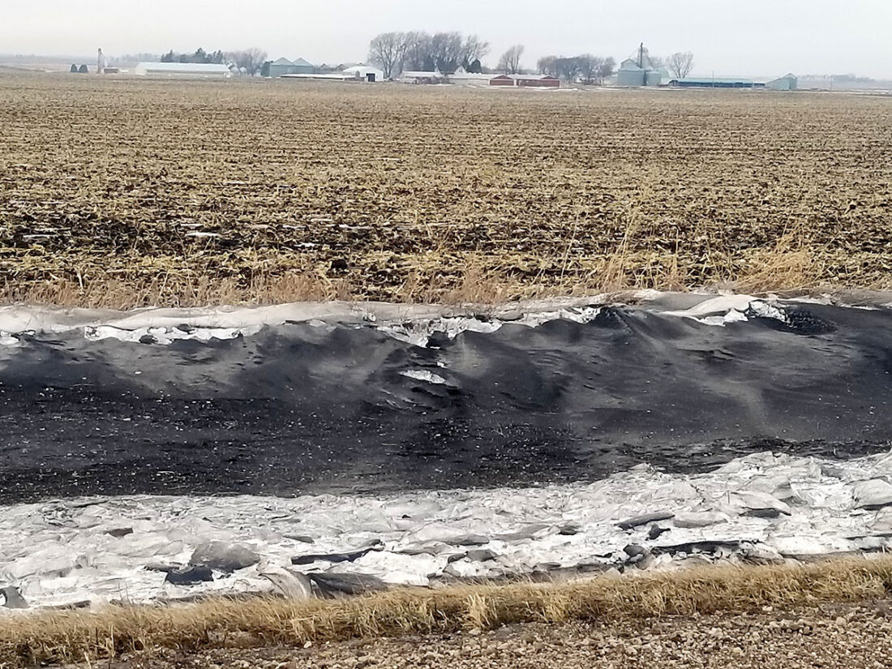
:::
:::::

## Desertification degrades productive land into arid systems

::::: columns
::: {.column width="50%"}
-   [Desertification]{.keyword}: transformation of fertile land into desert-like conditions
-   Driven by overgrazing, deforestation, and climate change
-   Reduces soil productivity and water retention
-   Common in dryland regions
-   Leads to displacement of human populations
:::

::: {.column width="50%"}
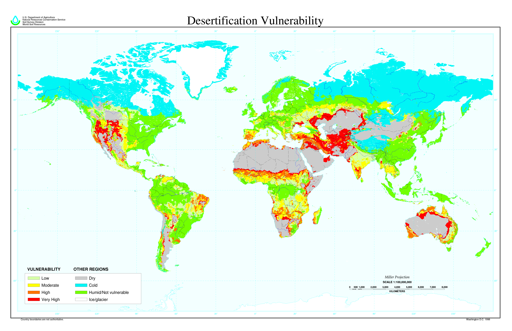
:::
:::::

## Irrigation boosts yields but can degrade soil and water systems

::::: columns
::: {.column width="50%"}
-   [Irrigation]{.keyword}: artificial addition of water to crops
-   Enables agriculture in dry regions
-   Leads to [salinization]{.keyword}: salt buildup in soils
-   Depletes groundwater resources
-   Alters natural water cycles and availability
:::

::: {.column width="50%"}
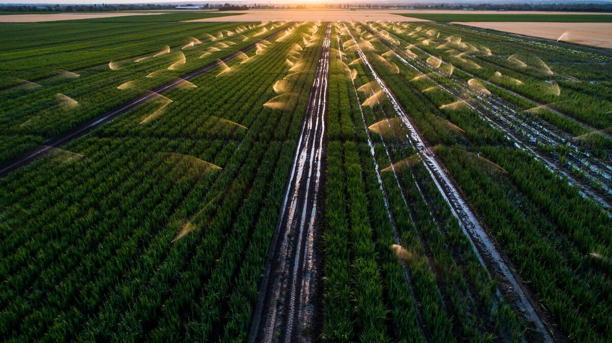
:::
:::::

## Agriculture contributes to water pollution

::::: columns
::: {.column width="50%"}
-   Fertilizer runoff introduces excess nitrogen and phosphorus
-   Causes [eutrophication]{.keyword}: nutrient enrichment of water bodies
-   Leads to algal blooms and oxygen depletion (dead zones)
-   Pesticides contaminate surface and groundwater
-   Pollution affects ecosystems and drinking water supplies
:::

::: {.column width="50%"}
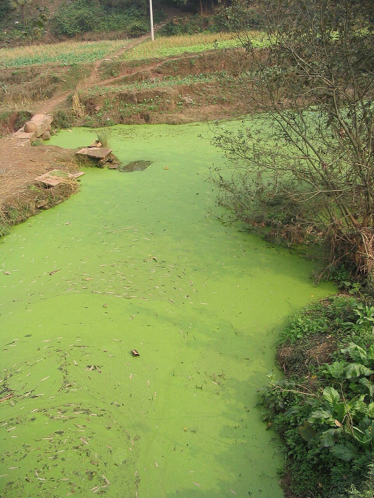{width="525"}
:::
:::::

## Agriculture drives biodiversity loss at multiple levels

::::: columns
::: {.column width="50%"}
-   **Conversion of natural habitats to farmland**
-   Monocultures reduce species diversity
-   Loss of [agrobiodiversity]{.keyword}: diversity within agricultural systems
-   Decline of pollinators and beneficial species
-   Reduced ecosystem resilience and stability
:::

::: {.column width="50%"}
{fig-alt="Flow diagram showing links from food system drivers (population growth, processed food consumption, technology, food waste) to increased pressure on production, intensification practices (monoculture, fertilizer use, land clearing), resulting ecological impacts (genetic erosion, species extinction, pollution, greenhouse gases), leading to degraded ecosystems, reduced food diversity and resilience, lower productivity, and negative impacts on human health and the economy." fig-align="center" width="1066"}
:::
:::::

## Meat production has high environmental costs per calorie

::::: columns
::: {.column width="50%"}
-   Requires large inputs of feed, land, and water
-   Produces methane and other greenhouse gases
-   [CAFOs]{.keyword}: concentrated animal feeding operations
-   Generate large amounts of waste and pollution
-   Less efficient than plant-based food production
    -   CO2 emissions from most plant based products are 1050 times lower than most animal based products
:::

::: {.column width="50%"}
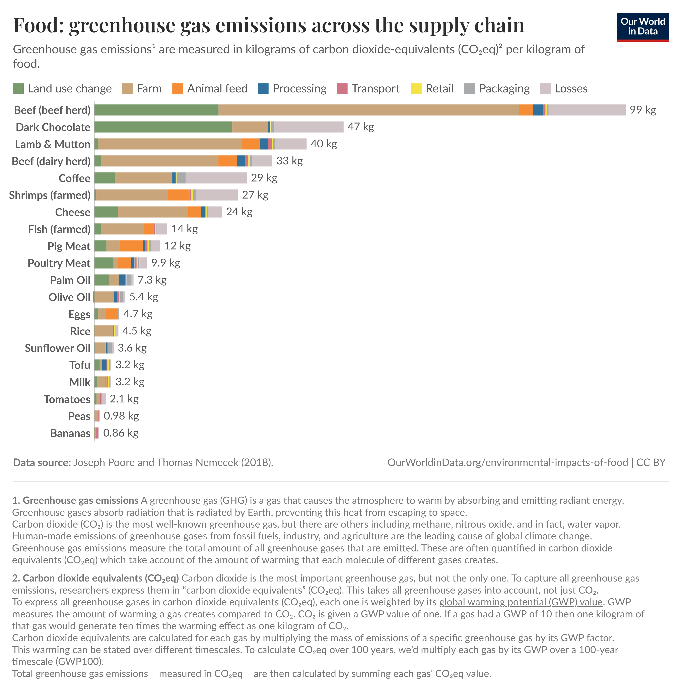{width="788"}
:::
:::::

# Pests, Pesticides, and Biotechnology

## Pests reduce agricultural productivity and require management

:::::: columns
::: {.column width="50%"}
-   [Pests]{.keyword}: organisms that damage crops or reduce yield
-   Include insects, weeds, fungi, and pathogens
-   Can significantly reduce food production
-   Management is essential for stable yields
-   Definitions depend on human goals and context
:::

:::: {.column width="50%"}
::: {#fig-elephants layout-ncol="2"}
{#fig-bmsb}

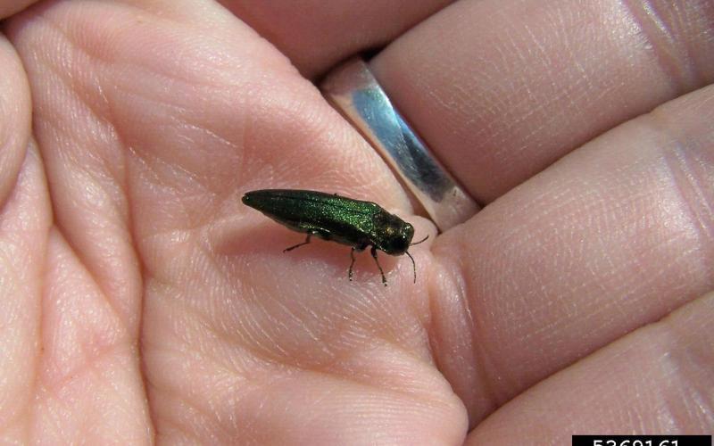{#fig-eab}

Agricultural pests in Minnesota.
:::
::::
::::::

## Pesticides provide benefits but carry ecological risks

::::: columns
::: {.column width="50%"}
-   [Pesticides]{.keyword}: chemicals used to control pests
-   Increase crop yields and reduce losses
-   Can harm non-target organisms (pollinators, predators)
-   Contaminate soil and water
-   Pose risks to human health
:::

::: {.column width="50%"}
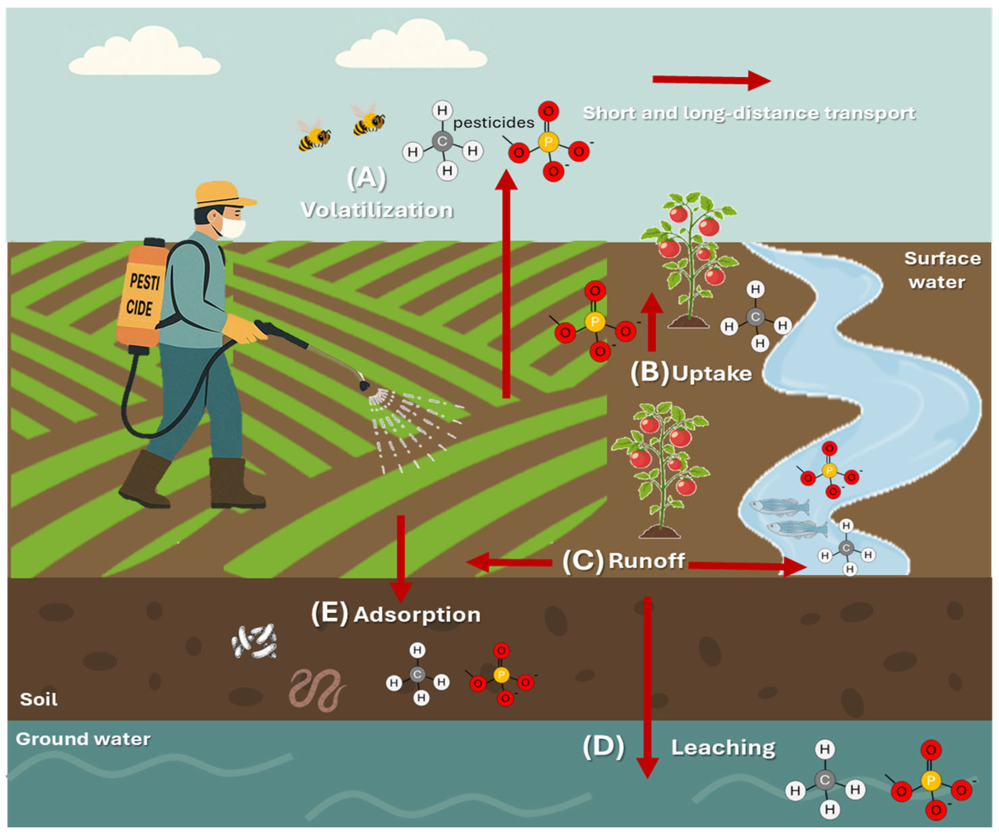
:::
:::::

## Pesticide resistance creates long-term challenges

::::: columns
::: {.column width="50%"}
-   Some pests survive pesticide application
-   Survivors reproduce and pass resistance traits
-   Leads to [pesticide resistance]{.keyword}
-   Requires stronger or more frequent chemical use
-   Creates a cycle known as the pesticide treadmill
:::

::: {.column width="50%"}
{fig-align="center" width="669"}
:::
:::::

## Persistent organic pollutants accumulate in food webs

::::: columns
::: {.column width="50%"}
-   [POPs]{.keyword}: long-lasting, toxic chemicals (e.g., DDT)
-   Persist in environment for years or decades
-   [Bioaccumulation]{.keyword}: buildup in individual organisms
-   [Biomagnification]{.keyword}: increasing concentration up food chains
-   Linked to health and ecological impacts
:::

::: {.column width="50%"}
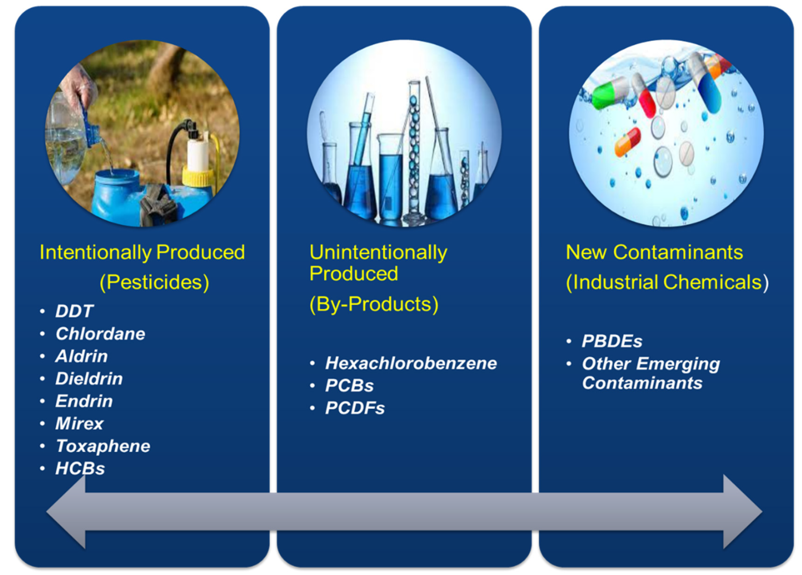{fig-align="center"}
:::
:::::

## Biotechnology allows targeted changes to crop traits

::::: columns
::: {.column width="50%"}
-   [Biotechnology]{.keyword}: use of biological systems to improve crops
-   Includes traditional breeding and [genetic engineering]{.keyword}
-   Can introduce specific genes for desired traits
-   More precise than traditional breeding
-   Expands tools available for agriculture
:::

::: {.column width="50%"}
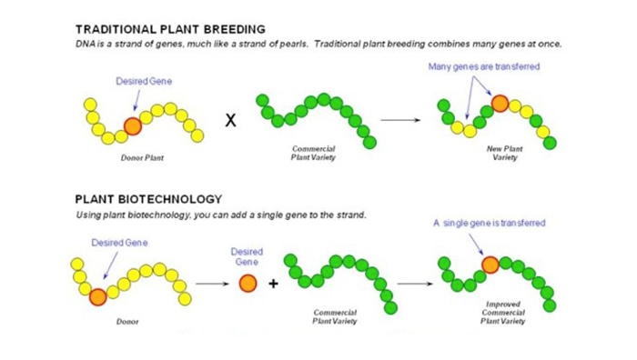
:::
:::::

## Genetically engineered crops offer both benefits and limitations

::::: columns
::: {.column width="50%"}
-   Can improve pest resistance and reduce pesticide use
-   May enhance nutritional content (e.g., golden rice)
-   Limited evidence of increased yield rates
-   Potential ecological risks (gene flow, resistance)
-   Require ongoing monitoring and evaluation
:::

::: {.column width="50%"}
{#fig-gmo-corn width="800"}
:::
:::::

# Sustainable Agriculture and Solutions

## Sustainable agriculture balances productivity with environmental health

::::: columns
::: {.column width="50%"}
-   [Sustainable agriculture]{.keyword}: food production that can be maintained long term without degrading natural systems
-   Meets human food needs while protecting ecosystems
-   Balances **environmental** quality, **economic** viability, and **social** equity
-   Reduces reliance on nonrenewable resources and harmful inputs
-   Emphasizes resilience, efficiency, and long-term productivity
:::

::: {.column width="50%"}
```{r}
#| label: fig-sustainable-agriculture-pillars
#| fig-cap: Three-pillar concept diagram showing sustainable agriculture at the center, supported by environmental protection, social well-being, and economic viability.
#| fig-alt: Diagram with a central box labeled Sustainable Agriculture connected by inward arrows from three surrounding boxes labeled Environment, Society, and Economy arranged evenly around the center.
#| fig-width: 8
#| fig-align: center

library(DiagrammeR)

grViz("
digraph sustainable_agriculture {

graph [
  layout = neato
  overlap = false
  splines = line
  outputorder = edgesfirst
  bgcolor = transparent
]

node [
  shape = rect
  style = 'rounded,filled'
  fontname = Helvetica
  color = '#666666'
  penwidth = 1.2
]

edge [
  color = '#777777'
  penwidth = 1.2
  arrowsize = 0.8
]

center [
  label = 'Sustainable\\nAgriculture'
  pos = '0,0!'
  width = 2.2
  height = 0.9
  fillcolor = '#A8D5A2'
  fontsize = 18
]

env [
  label = <
    <TABLE BORDER='0' CELLBORDER='0' CELLPADDING='2'>
      <TR><TD><B><FONT POINT-SIZE='18'>Environment</FONT></B></TD></TR>
      <TR><TD><FONT POINT-SIZE='11'>Soil, water, biodiversity</FONT></TD></TR>
    </TABLE>
  >
  pos = '-2,1.6!'
  width = 2.2
  height = 0.9
  fillcolor = '#DCECCB'
  fontsize = 14
]

soc [
  label = <
    <TABLE BORDER='0' CELLBORDER='0' CELLPADDING='2'>
      <TR><TD><B><FONT POINT-SIZE='18'>Society</FONT></B></TD></TR>
      <TR><TD><FONT POINT-SIZE='11'>Food security, equity, health</FONT></TD></TR>
    </TABLE>
  >
  pos = '2,1.6!'
  width = 2.2
  height = 0.9
  fillcolor = '#DCECCB'
  fontsize = 14
]

econ [
  label = <
    <TABLE BORDER='0' CELLBORDER='0' CELLPADDING='2'>
      <TR><TD><B><FONT POINT-SIZE='18'>Economy</FONT></B></TD></TR>
      <TR><TD><FONT POINT-SIZE='11'>Viability, livelihoods, profit</FONT></TD></TR>
    </TABLE>
  >
  pos = '0,-2!'
  width = 2.2
  height = 0.9
  fillcolor = '#DCECCB'
  fontsize = 14
]

env  -> center
soc  -> center
econ -> center

}
")
```
:::
:::::

## Soil conservation improves long-term productivity

::::: columns
::: {.column width="50%"}
-   Reduce [soil erosion]{.keyword} and nutrient runoff
-   Techniques include [buffer strips]{.keyword}, [cover crops]{.keyword}, and [no-till]{.keyword}
-   [Grass waterways]{.keyword} and wetlands slow runoff and trap sediment
-   Maintain soil structure, fertility, and soil moisture
-   Essential for productive and sustainable food systems
:::

::: {.column width="50%"}
{fig-alt="Cross-sectional illustration of cropland bordering a ditch, stream, or river. Between the field and water is a vegetated buffer zone with tall native grasses, flowering plants, shrubs, and trees. Labels indicate that roots stabilize soil and absorb nutrients, grasses prevent erosion and filter pollutants in runoff, and perennial buffers help maintain drainage channels while providing wildlife habitat."}
:::
:::::

## Integrated pest management reduces reliance on chemicals

::::: columns
::: {.column width="50%"}
-   [IPM]{.keyword}: combines biological, farming, and chemical control methods
-   Focuses on managing pests below damaging levels, not eliminating them
-   Uses pesticides only when needed and in targeted ways
-   Protects beneficial species such as predators and pollinators
-   Reduces environmental contamination and human health risks
:::

::: {.column width="50%"}
[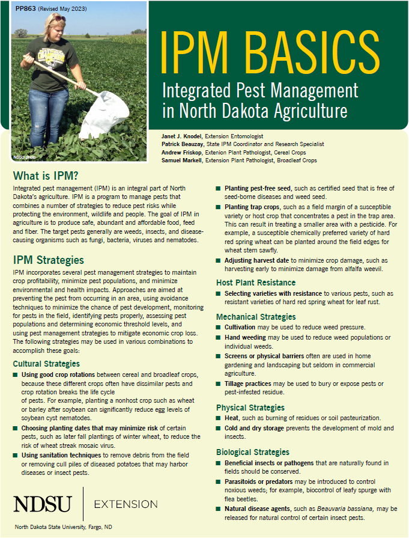{#fig-ipm-flyer fig-alt="Screenshot of the cover and first page of an NDSU Extension fact sheet titled “IPM Basics: Integrated Pest Management in North Dakota Agriculture,” featuring introductory text that defines IPM and outlines pest management strategies such as prevention, monitoring, identification, and economic thresholds." fig-align="center" width="495"}](https://www.ndsu.edu/agriculture/sites/default/files/2023-05/pp863.pdf)
:::
:::::

## [Biological control]{.keyword} uses natural predators to manage pests

::::: columns
::: {.column width="50%"}
-   Introduces or supports natural enemies that suppress pest populations
-   Includes predators, parasitoids, and disease-causing organisms
-   Minnesota example: parasitoid wasps released to reduce [emerald ash borer]{.keyword} populations
-   Can reduce reliance on chemical pesticides
-   Requires ecological knowledge and careful risk assessment
:::

::: {.column width="50%"}
{#fig-eab-biocontrol-map fig-alt="Map of Minnesota displaying emerald ash borer management areas. Red county-like outlines cover much of the state as quarantine zones, green shaded polygons mark generally infested regions concentrated in southern and eastern Minnesota, and numerous blue and purple points show biological control release sites, especially near the Twin Cities, Rochester, Duluth, and other population centers." fig-align="center" width="549"}
:::
:::::

## Crop rotation and intercropping improve system resilience

::::: columns
::: {.column width="50%"}
-   [Crop rotation]{.keyword}: changing crops over time to disrupt pests and improve soil fertility
-   [Intercropping]{.keyword}: growing two or more crops together in the same field
-   Increase biodiversity and make better use of light, water, and nutrients
-   Reduce disease, pest outbreaks, and reliance on chemical inputs
-   Improve stability and resilience compared with monocultures
:::

::: {.column width="50%"}
{#fig-crop-systems fig-align="center"}
:::
:::::

## Organic and low-input systems reduce environmental impacts

::::: columns
::: {.column width="50%"}
-   [Organic]{.keyword} systems avoid most synthetic fertilizers and pesticides
-   [Low-input]{.keyword} systems minimize their use
-   Often improve soil health, biodiversity, and ecosystem services
-   Can reduce pollution, energy use, and dependence on fossil-fuel-based inputs
-   Yields may be lower in some systems, but outcomes vary by crop and management
-   Adoption is increasing as farmers seek more sustainable production methods
:::

::: {.column width="50%"}
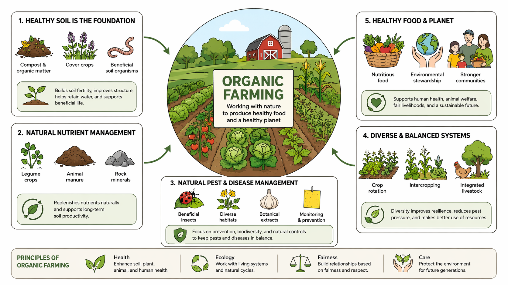{fig-alt="Diagram produced with ChatGPT."}
:::
:::::

## Feeding a growing population requires integrated solutions

-   Increase production while reducing environmental harm
-   Improve food distribution and access
-   Reduce waste and shift consumption patterns
-   Balance technological and ecological approaches
-   Address social and economic inequalities
