# Water

## Natural Resources, Water, Minerals, Energy, and Pollution

::::: columns
::: {.column width="50%"}
-   This module examines [freshwater]{.keyword}, mineral resources, energy resources, and major forms of pollution
-   Key question: how can societies meet resource needs more sustainably
-   Main themes: scarcity, environmental tradeoffs, pollution, and long-term sustainability
:::

::: {.column width="50%"}
:::
:::::

## Fresh water is limited and easily overused

::::: columns
::: {.column width="50%"}
-   We use available fresh water unsustainably by extracting it faster than nature can replace it, and by wasting and polluting it
-   Ice caps and glaciers hold most fresh water, but most of it is remote and not readily usable
-   [Shallow groundwater]{.keyword} is the largest reservoir of usable fresh water
-   Rivers and lakes are heavily used but make up only a tiny fraction of Earth’s water
-   If all Earth’s water were one gallon, readily usable fresh water would be only about two tablespoons
:::

::: {.column width="50%"}
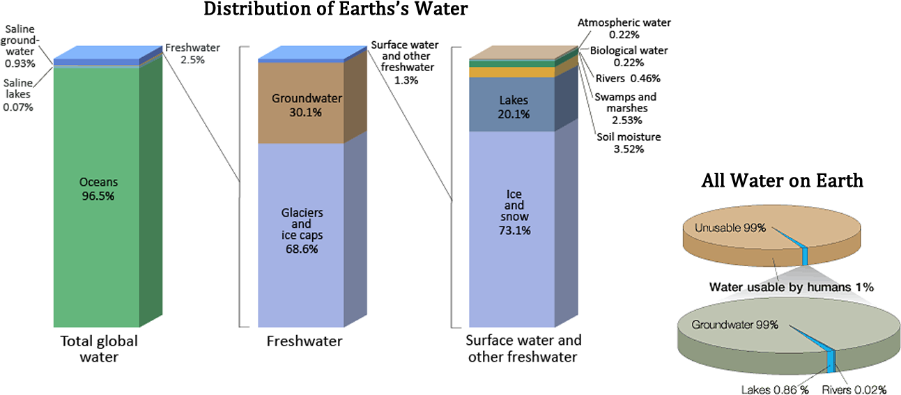{#fig-earth-water-reservoirs-overview fig-alt="Bar charts compare all water, freshwater, and surface water; pie charts show that only a very small fraction of Earth’s water is readily usable by humans." width="100%"}
:::
:::::

## Most of Earth’s water is not readily usable

::::: columns
::: {.column width="50%"}
-   Globally, Earth has abundant water, but only a small portion is accessible [freshwater]{.keyword}
-   Human use becomes a major issue when pollution and overuse outpace natural replenishment
-   Water is an economic and health issue because societies depend on safe, reliable supplies
-   Water is also an environmental issue because it moderates climate and helps dilute and transport wastes
:::

::: {.column width="50%"}
{#fig-earth-water-reservoirs-usable fig-alt="The same water-distribution graphic emphasizes the tiny share of Earth’s total water that is accessible fresh surface water or shallow groundwater." width="100%"}
:::
:::::

## Groundwater and aquifers are crucial freshwater resources

::::: columns
::: {.column width="50%"}
-   [Groundwater]{.keyword} infiltrates downward through spaces in soil and rock
-   [Saturation zone]{.keyword}: underground zone where water fills spaces between particles
-   [Water table]{.keyword}: upper surface of the groundwater zone; it rises and falls with weather and withdrawal rates
-   [Aquifer]{.keyword}: underground rock body that stores and transmits water
:::

::: {.column width="50%"}
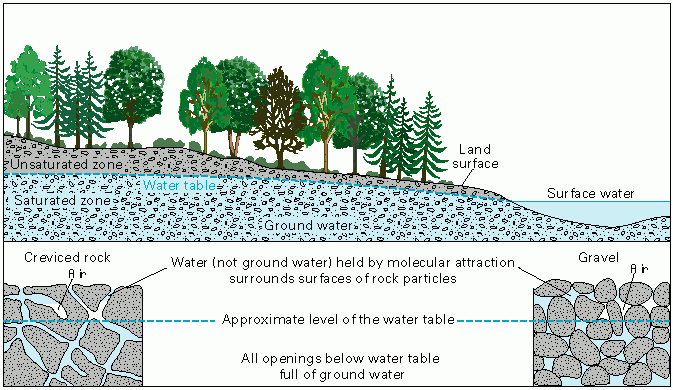{#fig-groundwater-aquifer fig-alt="Diagram of a hillside and subsurface layers showing infiltration, the water table, surface water, and groundwater stored in aquifers." width="100%"}
:::
:::::

## Surface water and virtual water shape our water footprint

::::: columns
::: {.column width="50%"}
-   [Surface water]{.keyword} includes freshwater stored at the surface from rain and snowmelt
-   About 34% of the world’s reliable surface runoff is used each year
-   Most surface-water withdrawals support agriculture, with smaller shares used by industry and cities
-   [Virtual water]{.keyword} is the water used to produce food and other products, and it is a major part of our water footprint
:::

::: {.column width="50%"}
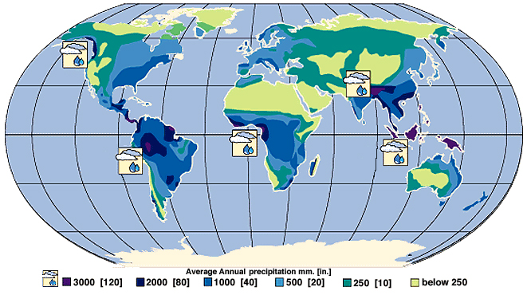{#fig-world-rainfall fig-alt="False-color world map showing areas of high rainfall in the tropics and low rainfall in major desert regions." width="100%"}
:::
:::::

## Water use depends on population and sector demand

::::: columns
::: {.column width="50%"}
-   Water is needed to produce food, energy, and mineral resources, often in large quantities
-   Regional water demand depends on [population]{.keyword} and the kinds of water use in that area
-   In the United States, total withdrawals declined slightly from 1980 to 2005 despite continued population growth
-   Improved management and conservation reduced or stabilized withdrawals for thermoelectric power and irrigation
:::

::: {.column width="50%"}
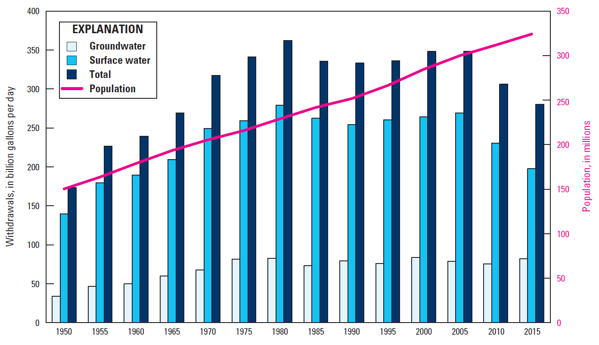{#fig-us-water-use-trends fig-alt="Bar-and-line chart showing groundwater and surface-water withdrawals over time alongside a rising U.S. population curve." width="100%"}
:::
:::::

## Water scarcity results from climate, overuse, and shared basins

::::: columns
::: {.column width="50%"}
-   [Water scarcity]{.keyword} can result from dry climate, drought, inefficient use, and withdrawing water faster than it is replenished
-   [Freshwater scarcity stress]{.keyword} compares available freshwater with the amount humans use
-   Many major river basins are shared by two or more countries, which can create conflict over water access
:::

::: {.column width="50%"}
{#fig-water-stress-map fig-alt="World choropleth map classifying countries by projected water stress in 2050 using five categories from low to extremely high. Dark brown countries with the highest projected stress include much of North Africa, the Arabian Peninsula, Iran, India, Spain, Portugal, and parts of southern Africa and South America. Red countries indicate high stress, yellow medium to high, light blue low to medium, and dark blue low stress." fig-align="center" width="65%"}
:::
:::::

## Aquifers can boost supplies but are vulnerable to overpumping

::::: columns
::: {.column width="50%"}
-   [Aquifers]{.keyword} provide drinking water for nearly half of the world’s people
-   In the United States, aquifers supply most rural drinking water and a large share of irrigation water
-   Many aquifers are renewable only if withdrawals do not exceed recharge from rain and snowmelt
-   **Overpumping** occurs when groundwater is removed faster than it is naturally replenished
:::

::: {.column width="50%"}
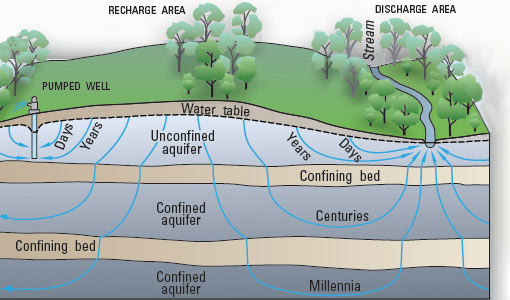{#fig-flowing-groundwater fig-alt="Cross-section diagram showing recharge areas, a pumped well, the water table, and groundwater flow through unconfined and confined aquifers." width="100%"}
:::
:::::

## Dams and water transfers have major tradeoffs

::::: columns
::: {.column width="50%"}
-   Large dams and reservoirs store runoff, reduce floods, generate [hydropower]{.keyword}, and supply irrigation and drinking water
-   Water-transfer projects move water from wetter regions to drier ones using dams, pumps, and aqueducts
-   These projects can displace people, flood productive land, and disrupt river ecosystems
-   They can also reduce river flow, worsen pollution problems, and encourage wasteful use through artificially low prices
:::

::: {.column width="50%"}
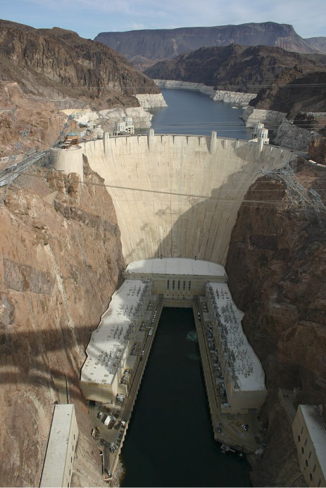{#fig-large-dam fig-alt="Photograph of a massive concrete dam spanning a canyon, with water and infrastructure below." fig-align="center" width="60%"}
:::
:::::

## [Desalination]{.keyword} can increase supply but is costly

::::: columns
::: {.column width="50%"}
-   **Distillation** heats saltwater, then condenses the vapor into freshwater
-   **Reverse osmosis** forces saltwater through membranes under high pressure
-   Desalination can increase freshwater supply, especially in dry coastal regions
-   Major drawbacks are high cost, high energy use, chemical impacts, and concentrated wastewater
:::

::: {.column width="50%"}
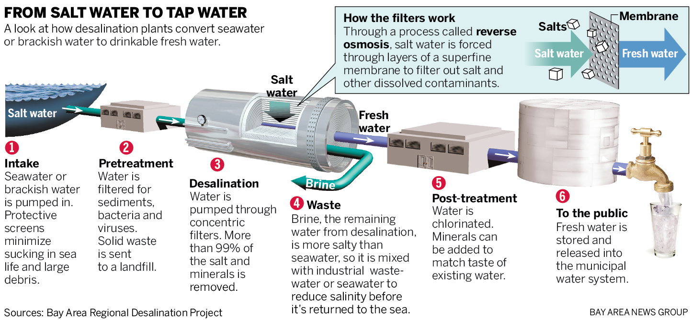{#fig-desalination-process fig-alt="Process diagram showing seawater intake, treatment steps, reverse osmosis membranes, brine waste, and freshwater delivery." width="100%"}
:::
:::::

## Sustainable freshwater use depends on conservation and pricing

::::: columns
::: {.column width="50%"}
-   Freshwater can be used more sustainably by reducing waste, protecting water-storing ecosystems, and slowing demand growth
-   More than half of the world’s freshwater supply is **lost** annually through evaporation and inefficient irrigation
-   Government subsidies and underpricing often encourage inefficient use
-   Modern **irrigation** methods, lined canals, nighttime irrigation, and treated wastewater can reduce losses
:::

::: {.column width="50%"}
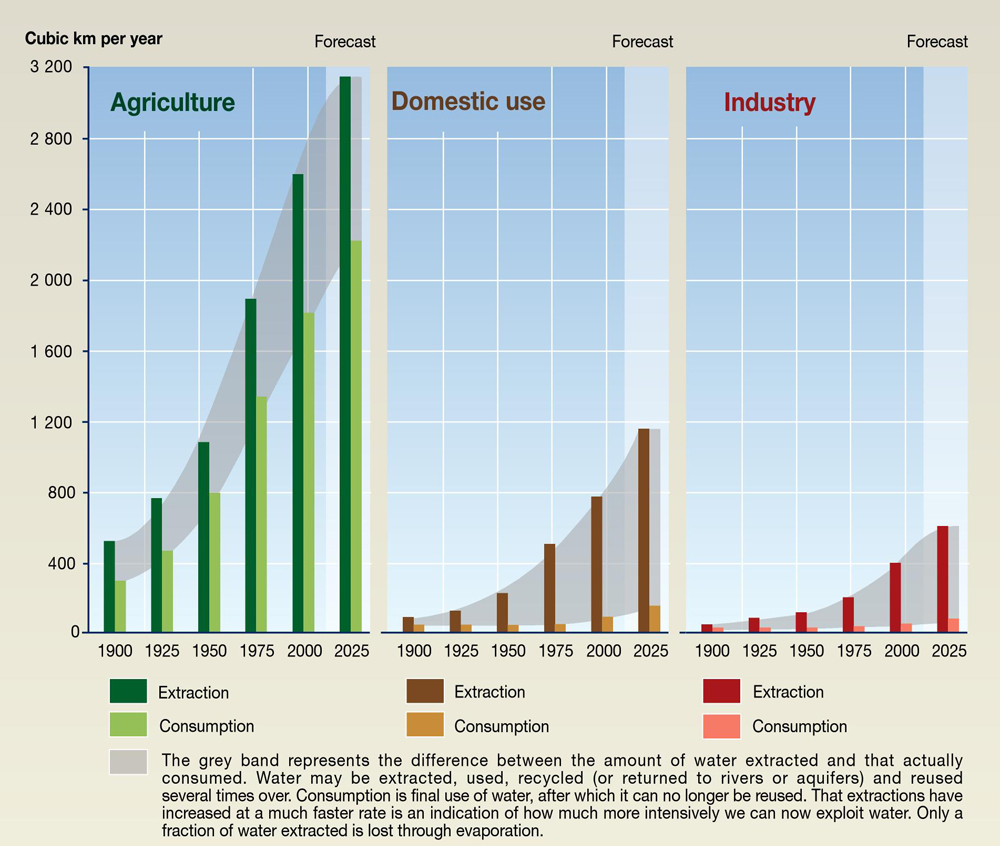{#fig-world-water-use-trends fig-alt="Three graphs show large growth in agricultural, domestic, and industrial water use over time, with projected future increases." width="100%"}
:::
:::::

## Efficient irrigation can save substantial water

::::: columns
::: {.column width="50%"}
-   Avoid growing thirsty crops in dry regions
-   Import some water-intensive crops and meat instead of producing them locally
-   Encourage organic farming and polyculture to help soils retain moisture
-   Use soil-moisture **monitoring** so water is applied only when needed
-   Microirrigation and other efficient systems can reduce water waste
:::

::: {.column width="50%"}
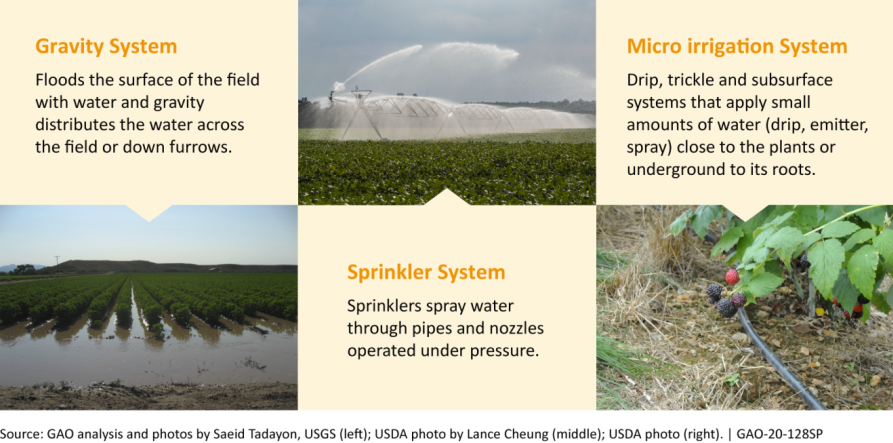{#fig-irrigation-technologies fig-alt="Panel comparing irrigation methods, including flooded fields, sprinkler irrigation, and drip or microirrigation close to plant roots." width="100%"}
:::
:::::

## Industry and households can cut freshwater losses

::::: columns
::: {.column width="50%"}
-   Industries can reduce water demand by recapturing, purifying, and recycling water
-   In U.S. homes, toilet flushing is the largest single use of domestic freshwater
-   Low-flow toilets, showerheads, and faucets reduce [household water use]{.keyword}
-   Leak repair, efficient washers, gray water, and smart irrigation can further reduce demand
:::

::: {.column width="50%"}
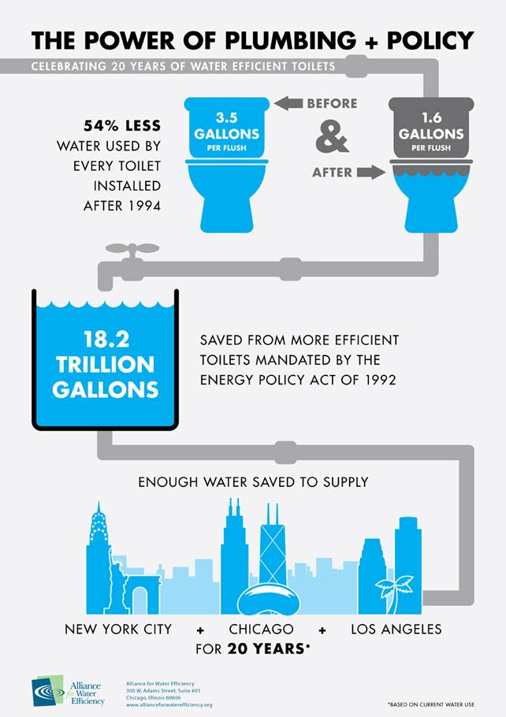{#fig-low-flow-plumbing fig-alt="Infographic showing reductions in water used per toilet flush and total water savings from plumbing policy changes." fig-align="center" width="60%"}
:::
:::::

## Human land-use changes increase flood risk

::::: columns
::: {.column width="60%"}
-   **Flooding** is made worse when humans narrow, straighten, dam, or confine rivers with dikes and levees
-   Removing vegetation reduces the landscape’s capacity to **absorb** water
-   Draining wetlands removes natural flood storage
-   Sea-level rise from climate change increases flood risks in coastal areas
-   One method of restoring absorption capacity is [re-meandering]{.keyword} : restoring natural river bends, slowing water flow, reconnecting floodplains, and reducing downstream flood risk
:::

::: {.column width="40%"}
{#fig-flooding-cross-section fig-alt="Screenshot from a video about the Mustinka River rehabilitation project in western Minnesota, showing restored river or floodplain landscapes designed to hold water, reconnect natural hydrology, and reduce flooding caused by rapid runoff from altered agricultural land use." fig-align="center" width="100%"}
:::
:::::

## Major water pollutants differ in source and effect

::::: columns
::: {.column width="50%"}
-   Water pollutants include infectious agents, nutrients, organic chemicals, inorganic chemicals, sediments, heavy metals, and heat
-   Different pollutants affect ecosystems through disease, toxicity, oxygen depletion, or reduced photosynthesis
-   Common sources include sewage, agriculture, mining, industry, and urban runoff
:::

::: {.column width="50%"}
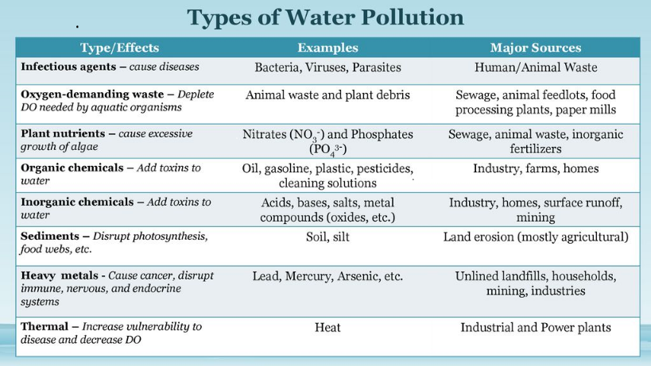{#fig-types-water-pollution fig-alt="Table listing categories of water pollution and matching them with typical effects, examples, and major sources." width="100%"}
:::
:::::

## Point and nonpoint pollution differ in source and control

::::: columns
::: {.column width="50%"}
-   [Water pollution]{.keyword} is any change in water quality that harms organisms or makes water unfit for use
-   [Point sources]{.keyword} come from specific, identifiable locations such as a pipe or discharge outlet
-   [Nonpoint sources]{.keyword} come from diffuse areas and are harder and more expensive to control
-   Agriculture, industrial facilities, and mining are leading contributors to water pollution
:::

::: {.column width="50%"}
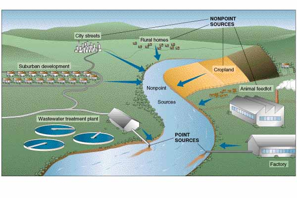{#fig-point-nonpoint-pollution fig-alt="Watershed diagram showing pollution from factories and treatment plants as point sources and runoff from farms and cities as nonpoint sources." width="100%"}
:::
:::::

## Streams can recover from waste only when pollution loads stay low

::::: columns
::: {.column width="50%"}
-   Streams and rivers can dilute and biologically break down some wastes naturally
-   This natural cleansing fails when [pollution load]{.keyword} is too high or streamflow is reduced by drought, dams, or diversion
-   Bacterial decomposition uses dissolved oxygen, which can eliminate species that need well-oxygenated water
:::

::: {.column width="50%"}
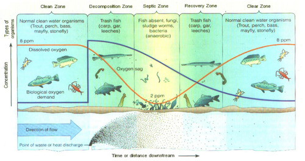{#fig-stream-oxygen-sag fig-alt="Stream diagram showing clean, decomposition, septic, and recovery zones, along with changing oxygen levels and aquatic organisms downstream." width="100%"}
:::
:::::

## Groundwater pollution persists for a long time

::::: columns
::: {.column width="50%"}
-   Groundwater usually cleanses itself much more slowly than flowing surface water
-   Polluted groundwater can take hundreds to thousands of years to recover
-   Lower dissolved oxygen, fewer decomposers, and colder temperatures slow breakdown of wastes
-   That makes [groundwater pollution]{.keyword} especially persistent and difficult to reverse
:::

::: {.column width="50%"}
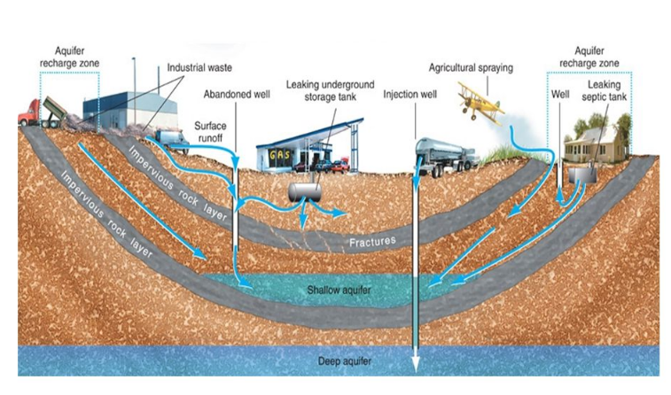{#fig-groundwater-pollution-pathways fig-alt="Cross-section showing contaminants moving from landfills, septic systems, agriculture, and industrial sites into groundwater." width="100%"}
:::
:::::

## Most ocean pollution begins on land

::::: columns
::: {.column width="50%"}
-   Humans often treat the ocean as a dumping site for waste
-   About 80% of marine pollution originates on land
-   In many less-developed coastal areas, most municipal sewage enters the ocean untreated
-   Pollutants may disperse in deep water, but [ocean pollution]{.keyword} still damages coastal ecosystems
:::

::: {.column width="50%"}
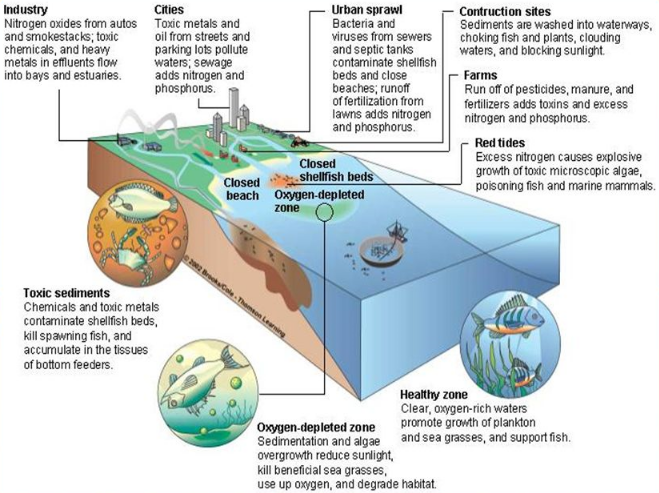{#fig-ocean-pollution-sources fig-alt="Coastal diagram showing cities, farms, industry, runoff, sewage, and contaminated sediments affecting shellfish beds and marine habitats." width="100%"}
:::
:::::

## Marine contaminants come from sewage, runoff, ships, and oil

::::: columns
::: {.column width="50%"}
-   Marine contaminants include viruses from sewage and treatment plants
-   Cruise ships and vessels can add toxic chemicals, garbage, sewage, and waste oil
-   Agricultural runoff contributes nitrates, phosphates, and sewage
-   Crude and refined petroleum can be [biomagnified]{.keyword} in marine food webs
-   Urban and industrial runoff are additional major sources
:::

::: {.column width="50%"}
{#fig-ocean-contaminants fig-alt="The coastal pollution diagram illustrates multiple contamination pathways from land and ships into nearshore waters." width="100%"}
:::
:::::

## Sewage treatment removes wastes in physical and biological stages

::::: columns
::: {.column width="50%"}
-   Urban wastewater from homes, businesses, and storm runoff is routed to [sewage treatment plants]{.keyword}
-   Primary treatment uses physical and mechanical processes to remove solids
-   Secondary treatment uses biological processes to reduce dissolved and suspended wastes
:::

::: {.column width="50%"}
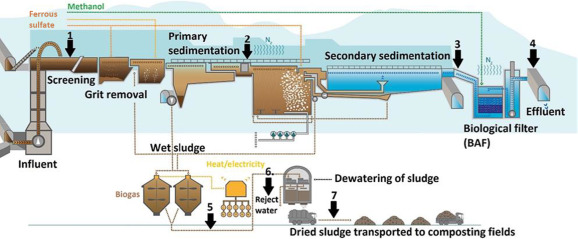{#fig-sewage-treatment-plant fig-alt="Process diagram of a sewage treatment plant showing screening, grit removal, primary and secondary treatment, effluent, and sludge processing." width="100%"}
:::
:::::

# Mineral Resources

## Mineral resources form through slow geological processes

::::: columns
::: {.column width="50%"}
-   Mineral resources are created by geological processes at Earth’s surface and in the interior
-   Because the [rock cycle]{.keyword} takes millions of years, mineral resources are effectively nonrenewable
-   Earth has three main internal zones: the core, mantle, and crust
-   The core includes a solid inner core and liquid outer core, the mantle flows slowly, and the crust is the thin outer layer
:::

::: {.column width="50%"}
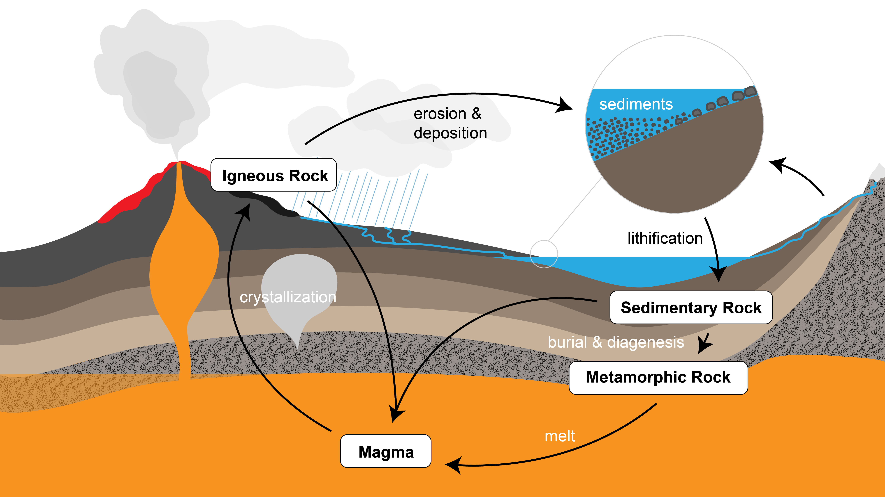{#fig-rock-cycle fig-alt="Diagram of the rock cycle illustrating the relationships among igneous, sedimentary, and metamorphic rocks, with arrows indicating processes including weathering and erosion, deposition and lithification, heat and pressure, melting into magma, and cooling to form new igneous rock."}
:::
:::::

## Convection in the mantle helps drive geological processes

::::: columns
::: {.column width="50%"}
-   The upper mantle is solid, but below it the partly melted [asthenosphere]{.keyword} can flow over long time scales
-   Heat from the core and mantle drives convection cells that move rock and energy through Earth’s interior
-   Molten rock can rise to the surface as volcanic magma
-   Important mineral resources are concentrated in the lithosphere
:::

::: {.column width="50%"}
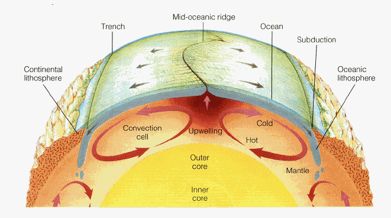{#fig-convection-cells fig-align="center"}
:::
:::::

## Minerals are naturally occurring solids with ordered structure

::::: columns
::: {.column width="50%"}
-   [Minerals]{.keyword} are naturally occurring chemical elements or inorganic compounds with regularly arranged atoms or ions
-   A mineral resource is any mineral deposit that can be extracted, processed, and used
-   Some minerals contain a single element, while others are compounds such as quartz or rare earth oxides
:::

::: {.column width="50%"}
:::
:::::

## Rocks are classified as sedimentary, igneous, or metamorphic

::::: columns
::: {.column width="50%"}
-   [Rocks]{.keyword} are solid aggregates of one or more minerals
-   Sedimentary rocks form when sediments are compacted and cemented
-   Igneous rocks form when magma or lava cools
-   Metamorphic rocks are altered by high temperature and pressure
:::

::: {.column width="50%"}
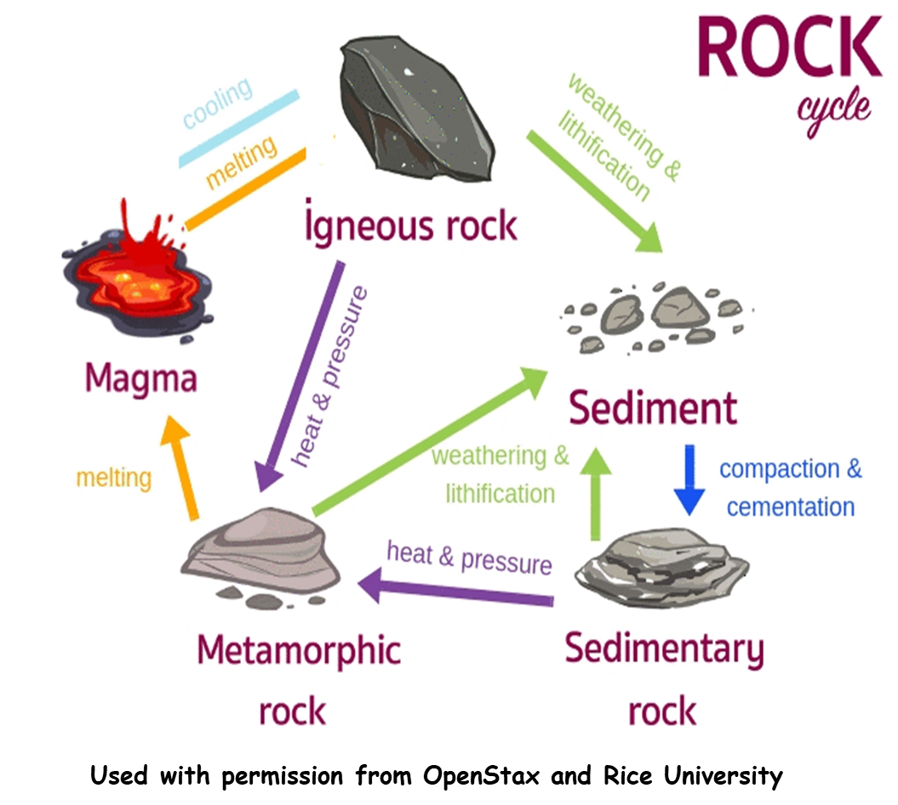{#fig-rock-types fig-alt="Three photos labeled with examples of sedimentary, igneous, and metamorphic rocks." width="100%"}
:::
:::::

## The rock cycle slowly recycles Earth materials

::::: columns
::: {.column width="50%"}
-   The [rock cycle]{.keyword} is the set of physical and chemical processes that convert rocks from one type to another
-   Important processes include erosion, melting, and metamorphism
-   Because this cycle is so slow, rock-derived mineral resources are nonrenewable on human time scales
:::

::: {.column width="50%"}
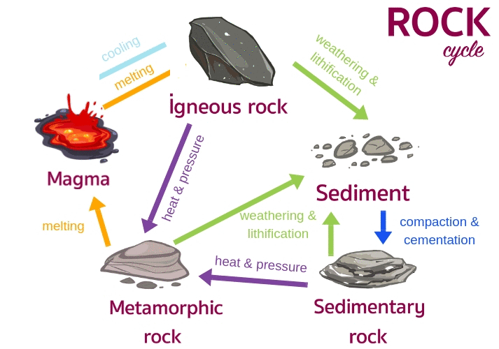{fig-alt="Circular diagram showing pathways among magma, igneous rock, sediment, sedimentary rock, and metamorphic rock." width="100%"}
:::
:::::

## Mineral resources are nonrenewable and limited by economic depletion

::::: columns
::: {.column width="50%"}
-   [Ore]{.keyword} is rock containing a valuable mineral that can be mined and processed profitably
-   About 60 metallic elements are mined and used in manufacturing
-   Nonmetallic resources such as sand, gravel, limestone, and phosphate are also widely used
-   The practical supply of mineral resources is limited by the costs of finding, extracting, and processing them
:::

::: {.column width="50%"}
:::
:::::

## Higher prices can make lower-grade ores worth mining

::::: columns
::: {.column width="50%"}
-   When supply tightens, market prices rise and lower-grade ores can become profitable
-   Lower-grade ores require more rock processing, more water, more energy, and more waste disposal
-   New technology can sometimes make these deposits economic
-   [Biomining]{.keyword} uses bacteria to help remove ore from rock, but it develops slowly
:::

::: {.column width="50%"}
:::
:::::

## Available reserves depend on economics as well as geology

::::: columns
::: {.column width="50%"}
-   [Reserves]{.keyword} are deposits that can be extracted profitably under current conditions
-   Reserves can expand when new deposits are found, prices rise, or extraction becomes cheaper
-   Future supply depends on both total resource availability and the rate of consumption
-   [Depletion time]{.keyword} is the time required to use about 80% of the available resource at a given rate
:::

::: {.column width="50%"}
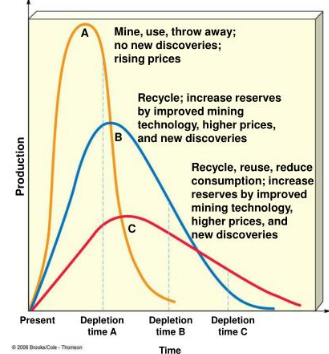{#fig-economic-depletion fig-alt="Conceptual diagram relating known reserves, undiscovered resources, recycling, and economic limits on mineral supply." width="100%"}
:::
:::::

## Rare earth metals are essential to modern technology

::::: columns
::: {.column width="50%"}
-   [Rare earth metals]{.keyword} and oxides are essential for many modern technologies
-   They are used in flat screens, LED bulbs, fiber optics, smartphones, cameras, and electric-vehicle motors
-   Supply concentration creates vulnerability: in 2016, China produced most of the world’s rare earth metals and oxides
:::

::: {.column width="50%"}
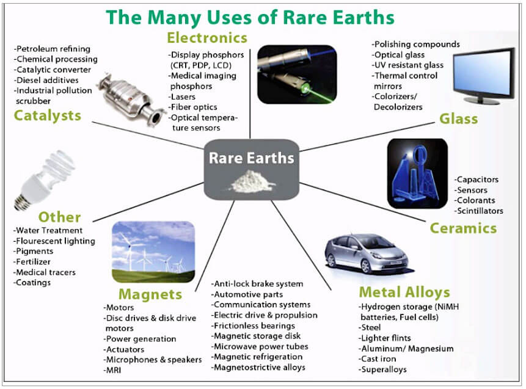{#fig-rare-earth-products fig-alt="Collage of modern electronic devices and technologies that depend on rare earth minerals." width="100%"}
:::
:::::

## Most ocean minerals are too dilute to mine profitably

::::: columns
::: {.column width="50%"}
-   Most dissolved minerals in seawater occur at concentrations too low for profitable extraction
-   Coastal and continental-shelf sediments can contain mineable deposits of sand, copper, iron, and diamonds
-   Hydrothermal vent regions may also concentrate valuable minerals on the seafloor
:::

::: {.column width="50%"}
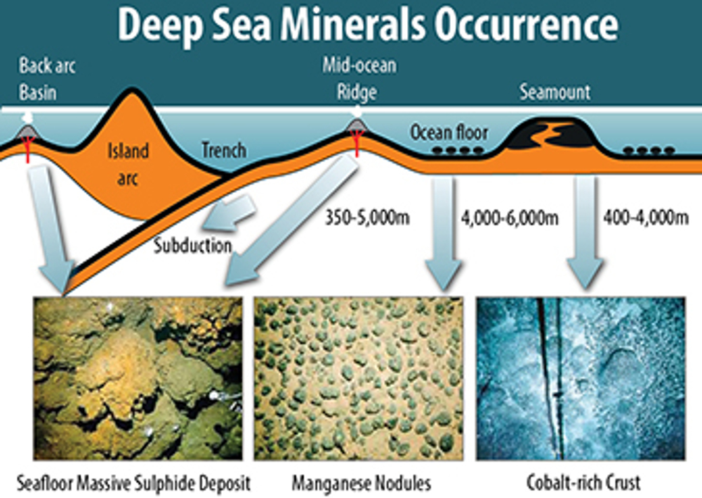{#fig-ocean-minerals fig-alt="Illustration of ocean zones and seafloor settings where minerals may accumulate, including shelves and vent regions." width="100%"}
:::
:::::

## Deep-sea mining may supply rare minerals but poses ecological risks

::::: columns
::: {.column width="50%"}
-   Rising demand and prices have made some [deep-sea mining]{.keyword} projects economically attractive
-   Remote-operated equipment can collect minerals from hydrothermal vent fields and other seafloor deposits
-   International regulation has expanded, but ecological risks remain
-   Disturbing seafloor sediments can damage filter feeders and other deep-sea organisms
:::

::: {.column width="50%"}
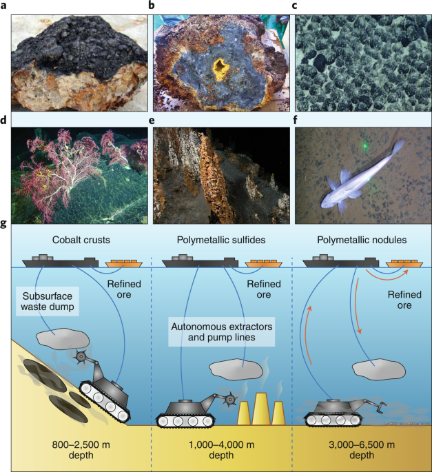{#fig-deep-sea-mining fig-alt="Diagram illustrating mining equipment on the seafloor and possible impacts on sediments and deep-sea organisms." width="100%"}
:::
:::::

## Mineral extraction has environmental costs across its life cycle

::::: columns
::: {.column width="50%"}
-   The [life cycle of a mineral]{.keyword} includes extraction, processing, manufacturing, use, disposal, and recycling
-   Each step can consume large amounts of freshwater and energy and generate pollution and waste
-   High-grade ores are mined first, so lower-grade ores usually cost more and cause greater environmental damage
:::

::: {.column width="50%"}
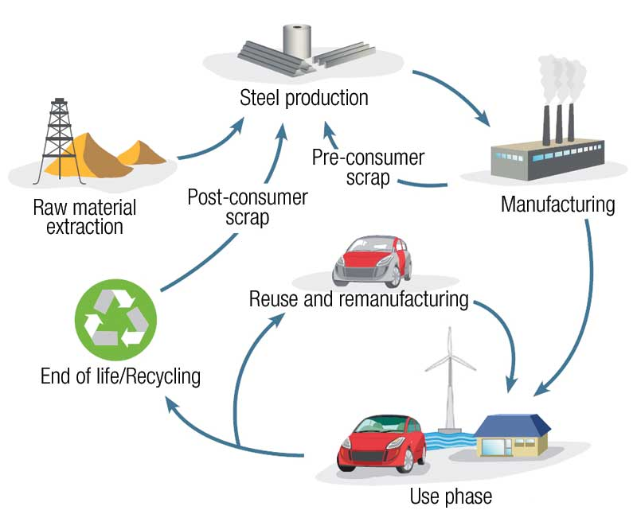{#fig-mineral-life-cycle fig-alt="Flow diagram showing stages from mineral extraction and processing to manufacturing, use, disposal, and recycling." width="100%"}
:::
:::::

## Surface mining includes open-pit and strip mining

::::: columns
::: {.column width="50%"}
-   [Surface mining]{.keyword} removes overburden and extracts shallow mineral deposits
-   [Open-pit mining]{.keyword} creates very large excavated pits
-   [Strip mining]{.keyword} removes minerals from horizontal beds near the surface, often for coal
-   These methods can heavily alter landscapes and create large waste volumes
:::

::: {.column width="50%"}
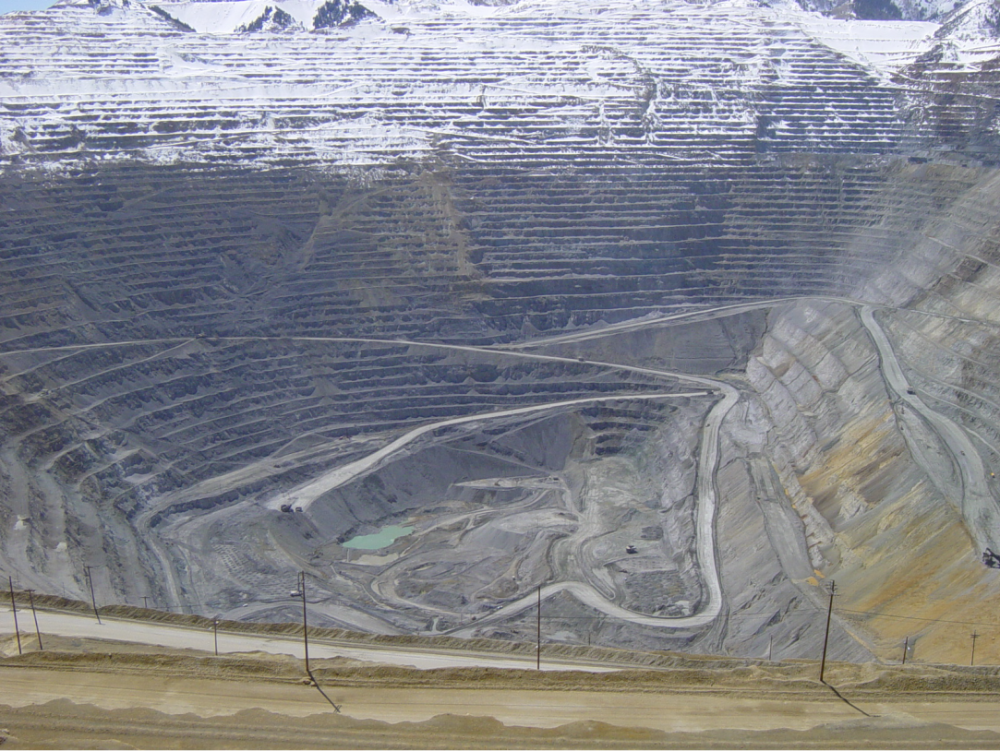{#fig-open-pit-mine fig-alt="Aerial view of a huge terraced open-pit mine with concentric benches cut into the landscape." width="100%"}
:::
:::::

## Mining methods vary with topography and ore depth

::::: columns
::: {.column width="50%"}
-   [Contour strip mining]{.keyword} terraces mountainsides to remove near-surface coal
-   [Mountaintop removal]{.keyword} uses explosives to remove ridge tops and is especially destructive
-   [Subsurface mining]{.keyword} removes deeper minerals through underground shafts
:::

::: {.column width="50%"}
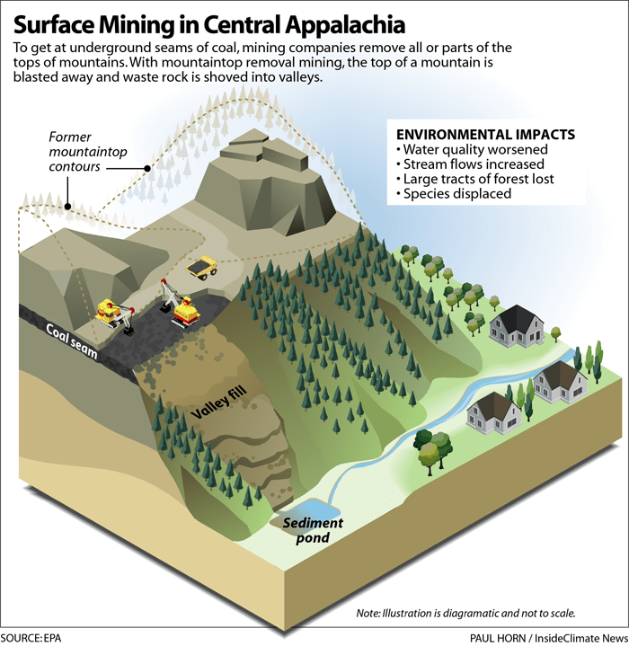{#fig-surface-subsurface-mining fig-alt="Illustrations and photos comparing terraced strip mines, blasted mountaintops, and underground mining shafts." width="100%"}
:::
:::::

## Mining and smelting generate major air and water pollution

::::: columns
::: {.column width="50%"}
-   Mining produces large volumes of solid waste and is a major source of air and water pollution
-   [Tailings]{.keyword} left after ore extraction can contaminate soil, surface water, and groundwater
-   [Smelting]{.keyword} uses heat and chemicals to separate metals and can release large amounts of sulfur dioxide and other air pollutants
-   Weak regulation makes these impacts substantially worse
:::

::: {.column width="50%"}
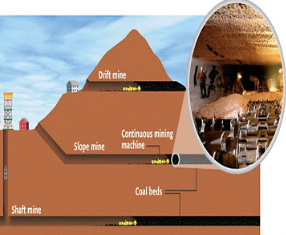{#fig-mining-environmental-effects fig-alt="Diagram and images showing tailings, contaminated water, smelting, and other mining-related environmental impacts." width="100%"}
:::
:::::

## Sustainable mineral use requires reuse, recycling, and substitution

::::: columns
::: {.column width="50%"}
-   Some mineral resources are scarce, so sustainability depends on finding substitutes and reusing what has already been mined
-   Materials science is replacing some metals with silicon, plastics, and fiber-optic materials
-   Not all scarce minerals are easy to replace
-   Policies can reduce damage by encouraging [recycling]{.keyword}, reuse, and reduced mining subsidies
:::

::: {.column width="50%"}
:::
:::::

## Tectonic plate movement creates major geological hazards

::::: columns
::: {.column width="50%"}
-   Geological hazards include volcanoes, earthquakes, tsunamis, erosion, and landslides
-   Earth’s rigid [tectonic plates]{.keyword} move slowly across the asthenosphere
-   Plate movement creates mountains, valleys, earthquakes, and volcanic eruptions, especially near boundaries
:::

::: {.column width="50%"}
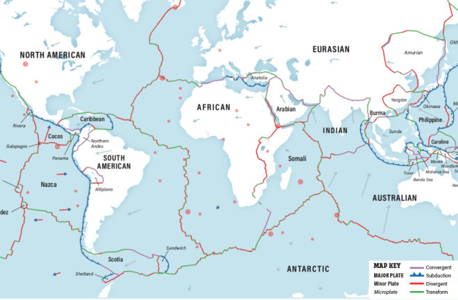{#fig-tectonic-plates fig-alt="World map showing tectonic plates, their boundaries, and regions of major geological activity." width="100%"}
:::
:::::

## Volcanoes bring magma to the surface

::::: columns
::: {.column width="50%"}
-   [Volcanoes]{.keyword} form where magma reaches the surface through vents or fissures
-   They commonly occur near tectonic plate boundaries
-   Eruptions release lava, ash, hot gases, and rock fragments
-   Volcanic regions can also produce fertile soils and dramatic scenery
:::

::: {.column width="50%"}
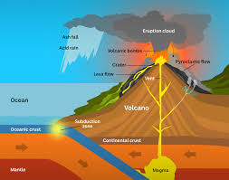{#fig-volcano-photo fig-alt="Photograph of an erupting volcano releasing ash and glowing lava." width="100%"}

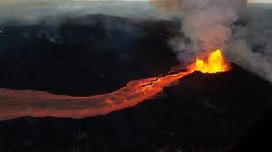{#fig-volcano-diagram fig-alt="Simple cutaway diagram showing magma rising through a volcanic vent to the surface." width="70%"}
:::
:::::

## Earthquakes release stress along faults

::::: columns
::: {.column width="50%"}
-   [Earthquakes]{.keyword} occur when stresses in Earth’s crust and mantle are suddenly released along faults
-   Seismic waves spread outward from the focus
-   Magnitude reflects the energy released, and strong earthquakes can heavily damage infrastructure
-   The largest recorded earthquake occurred in Chile in 1960
:::

::: {.column width="50%"}
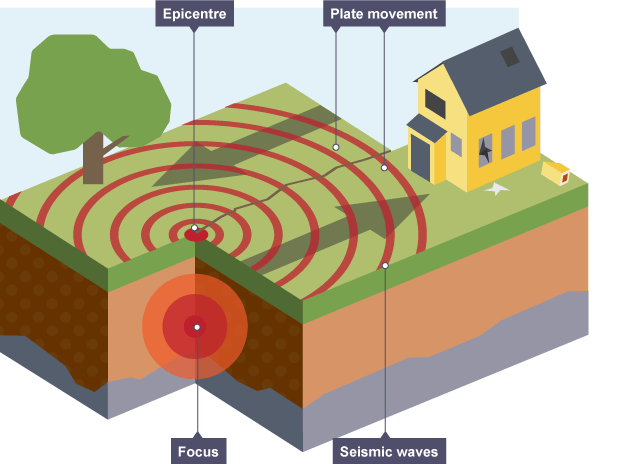{#fig-earthquake-damage fig-alt="Photo or graphic showing severe earthquake damage to built infrastructure." width="100%"}

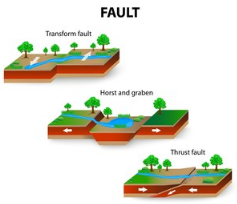{#fig-earthquake-waves fig-alt="Diagram showing an earthquake focus underground, a fault line, and seismic waves spreading outward." width="85%"}
:::
:::::

## Seafloor earthquakes can generate tsunamis

::::: columns
::: {.column width="50%"}
-   When the seafloor is suddenly lifted or dropped during an earthquake, it displaces the overlying water
-   This generates [tsunami]{.keyword} waves that can travel across entire ocean basins
-   When they reach shore, tsunamis can surge inland and devastate coastal settlements
:::

::: {.column width="50%"}
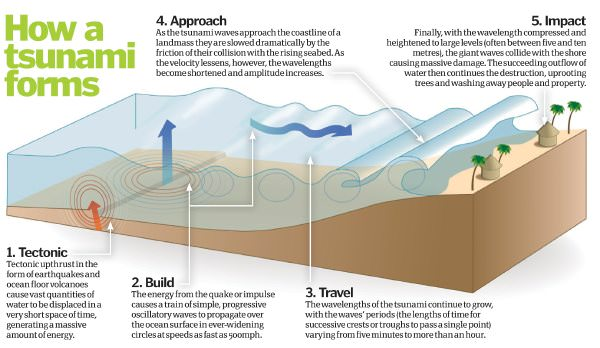{#fig-tsunami-formation fig-alt="Diagram showing an underwater earthquake rupturing the seabed and displacing seawater to start a tsunami wave." width="100%"}
:::
:::::

## Rare-metal shortages constrain some green technologies

::::: columns
::: {.column width="50%"}
-   Some low-carbon technologies depend on scarce [rare metals]{.keyword}
-   Many products are not recycled because recovering metals from finished goods is difficult and costly
-   Large volumes of e-waste accumulate each year, and only a small fraction is recycled
:::

::: {.column width="50%"}
:::
:::::

# Energy Resources

## Net energy determines the usefulness of an energy source

::::: columns
::: {.column width="50%"}
-   [Net energy yield]{.keyword} is the energy obtained from a resource minus the energy needed to produce it
-   Energy sources vary greatly in net energy yield
-   Commercial energy includes both nonrenewable and renewable sources sold in markets
-   Nonrenewable sources are finite on human time scales, while renewable sources are replenished naturally
:::

::: {.column width="50%"}
:::
:::::

## Only net energy available after extraction really counts

::::: columns
::: {.column width="50%"}
-   [Energy input]{.keyword} is the energy required to find, extract, process, and deliver usable energy
-   Net energy equals total energy produced minus that energy input
-   A source with zero or negative net energy cannot remain competitive over the long term
:::

::: {.column width="50%"}
:::
:::::

## Net energy yield varies widely among energy sources

::::: columns
::: {.column width="50%"}
-   Different energy technologies provide very different [net energy]{.keyword} returns
-   High net-energy sources can support more economic activity with less total extraction effort
-   Low net-energy sources may still be used, but their costs and tradeoffs are greater
-   Passive solar heating is one example of using sunlight directly for useful heat
:::

::: {.column width="50%"}
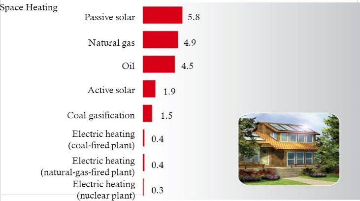{#fig-net-energy-yields fig-alt="Comparative chart showing that some energy sources return much more usable energy than others." width="100%"}
:::
:::::

## Fossil fuels are convenient but environmentally costly

::::: columns
::: {.column width="50%"}
-   People use [fossil fuels]{.keyword} because they have been abundant, transportable, and relatively cheap to extract
-   Their use causes air and water pollution and releases greenhouse gases
-   The environmental damages are not fully reflected in market prices
:::

::: {.column width="50%"}
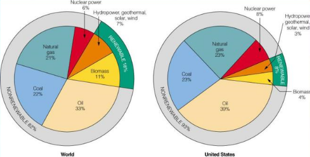{#fig-world-us-energy-use-2019 fig-alt="Comparative charts showing the shares of fossil fuels, nuclear power, and renewables in global and U.S. energy use." width="100%"}
:::
:::::

## Fossil fuels still dominate commercial energy use

::::: columns
::: {.column width="50%"}
-   Most commercial energy still comes from [fossil fuels]{.keyword}
-   A much smaller share comes from nuclear power and renewable sources such as biomass, hydropower, geothermal, wind, and solar
-   Petroleum forms over geologic time from buried organic remains subjected to pressure and heat
:::

::: {.column width="50%"}
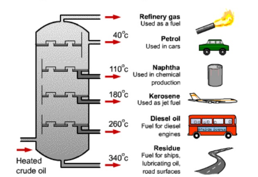{#fig-fossil-fuel-share fig-alt="Chart or graphic emphasizing the large share of commercial energy supplied by fossil fuels." width="100%"}
:::
:::::

## Oil extraction and refining lower net energy yield

::::: columns
::: {.column width="50%"}
-   Oil deposits are found using seismic surveys, test drilling, and production wells
-   [Peak production]{.keyword} is the maximum output from a well, after which yield declines
-   Crude oil must be refined before use, which reduces net energy yield
-   Oil supplies are not about to disappear, but they are finite
:::

::: {.column width="50%"}
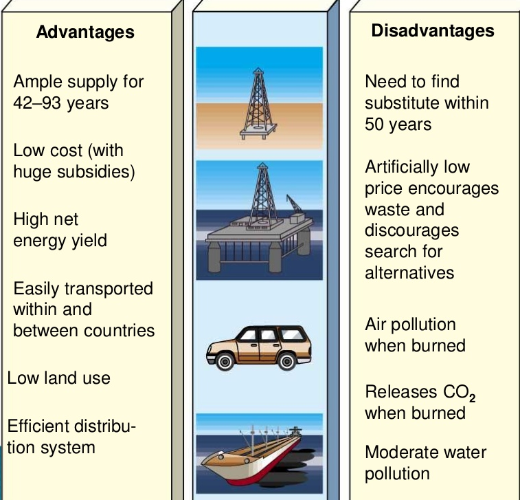{#fig-oil-extraction fig-alt="Image related to oil extraction infrastructure and the steps required before petroleum becomes usable fuel." width="100%"}
:::
:::::

## Shale oil and tar sands have low returns and high impacts

::::: columns
::: {.column width="50%"}
-   Using oil adds greenhouse gases to the atmosphere and contributes to climate change
-   [Shale oil]{.keyword} and [tar sands]{.keyword} have relatively low net energy yields
-   Both are typically more environmentally damaging than conventional petroleum extraction
:::

::: {.column width="50%"}
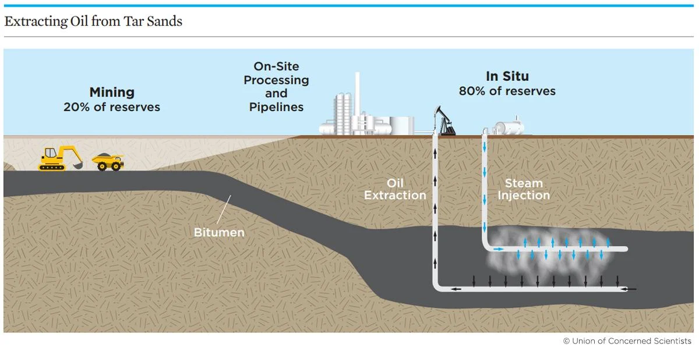{#fig-shale-oil fig-alt="Illustration or photo of shale oil extraction from rock layers." width="100%"}

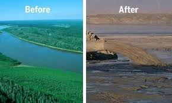{#fig-tar-sands-photo1 fig-alt="Photo showing an industrial tar-sands mining landscape." width="75%"}

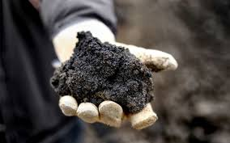{#fig-tar-sands-photo2 fig-alt="Photo showing heavy industrial disturbance associated with tar-sands development." width="75%"}
:::
:::::

## Natural gas is cleaner than coal and oil but still nonrenewable

::::: columns
::: {.column width="50%"}
-   [Natural gas]{.keyword} is mostly methane and currently supplies a substantial share of commercial energy
-   It has a medium net energy yield and burns more cleanly than coal or oil
-   Liquefied petroleum gas, including propane and butane, is stored in pressurized tanks
-   Natural gas may expand future supply, but it remains a finite fossil fuel
:::

::: {.column width="50%"}
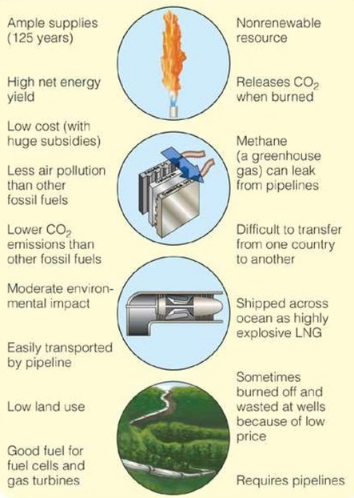{#fig-natural-gas fig-alt="Image related to natural gas production, storage, or distribution." width="100%"}
:::
:::::

## Coal types differ in energy content and emissions

::::: columns
::: {.column width="50%"}
-   [Coal]{.keyword} forms over millions of years, producing types that differ in carbon, sulfur, and heat content
-   Peat resembles coal and can be used as fuel, but it is not classified as true coal
-   Different coal types release different amounts of carbon dioxide and sulfur dioxide when burned
:::

::: {.column width="50%"}
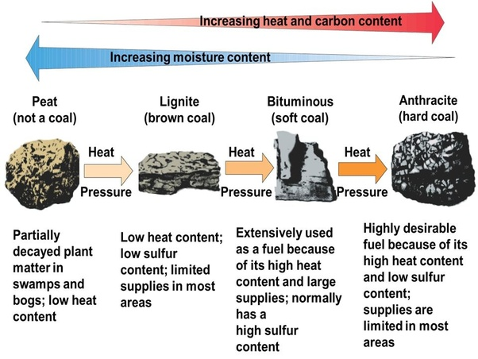{#fig-coal-types fig-alt="Graphic comparing major forms of coal and their differing energy and emission properties." width="100%"}
:::
:::::

## Coal-fired electricity is inefficient and polluting

::::: columns
::: {.column width="50%"}
-   Coal plants burn pulverized coal to boil water and generate steam that turns turbines
-   A large share of the energy released is lost as waste heat
-   Coal-burning plants are among the largest [greenhouse-gas emitters]{.keyword}
:::

::: {.column width="50%"}
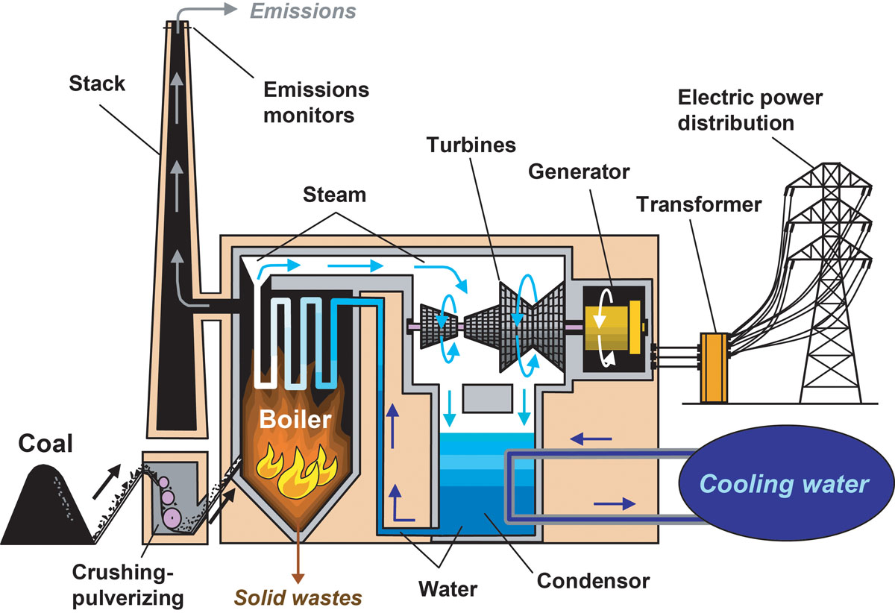{#fig-coal-power-plant fig-alt="Photograph of a large coal-burning power plant with cooling towers or smokestacks." width="100%"}
:::
:::::

## Coal appears cheap partly because its costs are externalized

::::: columns
::: {.column width="50%"}
-   Pollution controls such as scrubbers can reduce emissions, but they create toxic [coal ash]{.keyword}
-   Coal ash may be buried, released to water, or reused in construction
-   Coal looks inexpensive partly because many environmental and health costs are not included in market prices
-   Utilities often resist regulations and taxes that would internalize those hidden costs
:::

::: {.column width="50%"}
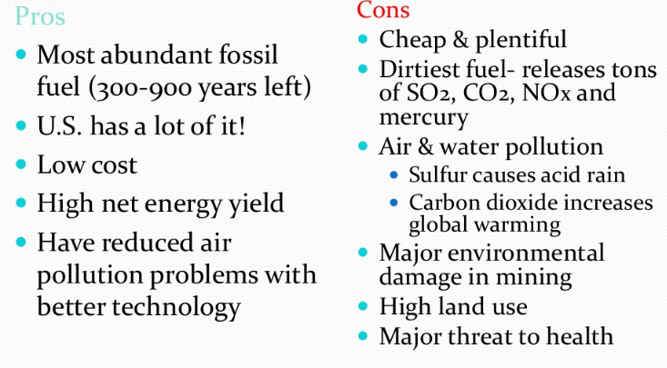{#fig-coal-scrubber fig-alt="Diagram or image showing coal emissions control and the resulting coal-ash waste stream." width="100%"}

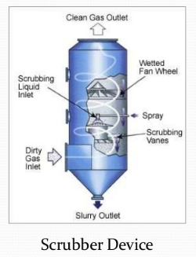{#fig-coal-ash fig-alt="Image showing waste ash or storage associated with coal-burning pollution controls." width="70%"}
:::
:::::

## Nuclear fission releases large amounts of energy through a chain reaction

::::: columns
::: {.column width="50%"}
-   [Nuclear fission]{.keyword} splits large atomic nuclei such as uranium-235 into smaller nuclei
-   Each fission event releases neutrons that can trigger additional fission events
-   This [chain reaction]{.keyword} releases enormous amounts of energy in a short time
:::

::: {.column width="50%"}
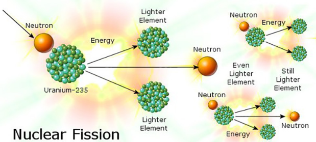{#fig-nuclear-fission fig-alt="Diagram showing a neutron striking uranium, splitting the nucleus, and producing additional neutrons that continue the chain reaction." width="100%"}
:::
:::::

## Nuclear reactors use fission heat to generate steam and electricity

::::: columns
::: {.column width="50%"}
-   In a [nuclear reactor]{.keyword}, fission produces heat that boils water into steam
-   The steam turns a turbine connected to an electrical generator
-   Fuel rods contain uranium, coolant moves heat, and the reactor sits within a steel containment structure
:::

::: {.column width="50%"}
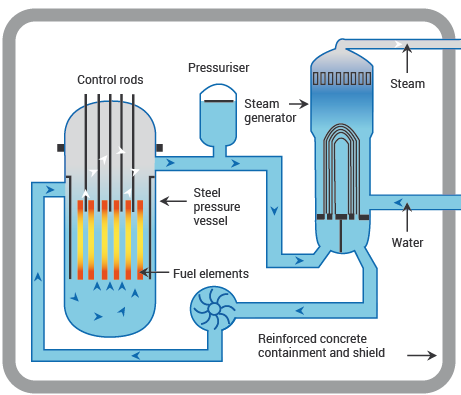{#fig-nuclear-reactor fig-alt="Diagram showing fuel rods, coolant flow, steam production, turbine, generator, and containment structure in a nuclear plant." width="100%"}
:::
:::::

## Spent fuel must be cooled and stored for long periods

::::: columns
::: {.column width="50%"}
-   After several years in a reactor, [spent fuel rods]{.keyword} are removed because they are no longer efficient
-   They are first stored in deep pools of water for cooling
-   Later they can be transferred to sealed dry casks made of heavy metal alloys and concrete
:::

::: {.column width="50%"}
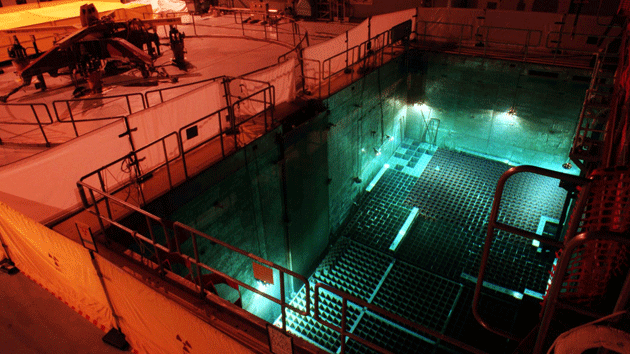{#fig-spent-fuel-pool fig-alt="Image of nuclear spent-fuel assemblies stored underwater in a cooling pool." width="100%"}

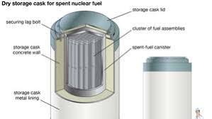{#fig-dry-cask-storage fig-alt="Image of large concrete and metal dry-storage casks used for spent nuclear fuel." width="85%"}
:::
:::::

## Long-term storage of nuclear waste remains unresolved

::::: columns
::: {.column width="50%"}
-   Spent uranium fuel becomes highly radioactive and remains dangerous for a very long time
-   Current storage in cooling ponds and dry casks may work for decades, but not for the full hazard period
-   The long-term containment of [radioactive waste]{.keyword} remains costly and politically difficult
:::

::: {.column width="50%"}
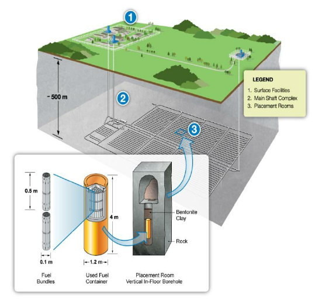{#fig-nuclear-waste-storage fig-alt="Image related to storage of spent nuclear fuel or radioactive waste infrastructure." width="100%"}
:::
:::::

## Nuclear power has benefits but major limits

::::: columns
::: {.column width="50%"}
-   [Nuclear power]{.keyword} produces electricity with relatively low direct air pollution during operation
-   Its expansion is limited by low net energy yield, high cost, accident concerns, and waste disposal challenges
-   Plant construction and fuel processing still generate greenhouse-gas emissions
-   Nuclear power has not replaced conventional fuels at the scale once predicted
:::

::: {.column width="50%"}
:::
:::::

## Fusion remains promising but not yet practical

::::: columns
::: {.column width="50%"}
-   [Nuclear fusion]{.keyword} would combine light atomic nuclei at extremely high temperatures to release energy
-   In principle, fusion could provide very large energy supplies with lower meltdown risk
-   At present, controlled fusion is not available at an affordable commercial scale
:::

::: {.column width="50%"}
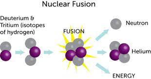{#fig-nuclear-fusion fig-alt="Diagram showing two light nuclei combining into a heavier nucleus and releasing energy." width="100%"}
:::
:::::

## Energy efficiency is a major energy resource

::::: columns
::: {.column width="50%"}
-   [Energy efficiency]{.keyword} means getting more useful work from each unit of energy
-   Poor building design wastes large amounts of heating and cooling energy
-   Transportation systems and commuting patterns also strongly affect energy demand
-   Data centers consume large amounts of electricity, and much of it is lost as heat
:::

::: {.column width="50%"}
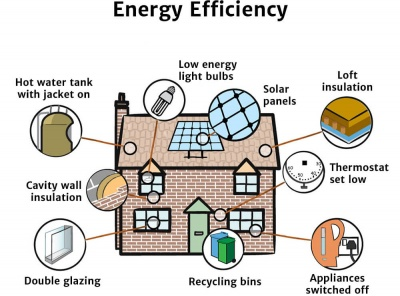{#fig-energy-efficiency fig-alt="Image or graphic illustrating wasted energy in common systems such as buildings, transport, or information technology." width="100%"}
:::
:::::

## Policy and infrastructure can improve energy efficiency

::::: columns
::: {.column width="50%"}
-   [Full-cost pricing]{.keyword} would include hidden environmental and health costs in fuel prices
-   Tax incentives can encourage smaller and more fuel-efficient vehicles
-   Public investment in mass transit and charging infrastructure can reduce energy demand
-   Research support can accelerate efficient vehicle technologies
:::

::: {.column width="50%"}
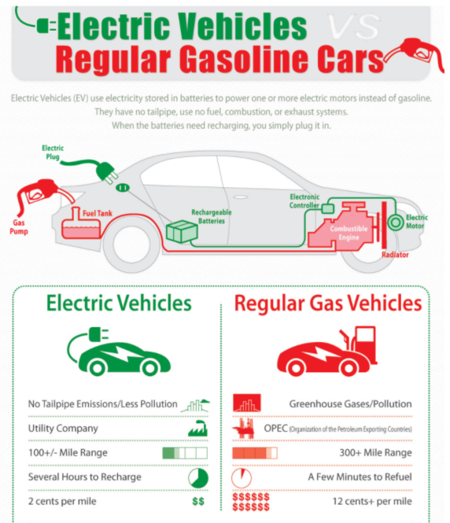{#fig-energy-efficiency-policy fig-alt="Graphic related to transportation efficiency, pricing, or policy measures that reduce energy use." width="100%"}
:::
:::::

## Buildings can be redesigned to waste less energy

::::: columns
::: {.column width="50%"}
-   Building efficiency improves with better insulation and sealing of air leaks
-   Superinsulation, geothermal heat pumps, and [solar heating]{.keyword} reduce heating demand
-   Tankless water heaters, efficient appliances, smart power strips, and efficient lighting also cut energy use
:::

::: {.column width="50%"}
{#fig-efficient-building fig-alt="Cutaway house diagram highlighting insulation, efficient heating, appliances, and energy-saving design features." width="100%"}
:::
:::::

## Solar energy is expanding as technology improves

::::: columns
::: {.column width="50%"}
-   [Solar cells]{.keyword} convert sunlight directly into electricity without releasing air pollutants during use
-   Solar can provide power to remote communities and less-developed regions
-   Its net energy yield has historically been low to medium, but performance continues to improve
-   Solar may become one of the world’s most important energy sources
:::

::: {.column width="50%"}
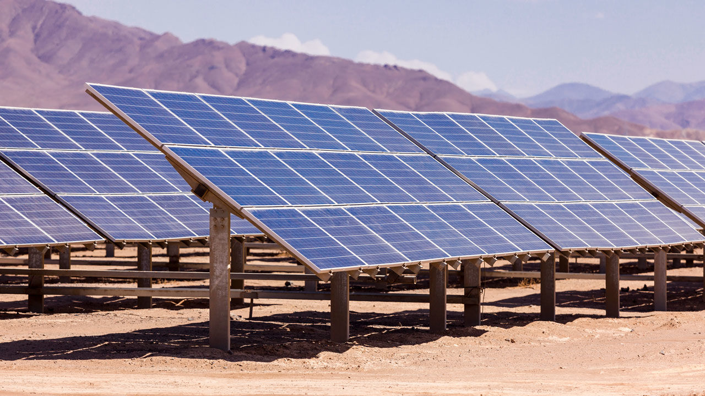{#fig-solar-panels fig-alt="Photograph of solar panels arranged to capture sunlight." width="100%"}

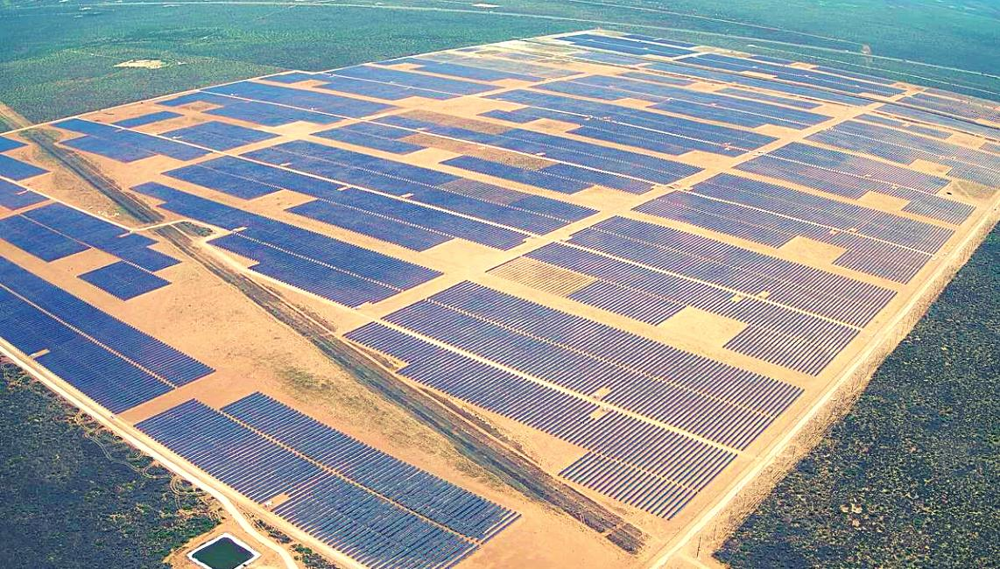{#fig-solar-cell-diagram fig-alt="Diagram showing sunlight striking solar cells and producing electrical current." width="85%"}
:::
:::::

## Hydropower provides electricity but can alter river systems

::::: columns
::: {.column width="50%"}
-   [Hydropower]{.keyword} uses the kinetic energy of falling or flowing water to generate electricity
-   Dams can store water and produce electricity, but they also trap sediment and alter ecosystems
-   Decomposing material in reservoirs can release greenhouse gases
-   Microhydropower can generate electricity with less environmental disruption
:::

::: {.column width="50%"}
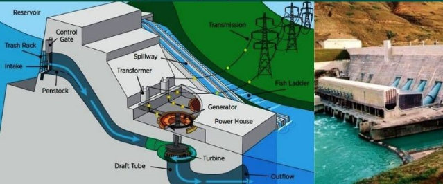{#fig-hydropower fig-alt="Diagram or image showing water moving through a turbine to generate electricity." width="100%"}
:::
:::::

## Wind power could supply large amounts of electricity

::::: columns
::: {.column width="50%"}
-   [Wind power]{.keyword} has very large technical potential on land and offshore
-   With grid upgrades and policy support, wind could replace a large share of fossil-fuel electricity
-   Even when full costs are considered, wind is often one of the least expensive ways to generate electricity
:::

::: {.column width="50%"}
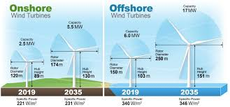{#fig-offshore-wind fig-alt="Photograph of wind turbines installed offshore in open water." width="100%"}

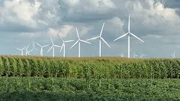{#fig-wind-turbine-size fig-alt="Illustration comparing the relative size of onshore and offshore wind turbines." width="85%"}
:::
:::::

## Geothermal systems generate electricity from underground heat

::::: columns
::: {.column width="50%"}
-   Water is pumped deep underground where Earth’s heat raises its temperature
-   When pressure is reduced at the surface, some of the hot water flashes to steam
-   The steam turns a turbine connected to a generator
-   Cooled water is reinjected, making [geothermal energy]{.keyword} a recirculating system
:::

::: {.column width="50%"}
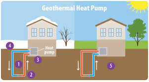{#fig-geothermal-energy fig-alt="Diagram showing hot water pumped from underground, steam driving a turbine, cooling, and reinjection of water." width="100%"}
:::
:::::

## Biofuels can store and transport plant-based energy

::::: columns
::: {.column width="50%"}
-   [Biomass]{.keyword} can be burned directly or converted into liquid fuels
-   Ethanol and biodiesel can substitute for gasoline in some uses
-   Biofuel crops can reduce reliance on imported oil, but sustainability depends on how they are grown
-   When managed sustainably, biofuels can reduce net carbon emissions
:::

::: {.column width="50%"}
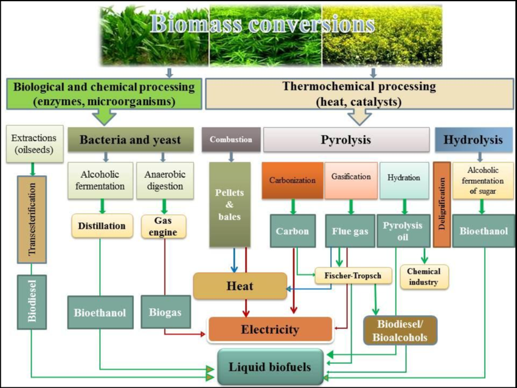{#fig-biofuels fig-alt="Process diagram showing plant biomass converted into heat, electricity, ethanol, biodiesel, and related products." width="100%"}
:::
:::::

## A sustainable energy transition will mix efficiency and renewables

::::: columns
::: {.column width="50%"}
-   Over this century, energy systems will likely shift gradually from fossil fuels toward a mix of renewable sources
-   The most practical path combines better [energy efficiency]{.keyword} with expanded solar, wind, hydro, and geothermal power
-   Because fossil fuels remain abundant and artificially cheap, policy matters for reducing their health and environmental impacts
:::

::: {.column width="50%"}
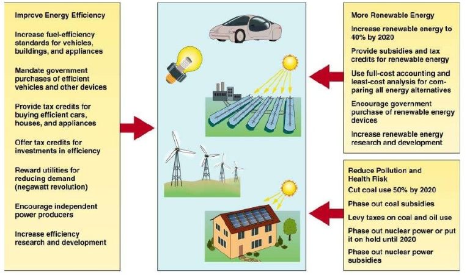{#fig-sustainable-energy-future fig-alt="Conceptual figure showing movement from fossil-fuel dependence toward more efficient and renewable energy systems." width="100%"}
:::
:::::

## Natural resources make life on Earth possible

::::: columns
::: {.column width="50%"}
-   Water, minerals, and energy resources support ecosystems, economies, and human societies
-   The central challenge is not just having resources, but using them at sustainable rates
-   Without these natural resources, Earth would be only a barren rock in space
:::

::: {.column width="50%"}
{#fig-earth-from-space fig-alt="View of Earth from space showing the planet as a life-supporting world shaped by water, atmosphere, and natural resources." width="100%"}
:::
:::::

## Questions

::::: columns
::: {.column width="50%"}
-   Any questions about freshwater, mineral resources, geological hazards, or energy transitions?
-   Key themes to remember: scarcity, tradeoffs, pollution, and sustainability
:::

::: {.column width="50%"}
:::
:::::
