## Learning Objectives

::::: columns
::: {.column width="50%"}
By the end of this module, you should be able to:

-   Describe the major layers of the atmosphere
-   Distinguish primary and secondary air pollutants
-   Explain how air pollution affects human and ecosystem health
:::

::: {.column width="50%"}
-   Explain the greenhouse effect
-   Identify major causes and consequences of climate change
-   Explain ozone depletion and why the Montreal Protocol matters
:::
:::::

## The Atmosphere Supports Life

::::: columns
::: {.column width="50%"}
-   Provides gases used by organisms
-   Regulates Earth’s temperature
-   Moves heat and water through weather systems
-   Screens harmful solar radiation
:::

::: {.column width="50%"}
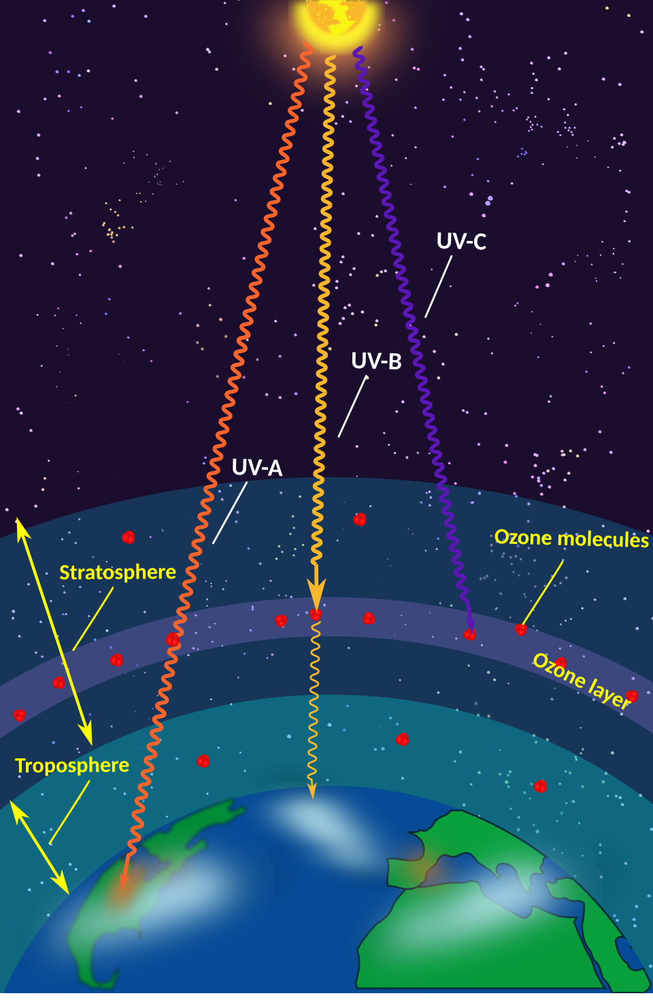{width="523"}
:::
:::::

## The Troposphere Is Where Weather and Most Pollution Occur

::::: columns
::: {.column width="50%"}
-   Lowest atmospheric layer
-   Contains most atmospheric water vapor
-   Region where weather occurs
-   Most human-caused air pollution begins here
:::

::: {.column width="50%"}
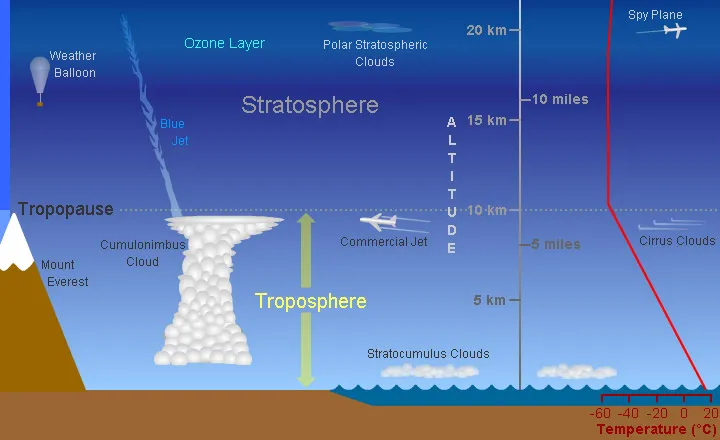
:::
:::::

## The Stratosphere Contains the Ozone Layer

::::: columns
::: {.column width="50%"}
-   Located above the troposphere
-   Contains concentrated ozone ($O_3$)
-   Absorbs much ultraviolet radiation
-   Protects organisms from DNA damage
:::

::: {.column width="50%"}
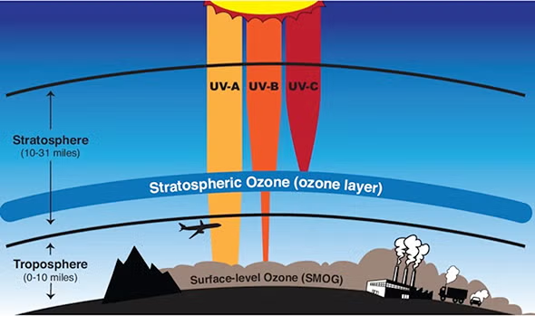
:::
:::::

# Air Pollution

## Air Pollution Can Come from Natural or Human Sources

::::: columns
::: {.column width="50%"}
-   [Air pollution]{.keyword}: harmful chemicals or particles in the atmosphere
-   Natural sources: dust, wildfires, volcanoes, pollen
-   Human sources: fossil fuels, vehicles, industry, agriculture
:::

::: {.column width="50%"}
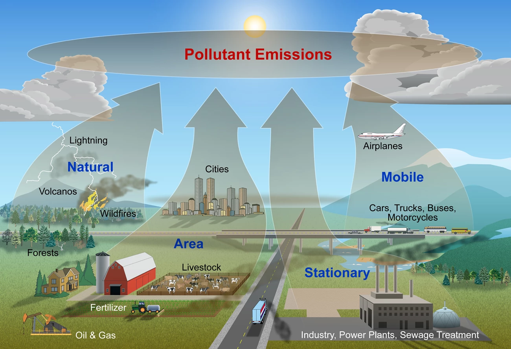
:::
:::::

## Primary Pollutants Are Emitted Directly

::::: columns
::: {.column width="50%"}
-   Released directly into the atmosphere
-   Examples:
    -   Carbon monoxide
    -   Sulfur dioxide
    -   Nitrogen oxides
    -   Particulate matter
    -   Volatile organic compounds
:::

::: {.column width="50%"}
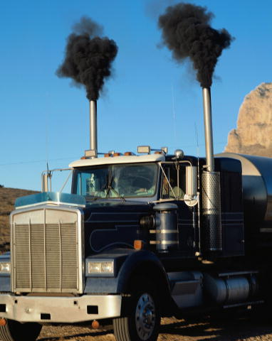
:::
:::::

## Secondary Pollutants Form in the Atmosphere

::::: columns
::: {.column width="50%"}
-   Produced by chemical reactions after emission
-   Often depend on sunlight and atmospheric conditions
-   Examples:
    -   Tropospheric ozone
    -   Acid-forming compounds
    -   Some smog components
:::

::: {.column width="50%"}
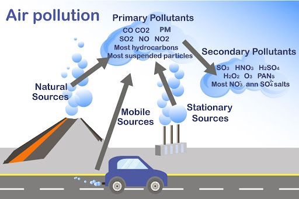
:::
:::::

## Industrial Smog and Photochemical Smog Have Different Causes

::::: columns
::: {.column width="50%"}
-   [Industrial smog]{.keyword}
    -   Sulfur compounds and particulates
    -   Often linked to coal combustion
-   [Photochemical smog]{.keyword}
    -   Nitrogen oxides + VOCs + sunlight
    -   Common in vehicle-dominated cities
:::

::: {.column width="50%"}
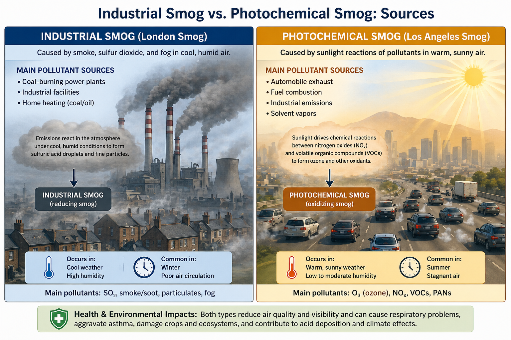
:::
:::::

## Local Conditions Influence Pollution Severity

::::: columns
::: {.column width="50%"}
Pollution can be reduced by:

-   Wind dilution
-   Rain or snow removal
-   Particle settling
:::

::: {.column width="50%"}
Pollution can be increased by:

-   Temperature inversions
-   Mountains or valley topography
-   Urban structures that block airflow
-   High temperatures that accelerate reactions
:::
:::::

## Temperature Inversions Trap Pollution Near the Ground

::::: columns
::: {.column width="50%"}
-   Normally, warm air rises and mixes
-   In an inversion, warm air sits above cooler surface air
-   Pollutants accumulate near people and ecosystems
:::

::: {.column width="50%"}
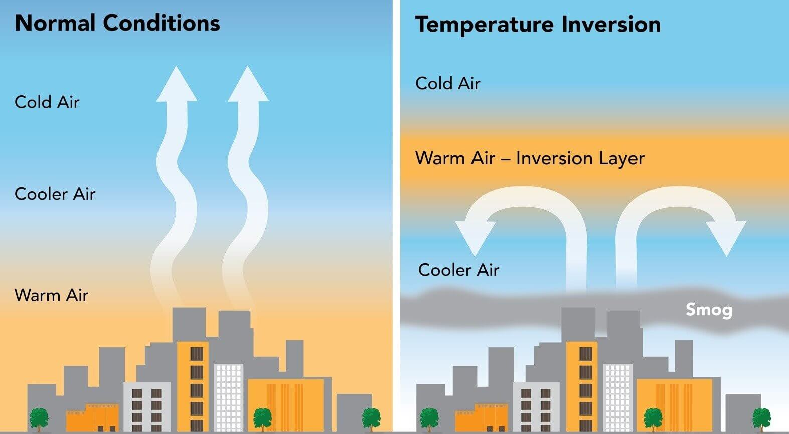
:::
:::::

## Acid Deposition Links Air Pollution to Soils and Water

::::: columns
::: {.column width="50%"}
-   Sulfur and nitrogen emissions form acids
-   Acids return to Earth through wet and dry deposition
-   Effects may occur far from the emission source
:::

::: {.column width="50%"}
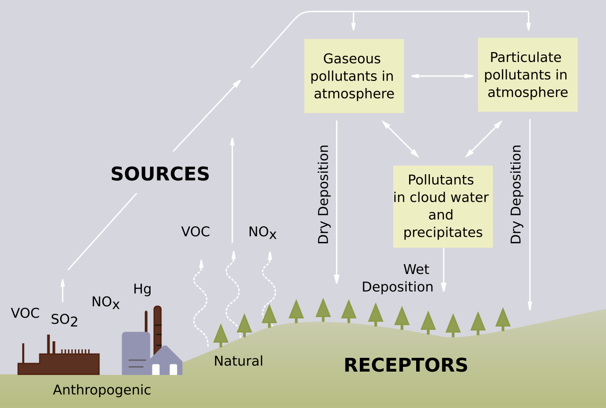
:::
:::::

## Acid Deposition Damages Ecosystems and Infrastructure

::::: columns
::: {.column width="50%"}
-   Acidifies lakes and streams
-   Leaches nutrients from soils
-   Mobilizes toxic metals
-   Reduces plant productivity

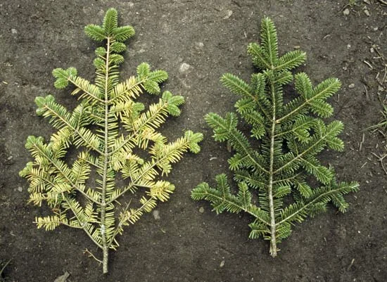{width="274"}
:::

::: {.column width="50%"}
-   Damages buildings and monuments
-   Worsens respiratory problems
-   Can alter food webs through biomagnification

{width="199"}
:::
:::::

## Indoor Air Pollution Can Be Severe

::::: columns
::: {.column width="50%"}
-   Smoke from wood, charcoal, dung, and coal
-   Tobacco smoke
-   Building materials and furniture
-   Cleaning products and solvents
-   Poor ventilation increases exposure
:::

::: {.column width="50%"}
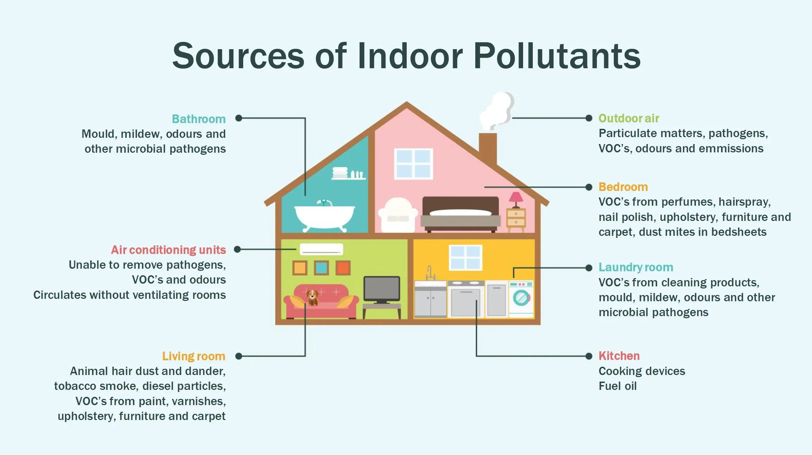
:::
:::::

## Air Pollution Is a Major Human Health Risk

::::: columns
::: {.column width="50%"}
-   Fine particles penetrate deep into lungs
-   Pollutants can overwhelm respiratory defenses
-   Long-term exposure increases disease risk
:::

::: {.column width="50%"}
Health effects include:

-   Asthma and respiratory illness
-   Cardiovascular disease
-   Premature death
:::
:::::

## Reducing Air Pollution Requires Prevention and Control

::::: columns
::: {.column width="50%"}
-   Emission standards
-   Cleaner fuels and energy sources
-   Public transit and efficient vehicles
-   Pollution control technology
:::

::: {.column width="50%"}
-   Better indoor ventilation
-   Cleaner stoves and cookers
-   Product standards for indoor materials
-   Reduced tobacco smoke exposure
:::
:::::

# Climate Change

## Weather and Climate Are Not the Same Thing

::::: columns
::: {.column width="50%"}
-   [Weather]{.keyword}: short-term atmospheric conditions
-   Changes over hours to days
-   Examples: storm, heat wave, cold front
:::

::: {.column width="50%"}
-   [Climate]{.keyword}: long-term average conditions and patterns
-   Usually measured over decades
-   Examples: average temperature, precipitation, seasonality
:::
:::::

## The Greenhouse Effect Makes Earth Habitable

::::: columns
::: {.column width="50%"}
-   Sunlight enters the atmosphere
-   Earth absorbs energy and emits infrared radiation
-   Greenhouse gases absorb some outgoing heat
-   Natural greenhouse effect keeps Earth warm enough for life
:::

::: {.column width="50%"}
<!-- Suggested figure: greenhouse effect diagram. -->
:::
:::::

## Major Greenhouse Gases Differ in Source and Strength

::::: columns
::: {.column width="50%"}
-   Carbon dioxide ($CO_2$)
    -   Fossil fuels, deforestation, cement
-   Methane ($CH_4$)
    -   Livestock, wetlands, fossil fuel extraction
:::

::: {.column width="50%"}
-   Nitrous oxide ($N_2O$)
    -   Fertilizers, soils, agriculture
-   Water vapor
    -   Important feedback, not the main direct human emission
:::
:::::

## Human Activities Have Increased Greenhouse Gas Concentrations

::::: columns
::: {.column width="50%"}
-   Fossil fuel combustion
-   Deforestation
-   Agriculture and livestock
-   Industrial processes
:::

::: {.column width="50%"}
<!-- Suggested figure: emissions by sector or Keeling Curve. -->
:::
:::::

## The Keeling Curve Shows Rising Atmospheric CO2

::::: columns
::: {.column width="50%"}
-   Direct measurements began at Mauna Loa in 1958
-   Seasonal cycle reflects plant growth and decay
-   Long-term trend shows sustained increase in atmospheric $CO_2$
:::

::: {.column width="50%"}
<!-- Suggested figure: Keeling Curve. -->
:::
:::::

## Climate Change Is Already Measurable

::::: columns
::: {.column width="50%"}
Evidence includes:

-   Rising global average temperature
-   Ocean warming
-   Glacier retreat
-   Ice sheet mass loss
:::

::: {.column width="50%"}
-   Earlier spring events
-   Shifting species ranges
-   Sea-level rise
-   More frequent heat extremes
:::
:::::

## Greenland Ice Loss Connects Warming to Sea-Level Rise

::::: columns
::: {.column width="50%"}
-   Greenland contains a large land-based ice sheet
-   Warming increases surface melt and glacier flow
-   Meltwater added to oceans raises sea level
:::

::: {.column width="50%"}
<!-- Suggested figure: Greenland ice sheet mass loss or glacier melt image. -->
:::
:::::

## Melting Ice Creates a Positive Feedback

::::: columns
::: {.column width="50%"}
-   Ice and snow reflect sunlight
-   Dark land and ocean absorb more energy
-   Melting exposes darker surfaces
-   More absorption causes more warming
:::

::: {.column width="50%"}
<!-- Suggested figure: albedo feedback diagram. -->
:::
:::::

## Climate Change Affects Physical Systems

::::: columns
::: {.column width="50%"}
-   Rising sea levels
-   More coastal flooding
-   More intense heat waves
-   Drought in some regions
:::

::: {.column width="50%"}
-   Heavier precipitation in some regions
-   Changing snowpack
-   More wildfire risk under hot, dry conditions
:::
:::::

## Climate Change Affects Ecosystems

::::: columns
::: {.column width="50%"}
-   Species shift ranges
-   Seasonal timing changes
-   Habitat suitability changes
-   Coral bleaching increases
:::

::: {.column width="50%"}
-   Food webs can become mismatched
-   Invasive species and pests may expand
-   Extinction risk increases for vulnerable species
:::
:::::

## Climate Change Affects People

::::: columns
::: {.column width="50%"}
-   Heat illness and mortality
-   Poorer air quality
-   Water stress
-   Food insecurity
:::

::: {.column width="50%"}
-   Flood and storm damage
-   Infrastructure costs
-   Displacement from high-risk areas
-   Uneven impacts across communities
:::
:::::

## Mitigation Reduces the Cause

::::: columns
::: {.column width="50%"}
[Mitigation]{.keyword}: actions that reduce greenhouse gas emissions or increase carbon storage

-   Energy efficiency
-   Renewable energy
-   Electrification
:::

::: {.column width="50%"}
-   Reduced fossil fuel use
-   Forest and wetland protection
-   Climate-smart agriculture
-   Lower-emission transportation
:::
:::::

## Adaptation Reduces Harm

::::: columns
::: {.column width="50%"}
[Adaptation]{.keyword}: actions that reduce vulnerability to climate impacts

-   Heat preparedness
-   Flood protection
-   Drought planning
:::

::: {.column width="50%"}
-   Climate-resilient crops
-   Wildfire planning
-   Infrastructure redesign
-   Managed retreat from high-risk areas
:::
:::::

# Ozone Depletion

## Stratospheric Ozone Protects Life from UV Radiation

::::: columns
::: {.column width="50%"}
-   Ozone is $O_3$
-   Concentrated in the stratosphere
-   Absorbs much UV-B and UV-C radiation
-   Reduces DNA damage in organisms
:::

::: {.column width="50%"}
<!-- Suggested figure: UV radiation filtered by ozone layer. -->
:::
:::::

## Chlorofluorocarbons Caused Major Ozone Loss

::::: columns
::: {.column width="50%"}
-   CFCs were used in refrigerants and aerosols
-   They persist long enough to reach the stratosphere
-   UV radiation breaks them apart
-   Released chlorine destroys ozone
:::

::: {.column width="50%"}
<!-- Suggested figure: CFC / chlorine / ozone reaction diagram. -->
:::
:::::

## One Chlorine Atom Can Destroy Many Ozone Molecules

::::: columns
::: {.column width="50%"}
-   Chlorine reacts with ozone
-   Ozone is converted to oxygen
-   Chlorine is regenerated
-   The reaction repeats many times
:::

::: {.column width="50%"}
$$
Cl + O_3 \rightarrow ClO + O_2
$$

$$
ClO + O \rightarrow Cl + O_2
$$
:::
:::::

## Ozone Depletion Increases UV Exposure

::::: columns
::: {.column width="50%"}
Potential effects include:

-   Higher skin cancer risk
-   More cataracts
-   Crop damage
:::

::: {.column width="50%"}
-   Harm to phytoplankton
-   Marine food web effects
-   Increased biological stress in high-UV environments
:::
:::::

## The Montreal Protocol Shows Policy Can Work

::::: columns
::: {.column width="50%"}
-   1987 international agreement
-   Phased out many ozone-depleting substances
-   Reduced global CFC consumption
-   Ozone recovery is now expected over time
:::

::: {.column width="50%"}
<!-- Suggested figure: decline in ozone-depleting substance consumption. -->
:::
:::::

## Take-Home Messages

::::: columns
::: {.column width="50%"}
-   Air pollution causes major health and ecosystem damage
-   Climate change is driven mainly by human greenhouse gas emissions
-   Climate impacts affect physical systems, ecosystems, and people
:::

::: {.column width="50%"}
-   Mitigation reduces future warming
-   Adaptation reduces harm from unavoidable impacts
-   Ozone depletion shows global environmental policy can succeed
:::
:::::
